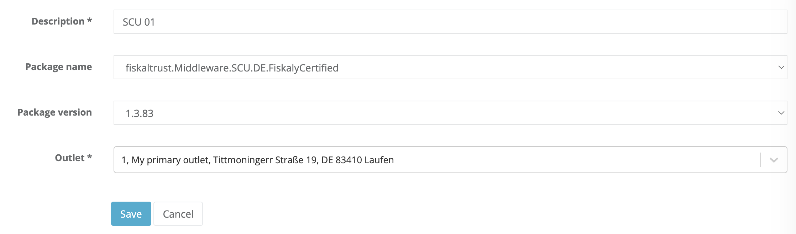
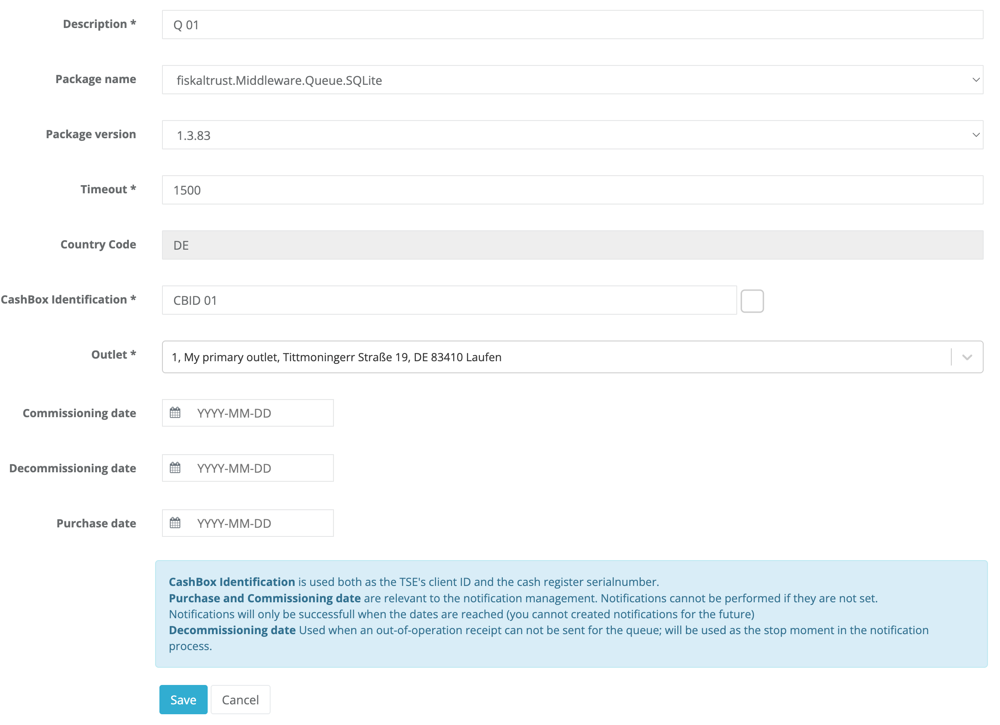
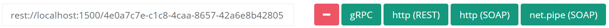
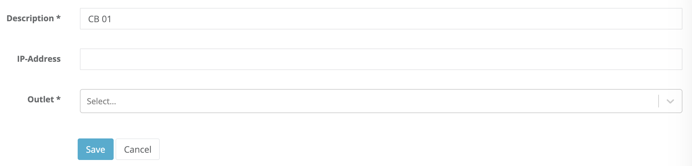
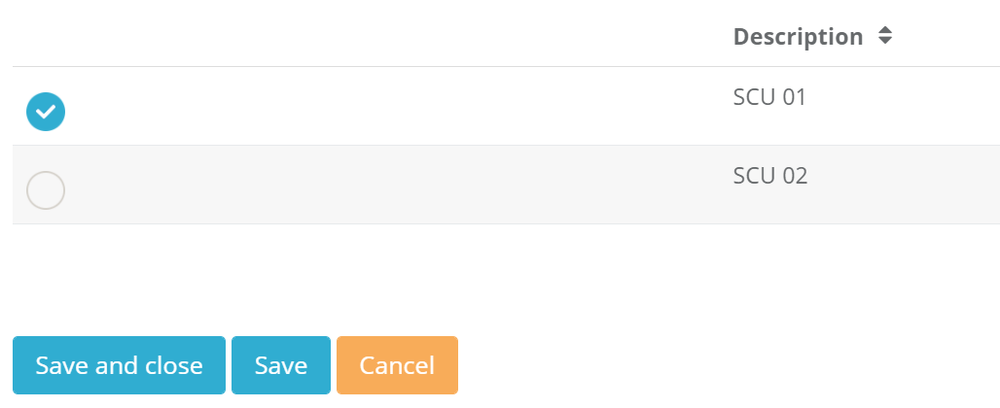

# Integration Steps

There are several mandatory steps to successfully integrate your solution with **fiskaltrust.Middleware**. These steps include:

- CashBox Configuration
- Middleware Launcher usage
- Middleware Communication testing

The following steps describe how to configure and test the integration of **ft.Middleware** with your POS system.

## 1. CashBox Configuration

### 1.1 Overview

As a POS creator, your first goal is to send requests from your POS system to our free ft.Middleware and test the integration. The following sections summarize the CashBox configuration and its components, which are required to achieve this goal.

:::note

All steps in this document are intended for testing purposes and should be performed in the Sandbox environment of the fiskaltrust Portal, unless otherwise specified.

:::

### 1.2 CashBox

A CashBox is a configuration container that connects (links) the configurations of individual components of the fiskaltrust.Middleware which can be configured in the fiskaltrust.Portal. The fiskaltrust.Portal can contain the configurations of Queues, SCUs, and various Helpers. A CashBox links them together to form a complete Middleware configuration.

In the next steps, an SCU and a Queue will be created for testing purposes and connected via a CashBox.

The steps for the creation and configuration of the CashBox are described in the [1.5 CashBox creation](#15-cashbox-creation) section.

### 1.3 Configuration of the SCU

The SCU (Signature Creation Unit) is a component of the ft.Middleware responsible for the communication with the TSE. The configuration of an SCU depends on the specific TSE you intend to use.

To create an SCU configuration in the fiskaltrust.Portal, select the menu item `Configuration` / `Signature creation unit` and click "Create". Enter a short description (name) for the SCU, then select the package for your TSE under "Package Name". Next, choose the latest version under "Package Version" and select the appropriate "Outlet". Click "Save" to create the SCU configuration.

After saving, additional configuration information are required. These depend on the selected TSE package. Typically, you define how the SCU connects to the TSE, as well as the endpoint through which the Queue communicates with the SCU.

In the upper section of the form, you can configure how the SCU connects to the selected TSE. The available fields depend on the chosen TSE type:

- **Cryptovision** - Enter the device path (drive letter followed by a colon) where the TSE is connected, for example `E:`.
- **Swissbit** - Enter the device path (drive letter followed by a colon) where the TSE is connected, for example `E:`.
- **Diebold - Nixdorf** - Enter the COM port to which the TSE is connected, for example `COM6`.
- **Epson** - Under revision.
- **fiskaly Cloud-TSE** - Enter the TSS ID, API key and the "Secret" key. One can obtain them for testing purposes from the official fiskaly website and fiskaly dashboard. Alternatively, you can purchase a free trial fiskaly Cloud-TSE in the sandbox fiskaltrust.Portal shop. This will automatically create an SCU with the corresponding data.

:::note

Select the outlet in the shop before you add the fiskaly Cloud-TSE test to your shopping cart (via the outlet dropdown in the upper area).

:::

To specify the communication endpoint for the SCU, select, for example, the "gRPC" by pressing the corresponding button in the lower part of the form . The input field is filled automatically and can be edited if necessary. For the purposes of this guide, the automatically filled gRPC endpoint is sufficient.

Save the configuration of your SCU after entering the required data. In the next step, we will configure the Queue.

### 1.4 Configuration of the Queue

The Queue is a component of the fiskaltrust.Middleware that collects the received data from the POS system and is responsible for creating the request chain. It is the component of the fiskaltrust.Middleware with which your POS system communicates. You send your data to it and receive signatures (and other data) in return.

Under the menu item `Configuration` / `Queue`, click the "Add" button to create a new Queue. This opens the input form. Enter a short description (name) and the CashBoxIdentification. The CashBoxIdentification is later used by the SCU as clientID for the TSE. It must therefore be a **unique value**, formatted as a ["printable string"](https://en.wikipedia.org/wiki/PrintableString) with a maximum length of 20 characters.

After saving, a form appears where you can specify the communication endpoint. This endpoint will later be used for communication with the Queue. For our example, we will choose http(REST) by clicking the corresponding button.

Once saved, the Queue configuration is complete. In the next step, we will create the CashBox (our configuration container).

### 1.5 CashBox creation

Under the menu item `Configuration` / `CashBox,`click the "Add" button to create a new CashBox. This opens the input form. After entering a short description (name), click "Save". The CashBox is now created and appears in the list.

#### 1.5.1 Connecting CashBox with Queue and SCU

Next, we will add the configuration of the Queue and SCU to the created CashBox and connect them. To do this, click the button with the list icon assigned to the CashBox.

Select the previously created Queue and SCU using the corresponding checkboxes, then click "Save". After saving, we will connect the Queue with the SCU. To do this, expand the list entry of the new CashBox in the overview of the CashBoxes. The detail area shows the contained configurations. Two buttons are assigned to the Queue configuration on the right side. Click the first button (box-and-arrow icon) to assign the new SCU to the Queue.

A popup appears where you can select the SCU. After assigning and saving, the CashBox configuration is complete.

## 2. Middleware Launcher

The ft.Middleware Launcher starts the required services on the local machine and exposes the endpoint configured for the Queue for the communication with your POS system.

### 2.1 Downloading the launcher

Before downloading the launcher, **it is important to "rebuild" the CashBox**. To do this, click the "Rebuild configuration" button (first grey button with the reload icon) in the CashBox line. **This action must be repeated whenever the CashBox configuration or any of its components is changed.**.

After rebuild, you can now download the launcher by clicking the "Download" button.

### 2.2 Enabling debug mode

:::info Note

The debug mode is not available in launcher version 1.2. For AT queues, a [debug launcher](https://docs.fiskaltrust.cloud/docs/poscreators/middleware-doc/france/installation#fiskaltrustmiddleware) is available, but it only provides additional logging for AT-specific scenarios.

:::

After the download is complete, you will receive a ZIP file containing the launcher, its corresponding configuration, and other required files. Extract the ZIP file and open the extracted folder. Locate the `test.cmd` fileand open it in a text editor of your choice. Add the argument `-verbosity=Debug` at the end of the second line (which starts with `fiskaltrust.exe`). This enables more detailed logging output.Save and close the `test.cmd` file.

### 2.3 Starting the launcher

The launcher must be started in Administrator mode. To do this, right-click the `test.cmd` file and select "Run as Administrator". A terminal window will open where you can follow the start of the local middleware via log messages. This window remains open, as it displays log messages for further progress. Do not click inside the terminal window, as this may pause the service (Windows feature). If this happens accidentally, click the window again and press "Enter" to cancel the interruption.

**Known issues / recommendations:**

- To avoid folder access issues during startup, extract the files to a "neutral" directory, e.g. `C:\Launcher\`. Running it from user-specific folders may result in **Access denied** errors.
- To avoid system permission issues when starting the Launcher, start a command prompt as Administrator, navigate to the folder containing Launcher's files, and start it from there.
- If the launcher fails because the port is already in use, you may need to change the Queue endpoint port. In that case, rebuild the CashBox, download the launcher again, and retry. If the issue persists, a system restart may help.

## 3. Middleware Communication

### 3.1 Initialization with an initial operation receipt

After starting the launcher, the local middleware is available. The next step is to initialize it using an initial operation receipt. To help you understand this and other operations, we provide a Postman collection with several examples of simple requests and complex business cases. You can access and use the collection directly from the fiskaltrust [middleware-demo-postman](https://github.com/fiskaltrust/middleware-demo-postman) GitHub repository.

#### 3.1.1 Configuration of the Postman collection

After the Postman collection loads, it must still be configured to send requests to the previously started local Middleware. To do this, select the "fiskaltrust Middleware" collection, click "Edit", and select the "Variables" tab. Here you will find two relevant variables: `base_url` and `cashbox_id`. Configure them as follows:

- **base_url** - Specifies the URL of the previously created http(REST) endpoint of the Queue. You can find the required value in the fiskaltrust.Portal under the menu item `Configuration` / `Queue`. Expand the detail area of the list entry of the Queue and copy the URL. For example, `rest://localhost:1500/f84bf516-a17b-4432-afa6-8c1050e2854d`. Replace `rest://` with `http://` in the URL to obtain the value for the Postman `base_url` variable. For example, `http://localhost:1500/f84bf516-a17b-4432-afa6-8c1050e2854d`. Now enter this value in Postman for the variable `base_url` as `CURRENT_VALUE`.
- **cashbox_id** - Specifies the ID of the configuration container (not to be confused with the CashBoxIdentification). You can find this value for the `cashbox_id` in the fiskaltrust.Portal under the menu item `Configuration` / `CashBox`. Expand the detail area of the list entry of the CashBox and copy the value of **CashBoxId**. For example, `90682627-f707-45ab-84df-f855118bba97`. Now enter this value in Postman for the variable `cashbox_id` under `CURRENT_VALUE`.

Once both variables are configured, click `Update` to save your changes.

#### 3.1.2 Send a request with the initial operation receipt

In our Postman collection, locate an entry with the name `Initial Operation Receipt`.  Click on it and select the `Body` tab to view its contents. You can now send the request by clicking `Send`. The request will be sent to the local Middleware, and the response will be displayed in Postman. You can view the corresponding log messages in the terminal. The ft.SecurityMechanism of the Middleware and the TSE are now initialized and ready to process further requests.

### 3.2 Sending further requests

### 3.2.1 Compliance Middleware documentation

The Compliance Middleware is described in our [Documentation](https://github.com/fiskaltrust/docs/tree/main/poscreators/middleware-doc) GitHub repository. This repository contains important information about communication with the Middleware.

The [middleware-doc](https://github.com/fiskaltrust/docs/tree/main/poscreators/middleware-doc) folder includes a general section (directory `general`) and country-specific sections that extend the general specification with localized requirements.

It is important to review this documentation before continuing with further steps.

### 3.2.2 Postman collection

The Postman collection referenced above contains additional request examples that you can explore and execute.

After familiarizing yourself with the Compliance Middleware documentation, we also recommend watching our [Middleware webinar video](https://www.youtube.com/watch?v=mq1hHL8ezOg&t=15s), which explains the examples in detail and provides additional context.
