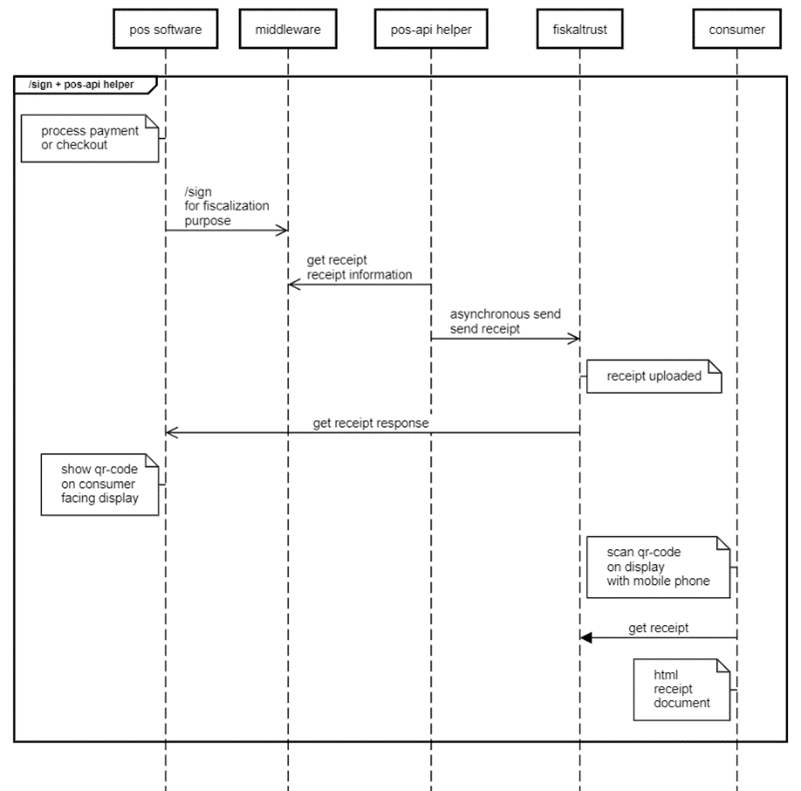

# Digital Receipt Implementation

:::note

Before start implementing, please read the getting started section first.

:::

fiskaltrust provides two implementing methods for the digital receipt via QR-Code and via Give-Away (QR-Label). The first approach is the POS API Helper, which is intended for Point of Sale software that is already integrated with the classic Middleware interface (`/sign` via IPOS v0 or the SignatureCloud API). The POS API Helper is configured on the CashBox in the fiskaltrust.Portal and makes the signed receipts available as digital receipts without changing that existing integration. It is a bridge for existing integrations and for testing/sandbox environments, not a replacement for the POS System API; for production rollouts, migrate to the POS System API following the [Migration Guide](../../possystem-api/migration-guide.md).

However, it's important to highlight that the POS API Helper does not log the delivery statuses of the digital receipt, as mentioned in the section Evaluation of document retrievals for financial administration ("Finanzverwaltung"). The absence of these logs prevents a tax auditor from reviewing the statuses of printing, acceptance, and submission in the event of an audit. This could result in non-compliance, particularly in Austria, due to the lack of logged records for the obligation to issue receipts ("Belegausgabepflicht") and the obligation to accept receipts ("Belegannahmepflicht"), rendering verification impossible.

To address this, the POS API provides comprehensive logging of digital receipt interactions: "printing" a digital receipt and the retrieval status. This logging fulfills the requirements for the obligation to issue receipts ("Belegausgabepflicht") and the obligation to accept receipts ("Belegannahmepflicht") in Austria, as well as the obligation to issue receipts ("Belegausgabepflicht") in Germany.

## Create receipts with /sign endpoint + POS API Helper (Dispreferred)

This sequence diagram describes the process of generating a digital receipt with the sign endpoint and the POS API Helper. The participants in the process are the Point of Sale software, fiskaltrust.Middleware, POS API Helper, fiskaltrust and the consumer. 



*Figure 1. Sequence diagram of generating a digital receipt with the sign endpoint and the POS API Helper.*

The Point of Sale software calls the Middleware's sign endpoint with a regular receipt request - the request will be processed by the fiskaltrust.Middleware. After this step, the POS software receives the receipt response from the fiskaltrust.Middleware (which also contains the data for creating a printed receipt). The Point of Sale software extracts the ftQueueId and ftQueueItemId properties from the receipt response and generates the link for the QR-Code out of this dataset. Final step is the visualization of the QR-Code containing the URL to the digital receipt on the customer display, handheld, self-checkout or any other suitable devices.

The consumer accesses the receipt by scanning the QR-Code displayed on the customer-facing display/device with their mobile phone. The consumer requests the receipt from fiskaltrust and receives an HTML document as the receipt. 

<details>
<summary>Response details (shortened):</summary> 


```json
"{
"ftCashBoxID":"124358e8-9cbd-4332-9076-7ed8b72306ac"
"ftQueueID":"c719b59a-9ff0-891a-98a1-030776d8c46f"
"ftQueueItemID":"f838d7c8-3113-4c3a-914a-46d7de555d11"
"ftQueueRow":"41"
"cbTerminalID":"T2"
"cbReceiptReference":"pos-action-identification-02"
"ftCashBoxIdentification":"bonstart"
"ftReceiptIdentification":"ft27#IT11"
"ftReceiptMoment":"2023-08-03T13:12:56.3989064Z"
}"
```


</details>

## Configure POS API Helper 

The POS API Helper is available in all countries. This Helper is responsible for uploading data from the local Queue to the digital receipt endpoint. This Helper is configured in the fiskaltrust.Portal and assigned to each CashBox that uses digital receipts. The POS API Helper changes to a direct upload behavior of the digital receipts.

To proceed with the configuration, login to your fiskaltrust.Portal account first. 

### Queue 

| Step  | Description |
| ------------- | ------------- |
| 1  | Navigate to the configuration section and go to Queue  |
| 2  | Configure Queue  |
| 3  | Copy the URLs to your local machine (Required for CashBox configuration later)   |
| 4  | For all countries: Change port to the next free port (+1) and <br/> a.	if no suffix exists after the port: add the suffix "/name_queue" to the URL ("name" can be freely chosen) <br/> b.	if suffix already exists: add the suffix "_queue" to the URL  |
| 5  | Germany & France only: Change grpc port to the next free port (if port is free no need to go up to the next free port) and add the suffix "/name_queue" to the URL ("name" can be freely chosen)  |
| 6  | Save changes  |

*Table 1. Queue configuration steps for the POS API Helper.*

### Helper 

| Step  | Description |
| ------------- | ------------- |
| 1  | Navigate to Helper  |
| 2  | Create new helper  |
| 3  | Add description  |
| 4  | Select  package name "fiskaltrust.service.helper.posapi"   |
| 5  | Select latest package version   |
| 6  | Select the outlet of CashBox    |
| 7  | Save configuration   |
| 8  | Click configure helper   |
| 9  | All Countries: Insert the previously saved Queue URLs to the Helper URLs and add the suffix "/name" to the URL (analogue to the naming in queue configuration). Germany & France only: Add also GRPC URL with next free port and add the suffix "/name" to the URL (analogue to the naming in queue configuration).   |
| 10  | Save configuration and close   |

*Table 2. Helper configuration steps for the POS API Helper.*

### CashBox 

| Step  | Description |
| ------------- | ------------- |
| 1  | Navigate to CashBox   |
| 2  | Select your CashBox and click edit by list  |
| 3  | Navigate to Helpers  |
| 4  | Activate the POS API Helper  |
| 5  | Save configuration  |
| 6  | Click rebuild configuration  |

*Table 3. CashBox configuration steps for activating the POS API Helper.*

### Restart

Restart the fiskaltrust.Middleware to apply the changes. 

## Create receipts with the /issue endpoint – POS System API (preferred)

The POS System API (v2) is the central entry point to the fiskaltrust.Middleware. Its functions are grouped into the endpoints `/echo`, `/pay`, `/sign`, `/issue` and `/journal`. For the digital receipt, the `/issue` endpoint is used: it generates the receipt output and updates its delivery state.

A digital receipt flow with the POS System API looks like this:

1. Optionally, call `/echo` to verify connectivity and authentication.
2. Call `/sign` to sign the receipt according to the local fiscalization regulations.
3. Call `/issue` with the receipt request and the receipt response from `/sign`. Alternatively, `/issue` accepts the `QueueId` and `QueueItemId` of a receipt that was already signed.
4. fiskaltrust stores the receipt document in the fiskaltrust.Cloud and returns `ftQueueID`, `ftQueueItemID` and the `DocumentURL` to the POS system.
5. Check whether the receipt was delivered with `GET /issue/{QueueId}/{QueueItemId}/delivered`. It returns `200` when the receipt was delivered and `204` while delivery is still pending. To wait for the delivery instead, call `GET /BlockIssueRequest/{QueueId}/{QueueItemId}/WhileDelivered`. The other `/issue/{QueueId}/{QueueItemId}` endpoints retrieve the receipt in other formats or update the receipt status.

Every request must carry the authentication and idempotency headers (CashBox ID, access token, operation ID, and POS system ID) as defined in the POS System API documentation. The CashBox ID and access token are obtained by creating a CashBox in the fiskaltrust.Portal.

For authentication, availability and the other endpoints, see the [POS System API introduction](../../possystem-api/introduction.md). For the full request and response models, payload schemas and error codes, see the [POS System API reference (v2.1)](https://docs.fiskaltrust.cloud/apis/pos-system-api). If your POS system uses API v0, follow the [Migration Guide](../../possystem-api/migration-guide.md).

The [POS System API development kit](https://github.com/fiskaltrust/possystemapi-devkit/blob/main/README.MD) provides runnable C# samples for the POS System API. Use it to get familiar with the flow before implementing it in your point-of-sale software.

:::info

Legacy POS API v0 integrations use the `/print` endpoint instead of `/issue`.

:::

## QR-Code version (QR-Code on display)

This method provides the digital receipt via a link from POS API that should be distributed as a QR-Code (e.g. on the customer display of the POS system, handheld or self-service terminal), which should contain the URL to the digital receipt in the following format:

https://receipts.fiskaltrust.cloud/v0/[QueueId]/[QueueItemId]

For Sandbox environment the URL should contain following format:

https://receipts-sandbox.fiskaltrust.cloud/v0/[QueueId]/[QueueItemId]

## Give away version (QR-Label)

This method provides the digital receipt via QR-Label, a receipt tag that should be distributed via a barcode scanner from the Point of Sale into the Middleware. There are three options in following JSON format available. 
For this implementation the POS API Helper or POS API is required to change to a direct upload behavior, required for the digital receipt. 


<details>
<summary>Request body schema (JSON):</summary>


```json
"ftReceiptCaseData":  "{ \"ReceiptTag\": \"https://receipts.fiskaltrust.cloud?tag=abc123456789\" }"

"ftChargeItemCaseData": "{ \"ReceiptTag\": "https://receipts.fiskaltrust.cloud?tag=abc123456789\" }"

"ftPayItemCaseData": "{ \"ReceiptTag\": \"https://receipts.fiskaltrust.cloud?tag=abc123456789\" }"
```


</details>

<details>
<summary>Full request body schema (JSON), containing all three options could e.g. look like this:</summary>


```json
{
    "ftCashBoxID": "00000000-0000-0000-0000-000000000000",
    "ftPosSystemID": "00000000-0000-0000-0000-000000000000",
    "cbTerminalID": "1",
    "cbReceiptReference": "1",
    "cbReceiptMoment":"{{current_moment}}",
    "cbChargeItems": [
        {
            "Quantity": 1.0,
            "Description": "Article 1",
            "Amount": 33.06,
            "VATRate": 20.0,
            "ftChargeItemCase": 4707387510509010944,
            "ftChargeItemCaseData":  "{ \"ReceiptTag\": \"https://receipts.fiskaltrust.cloud?tag=abc123456789\" }",
            "AccountNumber": "",
            "CostCenter": "",
            "ProductGroup": "",
            "ProductNumber": "1",
            "ProductBarcode": "",
            "Unit": ""
        },
        {
            "Quantity": 1.0,
            "Description": "Article 2",
            "Amount": 5.69,
            "VATRate": 20.0,
            "ftChargeItemCase": 4707387510509010944,
            "ftChargeItemCaseData": "",
            "AccountNumber": "",
            "CostCenter": "",
            "ProductGroup": "",
            "ProductNumber": "2",
            "ProductBarcode": "",
            "Unit": ""
        }
    ],
    "cbPayItems": [
        {
            "Quantity": 1.0,
            "Description": "Bar",
            "Amount": 38.75,
            "ftPayItemCase": 4707387510509010944,
            "ftPayItemCaseData": "{ \"ReceiptTag\": \"https://receipts.fiskaltrust.cloud?tag=abclökaejölasjf\" }",
            "AccountNumber": "",
            "CostCenter": "",
            "MoneyGroup": "",
            "MoneyNumber": ""
        }
    ],
    "ftReceiptCase": 4707387510509010945,
    "ftReceiptCaseData": "{ \"ReceiptTag\": \"https://receipts.fiskaltrust.cloud?tag=abclökaejölasjf\" }"
}
```


</details>

:::info

Please keep in mind that in a real use case, only one of the three mentioned ways to inject the link into the receipt request should be used, depending on what fits the POS software's internal flows best.

:::

## Failure or disruption of internet connection

### Austria 

In the event of a failure or disruption of the internet connection, where no receipts can be uploaded to the fiskaltrust backend, you are required by Austrian law to print the receipt and make it available for the consumer. 
If you receive the ftState 0x4154000000000001 or 0x4154000000000004 as a ReceiptResponse, no digital receipt should be visualized as a QR-Code or scanned as Give-Away. The receipt needs to be printed.

The country-specific code is made of the country's code value following the ISO-3166-1-ALPHA-2 standard, converted from ASCII into hex. For Austria (AT) this is 0x4154, which results in 0x4154000000000001 as the value for the "out of service" status.

| Value  | Description | Middleware version |
| ------------- | ------------- | ------------- |
| 0x4154000000000001  | "out of service" No RKSV signatures are generated or sent back. No RKSV-DEP is written, as nothing is being signed. The E131-DEP records requests and responses.  | 1.0  |
| 0x4154000000000004  | "SSCD permanently out of service" The status "SSCD temporary out of service" was activated more than 48h ago. Thus a FinanzOnline notification has been generated. For conduct and termination of this mode, see "SSCD temporary out of service".  | 1.0  |

*Table 4. Austrian ftState values indicating out-of-service conditions.*

<details>
<summary>The following example shows how to extract the value of a flag into the ftState property.</summary>


```json
if ((ReceiptResponse.ftState & 0x4154000000000001) != 0) 
{ 
    //your code in case of out of service condition 
}
if ((ReceiptResponse.ftState & 0x4154000000000004) != 0)
 { 
    //your code in case of SSCD permanently out of service condition
 }
```

</details>

### Germany 

In the event of a failure or disruption of the internet connection, we recommend to print the receipt and make it available to the customer. If you receive the ftState 0x4154000000000001 or 0x4154000000000004 as a ReceiptResponse, no digital receipt should be visualized as a QR-Code or scanned as Give-Away - the receipt should be printed out. The country-specific code is made of the country's code value following the ISO-3166-1-ALPHA-2 standard, converted from ASCII into hex. For Germany (DE) this is 0x4445, which results in 0x4445000000000002 as the value for the "security mechanism was not able to communicate with the TSE device for at least one cycle" status.

| Value  | Description | Middleware value |
| ------------- | ------------- | ------------- |
| 0x4445000000000002  | The security mechanism was not able to communicate with the TSE device for at least one cycle. If this is the case, no more communication attempts are done to avoid long waiting times for each Receipt request/Receipt response sequence. To leave this state, a Zero-Receipt must be sent, which forces a communication retry towards the TSE device. Receipts created in a state where no communication is possible with the TSE device are protected by the security mechanism of fiskaltrust.  | 1.0  |
| 0x4445000000000100  | The Middleware is in the process of switching SCUs. This state is returned in case any receipts are processed between the initialize-switch receipt and the finish-switch receipt. These receipts are protected by the fiskaltrust.SecurityMechanism, but not sent to any TSE, as no SCU is connected at this point.  | 1.3.19  |

*Table 5. German ftState values indicating TSE communication and SCU-switching conditions.*

The following example shows how to extract the value of a flag into the ftState property.

<details>
<summary>The following example shows how to extract the value of a flag into the ftState property.</summary>


```json
if ((ReceiptResponse.ftState & 0x4445000000000002) != 0)
{ 
    //your code in case of out of service condition 
}
if ((ReceiptResponse.ftState & 0x4445000000000100) != 0)
 { 
    //your code in case of SSCD permanently out of service condition
 }
```


</details>

## Mandatory fields for digital receipt visualization 

This chart shows the required data fields to visualize the whole dataset of the digital receipts properly, like the services or items sold, payment methods like voucher or card payment transaction data from your PSP. 

| Field name  | Sample data | Mandatory field | Visualized on receipt | Description |
| ------------- | ------------- | ------------- | ------------- | ------------- |
| cbTerminalID  | Terminal 1  | mandatory  | no  | The unique identification of the cash register within a ftCashBoxID  |
| cbReceiptReference  | 7657a361-ffe1-4633-86d8-500ee4d1cb0a  | mandatory  | no  | Reference number send by the cash register  |
| cbReceiptMoment  | 2023-08-01T08:17:32.003Z  | mandatory  | yes  | The time of receipt creation. Must be provided in UTC  |

*Table 6. Receipt-level fields required to visualize the digital receipt.*

### cbChargeItems (List of services or items sold)

| Field name  | Sample data | Mandatory field | Visualized on receipt | Description |
| ------------- | ------------- | ------------- | ------------- | ------------- |
| Quantity  | 1  | mandatory  | yes  | Amount or volume (number) of service(s) or items of the entry  |
| Description  | Kaffee  | mandatory  | yes  | Name, description of customary indication, or type of the service or item  |
| Amount  | 3.2  | mandatory  | yes  | Gross total price of service(s). The gross individual price, net total price, and net individual price, have to be calculated using the amount and either VAT rate or VAT amount  |
| VATRate  | 20  | mandatory  | yes  | VAT rate as percentage  |
| ftChargeItemCase  | 0x4154000000000003  | mandatory  | no  | Type of service or item according to the reference table in the appendix. It is used in order to determine the processing logic for the corresponding business transaction  |
| ftChargeItemCaseData  | `"ftChargeItemCaseData": "{\"cbChargeItemLines\":[\"Mit Hafermilch\\r\\nund Zucker\"]}"`  | optional  | currently not*  | Additional data about the service, currently accepted only in JSON format  |
| VATAmount  | 0.5333333333333333  | optional  | yes  | If the VAT amount is indicated, it can be used to calculate the net amount in order to avoid rounding errors which are especially likely to appear in row-based net price additions  |
| AccountNumber  | 1234  | optional  | no  | Account number for transfer into bookkeeping  |
| CostCenter  | 1  | optional  | no  | Indicator for transfer into cost accounting (type, center, and payer)  |
| ProductGroup  | Kaffee  | optional  | no  | This value allows the customer the logical grouping of products  |
| ProductNumber  | 123  | optional  | no  | Value used to identify the product  |
| ProductBarcode  | 16514646137  | optional  | currently not*  | Product’s barcode  |
| Unit  | Stk  | optional  | no  | Unit of measurement  |
| UnitQuantity  |  -  |  optional  | no  | Quantity of the service(s) of receipt entry, displayed in indicated units  |
| UnitPrice  | 2.56  | optional  | no  | Gross price per indicated unit  |
| Moment  | 2023-08-01T07:47:53.68Z  | mandatory  | no  | Time of service (year, month, day, hour, minute, second). Must be provided in UTC  |

*Table 7. cbChargeItems fields for services or items sold.*

### cbPayItems (List of payment received)

| Field name  | Sample data | Mandatory field | Visualized on receipt | Description |
| ------------- | ------------- | ------------- | ------------- | ------------- |
| Quantity  | 1  | mandatory  | no  | Number of payments. This value will be set to 1 in most of the cases. It can be greater than 1 e.g. when paying with multiple vouchers of the same value  |
| Description  | Hobex   | mandatory  | yes  |Name or description of payment  |
| Amount  | 3.2  | mandatory  | yes  | Total amount of payment  |
| ftPayItemCase  | 0x4154000000000003  | mandatory  | no  | Type of service or item according to the refer-ence table in the appendix. It is used in order to determine the processing logic for the corresponding business transaction  |
| ftPayItemCaseData  | `"ftPayItemCaseData":<br/>"{\"cbPayItemLines\":[\"* *  Kundenbeleg  * *\\r\\nTest\\r\\nMusterstr. 1\\r\\n5020 Salzburg\\r\\nDatum: 05.07.2023\\r\\nUhrzeit: 08:46:26 Uhr\\r\\nBeleg-Nr. 0001\\r\\nTrace-Nr. 000123\\r\\nKartenzahlung\\r\\nContactless\\r\\ngirocard\\r\\nNr.\\r\\n###############7123 0000\\r\\nGenehmigungs-Nr. 880123\\r\\nTerminal-ID 52051123\\r\\nPos-Info 00 075 01\\r\\nAS-Zeit 05.07. 08:46 Uhr\\r\\nWeitere Daten 0000000001\\r\\n/////1F0312//\\r\\nBetrag EUR 8,60\\r\\nZahlung erfolgt\\r\\nBitte Beleg aufbewahren\\r\\n\"]}","Moment":"2023-08-09T07:12:46.0000000Z"}]}"`  | optional  | yes  | Additional data about the payment transaction data, only accepted in JSON format. This can be the transaction data from card payment data from your PSP or the remaining value of a voucher  |
| CostCenter  | 1  | optional  | no  | Indicator for transfer into cost accounting (type, center and payer)  |
| MoneyGroup  | 1  | optional  | no  | This value allows the logical grouping of payment types  |
| MoneyNumber  | 1  | optional  | no  | This value identifies the payment type  |
| ftReceiptCase  | 0x4154000000000001  | mandatory  | no  | The ftReceiptCase indicates the receipt type and defines how it should be processed by the fiskaltrust.SecurityMechanism in accordance with the local law  |
| cbReceiptAmount  | 3.2  | optional  | yes  | Total receipt amount incl. taxes (gross receipt amount). If it is not provided, it can be calculated with the sum of the amounts of the cbChargeItems. It can be useful and important for systems working with net amounts, as it helps to apply different methods of calculation and rounding  |
| cbUser  | Hr. Müller  | optional  | currently not*  | Identification of the user, who creates the receipt. Although all string values are supported, we suggest using data structures serialized into JSON format  |

*Table 8. cbPayItems fields for payments received.*

*Implementation for visualization on the digital receipt planned, but not yet available  
