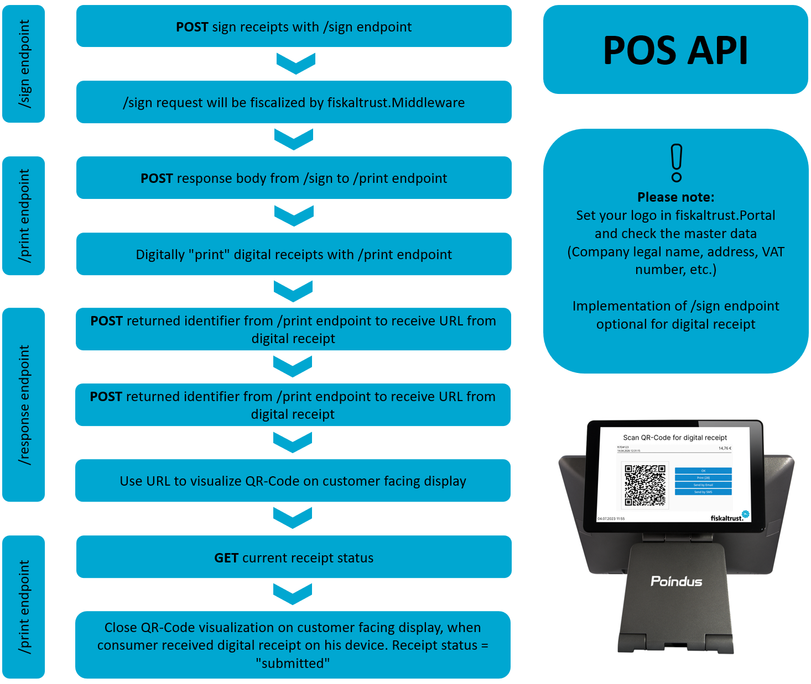
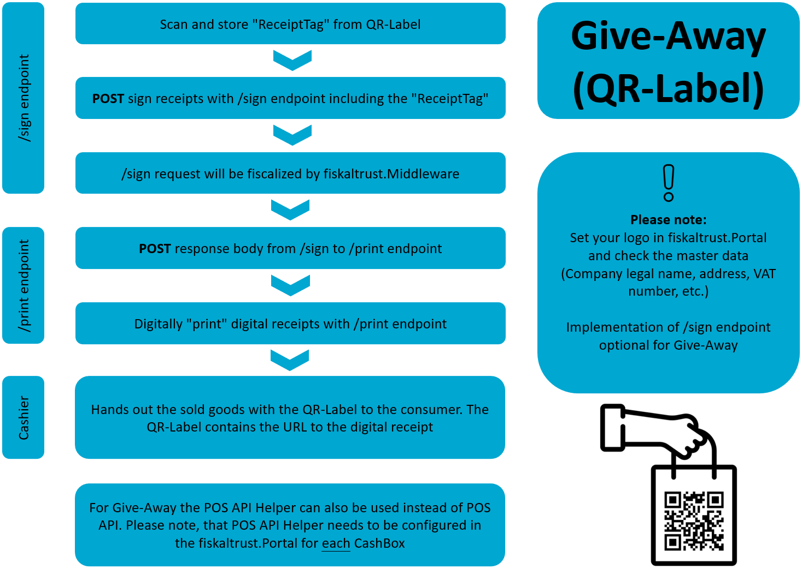

# Getting Started

In this section, the implementation steps to achieve and ensure a complete integration into your Point of Sale software are described. 

:::note

Currently the digital receipt can only be implemented into existing middleware integrations. An own standalone digital receipt API is not available yet. 

:::

This high level overview shows you the implementation and configuration steps, who are required for the digital receipt via QR-Code, Give-Away (QR-Label) and the InStore App. 

 

*Figure 1. High-level implementation and configuration steps for the digital receipt via QR-Code.*

 

*Figure 2. High-level implementation and configuration steps for the digital receipt via Give-Away (QR-Label).*
