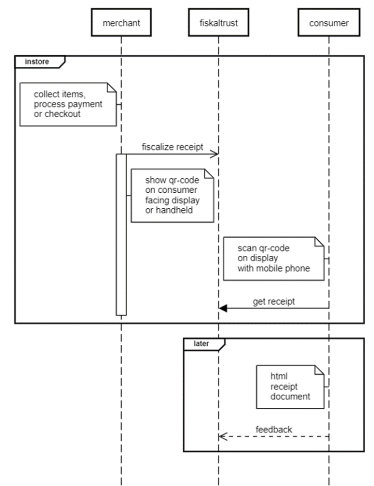
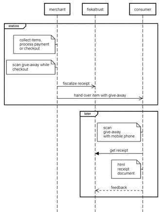

# Receiving Digital Receipts

There are various ways receipts are provided and transported towards the consumer. When a merchant uses digital receipts, it is important to teach the staff on how to use the system and to provide information on the availability of the different methods used. Not all available methods should be implemented, only the most efficient way related to the business should be used. 

## With customer facing display/device 

This sequence diagram describes the process of generating a digital receipt with a customer display, handheld or self-checkout device using the fiskaltrust digital receipt solution. The participants in the process are the merchant, fiskaltrust and the consumer. 

In store, the merchant collects the items and processes the checkout. Then the merchant sends a sign message to fiskaltrust for fiscalization purposes. The merchant then shows a QR-Code on a customer-facing display/device, which can be scanned by the consumer using their mobile phone. 

The consumer accesses the receipt by scanning the QR-Code displayed on the customer-facing display/device with their mobile phone. The consumer requests the receipt from fiskaltrust and receives an HTML document as the receipt. The consumer can then provide feedback regarding the receipt. 

Overall, this diagram illustrates the process of generating a digital receipt with customer display, handheld or self-checkout devices, where the receipt is accessed by the consumer through a QR-Code displayed on the customer-facing display/device. 

## With Give-Away (QR-Label)

This sequence diagram describes the process of generating a digital receipt with Give-Away (QR-Labels) using the fiskaltrust digital receipt solution. The participants in the process are the merchant, fiskaltrust and the consumer. 

In store, the cashier can flexibly scan the QR-Code label on the Give-Away during the production process or during the payment process and thus establish the connection to the receipt created. Then the merchant sends a sign message to fiskaltrust for fiscalization purposes. The merchant then hands over the Give-Away or the item with the QR-Label to the consumer.

The consumer accesses the receipt by scanning the QR-Label on the Give-Away with their mobile phone. The consumer requests the receipt from fiskaltrust and receives an HTML document as the receipt. The consumer can then provide feedback regarding the receipt. 

From the fiskaltrust.Portal, prefabricated adhesive labels can be purchased to be resold, which then serve as carriers of a QR-Code for the digital receipt. There are no delays due to the interaction of the cash register or the operating staff with the consumer, because the consumer only receives a QR-Label on a Give-Away and can retrieve the digital receipt later, regardless of time and location.

The merchants PosDealer can participate by means of placing orders and intermediary in support and billing for each transaction of the POS operator. This applies to every single receipt issued, as the giveaway is issued regardless of how it is viewed and used by the consumer. Since the cost of a QR-Code label for the digital receipt is less than one third of an 80/80/12 thermal roll at an average length of 20cm per receipt, the margin to be achieved for the PosDealer is higher than for thermal paper (if the PosDealer does not want to contribute an additional investment for giveaways in consumer satisfaction).

## With InStore App

The following diagram describes the process of generating a digital receipt with the InStore App. The participants in the process are the merchant, fiskaltrust, the consumer and the InStore App.

The InStore App offers five options: scanning the QR code to receive the digital receipt on a mobile phone, tapping the OK button to manually acknowledge receipt, printing the receipt on thermal paper, sending the receipt via email, or sending it via SMS.

In-store, the merchant collects items and processes the payment or checkout. The merchant then sends a sign message to fiskaltrust for fiscalization purposes. 

- **Scan QR code:** The InStore App continuously listens to the fiskaltrust receipt backend for incoming receipt push events. When an HTTPS receipt link is received, it displays a QR code on the device screen. The consumer scans the QR code with their mobile phone and receives the HTTPS receipt link. The InStore app sends a log to the fiskaltrust backend indicating that the receipt was scanned by the consumer. The fiskaltrust backend renders the receipt, and the QR code display on the InStore App device is closed. The consumer can now accesses the HTML receipt document and provide feedback regarding the receipt. 

- **Acknowledge:** The consumer manually acknowledges receipt by tapping the OK button in the InStore App. The InStore app sends a log to the fiskaltrust backend indicating that the receipt was acknowledged manually. The InStore app receives a response from the fiskaltrust backend to close the display. 

- **Print receipt:** Consumers can manually initiate paper receipt printing on the InStore App device by tapping the Print button. Additionally, if there is no user interaction, a paper receipt is automatically printed after a default countdown of 15 seconds. Once the receipt is printed, the display closes and the print command is logged.

- **Send receipt via email:** Consumers can choose to receive the digital receipt via email by tapping the Send per Mail button on the InStore App device. A screen will then be displayed where the consumer can enter their email address.

- **Send receipt via SMS:** Consumers can choose to receive the digital receipt via SMS by tapping the Send per SMS button on the InStore App device. A screen will then be displayed where the consumer can enter their phone number.
