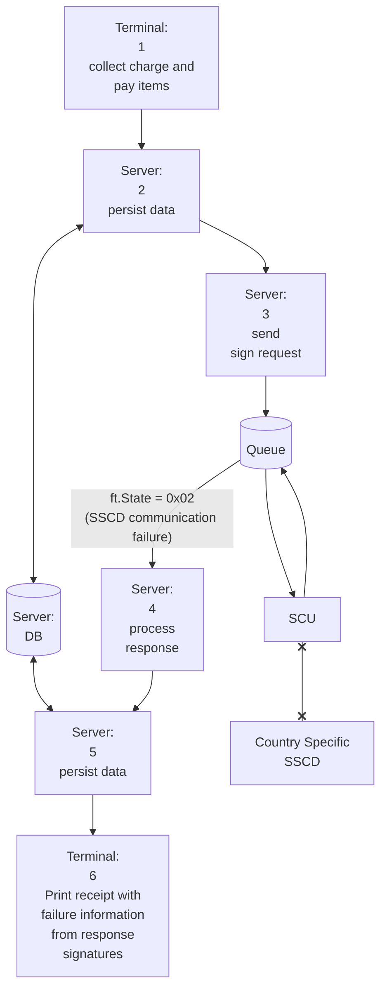
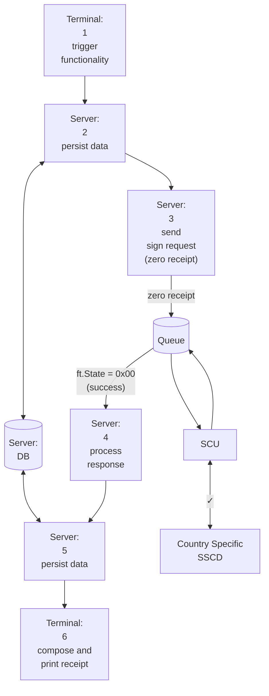
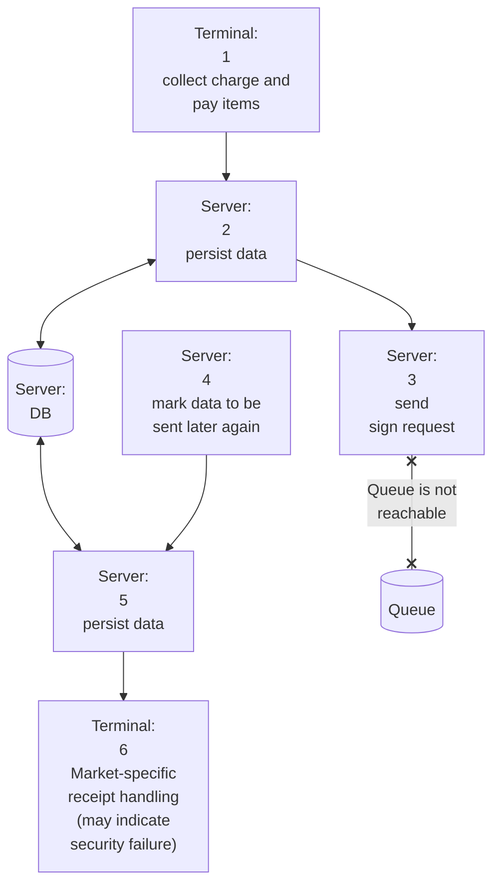
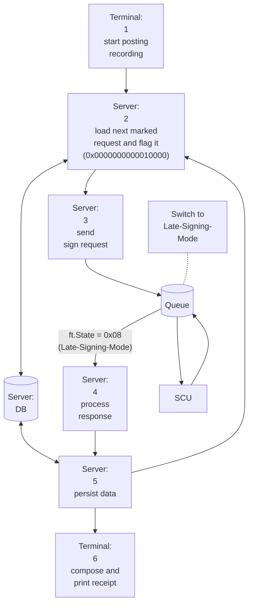
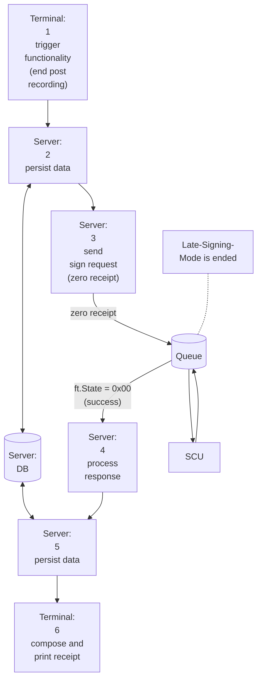

# Failure Scenarios

This section describes failure scenarios when using the fiskaltrust.Middleware and how to handle them.

On a high level, three types of failure scenarios must be considered. These are described in detail in the following sections:

1. **Signature Creation Unit not reachable or failing:** If the SCU is not reachable or returns an error (e.g. due to an outage of the wrapped signing device or service), the Middleware enters failed mode (circuit-breaker state). In this state, no further SCU calls are executed. Failed mode must be reset by sending a zero receipt.
2. **Middleware not reachable or failing:** If the cash register does not receive a response from the Middleware (e.g. due to a network or server outage), receipts must be re-sent once the Middleware becomes reachable again. The flag `0x0000000000010000` must be used to activate late-signing mode. If required by local regulations, the Middleware will automatically perform late signing of receipts. After all receipts have been successfully re-sent, failure mode must be exited by sending a zero receipt.
3. **Cash register outage:** If the entire cash register/POS system is unavailable (e.g. due to a power outage or system failure) and local fiscalization laws require tracking of handwritten receipts (e.g. in Germany), receipts may be re-sent to the Middleware after the system is restored. In this case, the handwritten `ftReceiptCaseFlag` `0x0000000000080000` must be used.

## Signature Creation Unit not reachable or failing

If the communication between the Middleware and the SCU fails (e.g. when the secure Signature Creation Device is not reachable), the POS System can continue to operate until the SCU is accessible again, and the Middleware will handle all legally required steps (e.g. re-signing receipts, if required in the respective market). Receipts created in a state where no communication is possible with the SCU are still secured by the security mechanism of fiskaltrust. The fiskaltrust.Middleware will respond with the `ftState` = `0xXXXX000000000002` ("SCU communication failed"), where `XXXX` represents the local market code (see the reference tables in the appendices for more details). The POS system receives this response and processes the contained data. For subsequent Requests, no more communication attempts are done in order to avoid long waiting times for each Receipt request/Receipt response sequence.

The Middleware uses a circuit breaker pattern for this failure mode. After a communication failure is detected, further SCU calls are suppressed until recovery. This prevents repeated failures during temporary outages and ensures that POS operations can continue without blocking due to SCU timeouts.

*Figure 1. Receipt flow when the Signature Creation Unit is not reachable and the Middleware enters failed mode.*
  
When the SCU becomes reachable again, a Zero-Receipt must be sent. This triggers a communication retry towards the SSCD. If the fiskaltrust.Middleware is able to connect to the SCU again, the `ftState` = `0xXXXX000000000000` (ok) is returned to the POS system via the response and the fiskaltrust.Middleware is ready for normal operation again. Furthermore, the response contains a listing of the requests that were not signed by the SSCD. The requests affected by the failure of the communication with the SCU do not have to be sent to the Queue again after the problem has been resolved.

:::tip

We recommend to make the Zero-Receipt after a failure a manual operation, and not automatically send it via the POS system as soon as a failure state is returned. In most scenarios, only Operators can determine if the connection to the SSCD can be re-established, e.g. when the internet or the device is reconnected. Automatically sending a Zero-Receipt may result in unnecessary delays if the connection is still unavailable at that point in time.

:::

:::tip

We recommend to not manually print the text "SCU communication failed", but to print the content of the SignatureItem returned in the Middleware's response when operating in failed mode (as the text in there will fulfill local requirements, e.g. for the language of the text).

:::

*Figure 2. Recovery flow after the SCU connection is re-established via a Zero-Receipt.*

## Middleware not reachable or failing

If a cash register cannot communicate with the fiskaltrust.Middleware, the cause is typically a failure of the network connection, the Middleware host, or the Middleware itself. In this state, the electronic recording system is not operational, and access to the journal is not available.

*Figure 3. Receipt flow when the cash register cannot communicate with the fiskaltrust.Middleware.*

In this case, the following steps must be taken:

  - The cash register or input station must automatically produce a receipt and its copy.
  - The receipt must be marked with the identification "electronic recording system failed" and include the current failure counter.
  - This copy needs to be kept until the failure is resolved. The creation and storage of the receipt copy can also be done electronically by the cash register or terminal.
  - After communication with the fiskaltrust.Middleware is restored, the cash register or the input station must send all receipts marked with the identification "receipt copy, electronic recording system failed" to fiskaltrust.Middleware. The ReceiptCase must be flagged with the code "failed receipt" to indicate the failure state to fiskaltrust.Middleware, which will then issue a receipt response with the `ftState` "Late Signing Mode".

*Figure 4. Late-signing mode used to re-send receipts once the Middleware is reachable again.*

After the fiskaltrust.Middleware has received an "end of failure receipt" (i.e. a Zero-Receipt), the failure status is terminated by receiving a response with normal state code.

*Figure 5. Ending late-signing mode by sending a Zero-Receipt to return to normal operation.*

:::tip

We recommend resending the first failed receipt using the "receipt request" flag `0x0000000080000000`, which checks if a receipt was already sent and returns it in that case (to cover the case when the Middleware received and processed a receipt, but the answer was lost, e.g. due to a network outage). More details about this flag can be found [here](../reference-tables/reference-tables.md#ftreceiptcaseflag)

:::

## Cash register outage

In case of a complete outage of the cash register, most fiscalization laws require to track the data on handwritten receipts or specific notebooks. For POS systems that support tracking these receipts after the cash register comes back online, we recommend sending them to the Middleware as well to ensure a consistent receipt trace (e.g. in exports).

In this case, the following steps _may_ be taken:

- While the cash register is offline (e.g. due to a power outage, system failure, etc.) handwritten receipts should be created, and the receipts should be tracked (e.g. in a notebook), depending on the local requirements.
- Once the cash register is operational again, the receipts may be tracked in the cash register.
- When this happens, the receipts should be sent to the Middleware as well, including the `ftReceiptCaseFlag` `0x0000000000080000` to mark that this is a handwritten receipt.

:::warning

When re-signing failed receipts, they must be signed in the same order in which they were originally created. Particularly this means that values sent under the `cbReceiptMoment` field in the individual sign requests must be sequential (ascending order). 

Incorrect re-signing example:

1. Receipt Nr.1: cbReceiptMoment: "2026-01-01T12:00:05Z"
2. Receipt Nr.2: cbReceiptMoment: "2026-01-01T12:00:00Z"

:::
