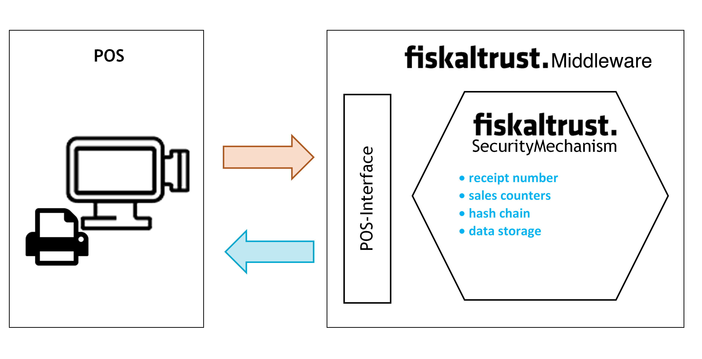
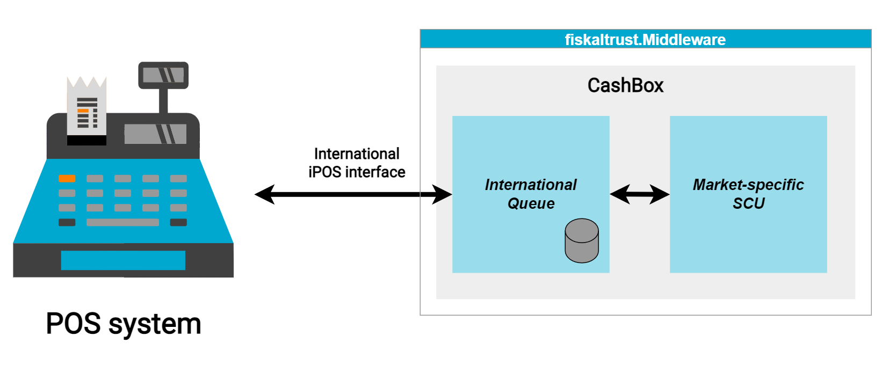
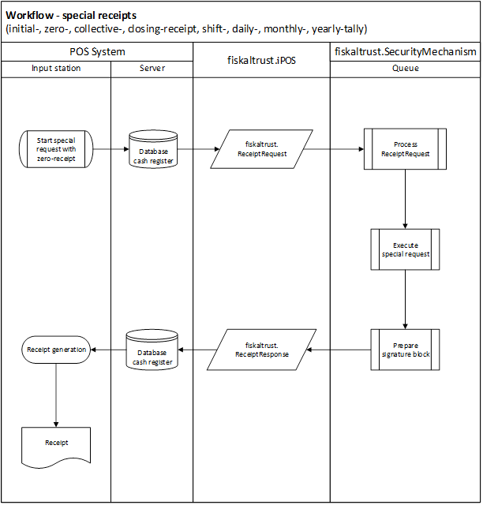
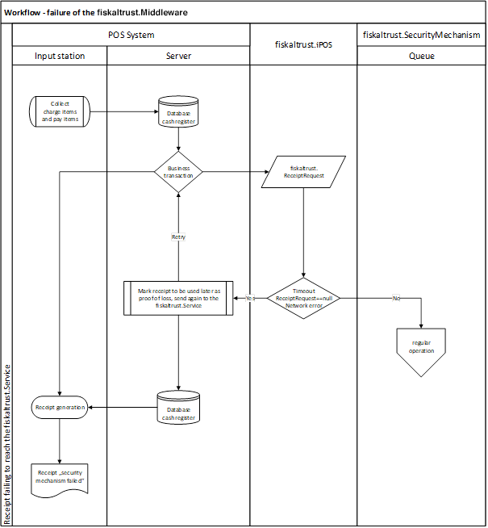
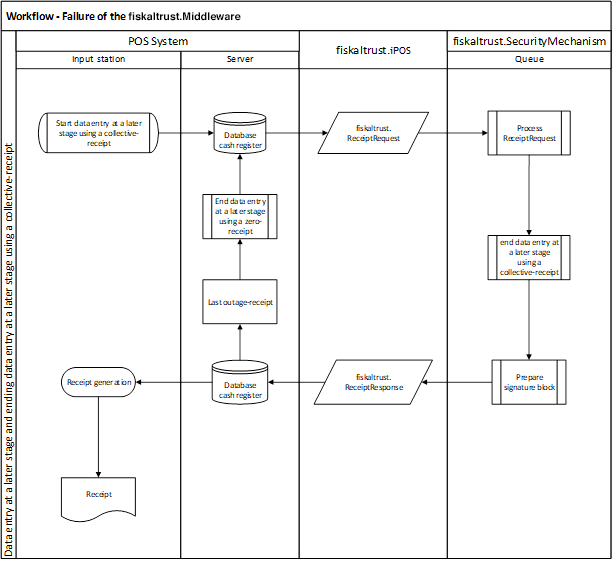
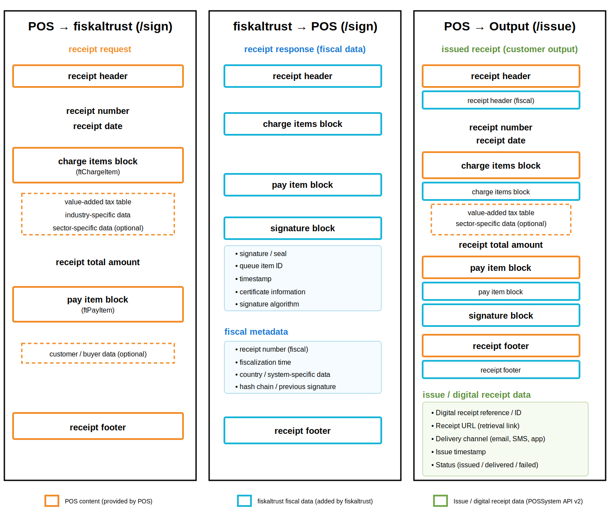

# Cash Register Integration

While designing the integration of fiskaltrust.Middleware into Cash Register Systems, our goal was to minimize the impact to the existing workflow as much as possible. With that in mind we've developed the following implementation suggestion.

The best time for the integration is right after all services and payments have been gathered and the receipt has been created in the system, but before it is being printed (response created electronically). Right at that point the receipt data will be transferred to the fiskaltrust.SecurityMechanism via fiskaltrust.iPOS.

## Receipt creation process

This chapter describes the general process and workflow of creating receipts with fiskaltrust.Middleware.

### The fiskaltrust.SecurityMechanism

The regular workflow of the fiskaltrust.SecurityMechanism defines the steps required to create a receipt as follows:

  - assign a sequential receipt number
  - increase sales counters
  - chain receipts
  - save all data

This additional receipt data, generated by the fiskaltrust.SecurityMechanism, is sent back to the cash register and must be stored in the POS. Once storage is completed, the entire receipt - containing both the cash register and the fiskaltrust.SecurityMechanism data - can be issued either as a printed paper or as an electronic receipt.

In addition to the security mechanism workflow, the fiskaltrust.Middleware processes some of the most essential data fields on the receipt. The receipt number, serving as a unique identifier of a receipt transmitted by the cash register, is created by the fiskaltrust.Middleware to ensure that each receipt is properly processed.

Compliance is achieved through a combination of several methods and components.

First, the fiskaltrust.Middleware ensures that all receipts are processed by a third party, in addition to the PosCreator and PosOperator. This represents the organizational implementation of security.

As the technical implementation of security, each request and response is hashed to ensure the integrity of the data. To guarantee immutability, another hash value is generated that relates to the entire request-response cycle. This includes the cycle identification, the time of operation, the human-readable document number, and the hash values of the request, response, and the previous receipt, called the document hash value. This concatenation of the receipt hash value provides immutability and the ability to detect any changes or deletions in actions provided by the POS system.

To limit the risk of attacks on the chain originating from the last unlinked hash value, fiskaltrust provides a mechanism that mirrors the current data to the fiskaltrust cloud. This data mirror can detect attacks that would not be visible at the cash register itself.

As the final component of the security mechanism, the fiskaltrust.Middleware also provides direct implementations for all relevant market-related security mechanisms (e.g., smart cards and online signing in Austria, and **all** TSSs in Germany).

To remain open to different platforms and operating systems and to act as a stable interface to the POS system, the fiskaltrust.Middleware follows a strict architecture:

The configuration container - identified by the unique `CashboxId` - can be integrated into various platforms and operating systems. The management of the configuration and status of these components is handled through the market-related fiskaltrust.Portal. The fiskaltrust security mechanism is provided by the Queue component and the SCU (Signature Creation Unit) component, which implements the market-related security mechanism requirements.

### Workflow - regular operation

The following diagram illustrates the regular creation of a receipt with fiskaltrust.Middleware. The implementation of a fiskaltrust.SecurityMechanism may differ between countries and derive from their national laws – for details please refer to the appropriate appendix.

### Workflow - special receipts

The following diagram illustrates the creation of a special receipt with fiskaltrust.Middleware. For a general description of special receipts, please refer to ["Receipt for special functions"](#receipt-for-special-functions) Chapter. For national laws on receipts, refer to the appropriate appendix.

### Workflow - failure of communication or failure of the fiskaltrust.Middleware (timeout)

The following diagram illustrates the workflow of a failure of fiskaltrust.Middleware. For a description of recovering, please refer to the appropriate appendix.

## Receipt for special functions

There are several receipt requirements fulfilled by the fiskaltrust.Middleware in addition to the usual receipts produced by business transactions. Those special receipts can support the process of collecting additional information.

This section describes the receipt types used for those special functions. For further information on how to fulfil the requirements of national laws, please refer to the appropriate appendix.

### Zero Receipt

A zero receipt is a universal data carrier and storage. The cash register sends a receipt with an empty charge items block (ftChargeItem) and an empty pay items block (ftPayItem) which logically contain a total amount of "0".

The fiskaltrust.SecurityMechanism sends the necessary blocks, such as the receipt header, the charge item block, and the signature block in the response. This response is either printed or issued electronically and has to be archived.

Further you can find examples of special cases of zero receipts.

#### Start Receipt (Initial Receipt)

The start receipt has to be sent before the security mechanism is used for the first time. This receipt receives a meaningful response from fiskaltrust.SecurityMechanism only the first time: in order to start operative calculations.

#### Stop Receipt (Closing Receipt)

The stop receipt is required for scheduled decommissioning of security mechanisms and/or cash registers. The stop receipt is used to switch off: the receipt chaining, the counter up-counting, and the totalizer storing. It also concludes the data collection log.

This receipt has a meaningful response from fiskaltrust.SecurityMechanism only the first time: in order to stop operative calculations and the operation of a queue. After receiving a stop receipt the queue will be closed. There will be no positive response from the cash register when a receipt is sent to a closed queue.

A closed queue can’t be reopened with a start receipt. Instead, a new queue has to be generated and initialized with a start receipt.

#### End of Failure Receipt (Collective Failure Report)
The End of failure Receipt is required to exit the late signing mode when the receipts created during a failure are transferred.
After fiskaltrust.Middleware has received an "end of failure receipt", the status of failure is terminated by receiving a response with normal state code.

## Receipt structure

This chapter describes the receipt structure.

*Figure 8. Receipt Structure - general; cash register-receipt data (header, charge items, pay items, footer) and fiskaltrust-receipt data (header, charge items, pay items, signature, footer)*

### Receipt Header

The receipt header can be branded with label and/or logo of the issuing company (see figure above) which is usually done already at the cash register. If required, receipt header can be further extended through fiskaltrust.Middleware.

### Charge Items Block

The charge items block on the cash register receipt contains the details of services or items sold. In addition, a tax on sales code or other item specific data (such as e.g. the serial number) can be included.

If required, the charge items block can be extended through fiskaltrust.Middleware. This should be done by setting the quantity or the amount due to "0" to keep the amount unchanged (e.g. a cash transactions amount).

### Pay Items Block

The pay items block of the cash register receipt contains the details of payments of business transactions received (these include payments with bank or credit card, or other comparable electronic means of payments, cash cheques as well as vouchers, coupons, token coins or similar means of payment) in local currency.

If required, the pay item block can be extended through fiskaltrust.Middleware. As with the charge items block, this should only be done by setting the quantity or the amount due to "0" in order not to change cash and cash equivalents.

### Signature Block

The fiskaltrust.SecurityMechanism generates signature blocks, which include security features defined by national laws (see appropriate appendix for further definition). They may also include some optional additional information, such as references to training or reverse posting, or an information about an operating failure of the signature creation device. Cash registers should add the signature block to the receipt output between the pay item block and the receipt footer.

### Receipt Footer

The receipt footer contains messages or announcements for the customer. It can be extended through fiskaltrust.Middleware. The cash register can display additional rows before or after the receipt footer. The rows of the receipt footer of the fiskaltrust.Middleware should be included in any case, as they can contain important directions for the company or customer regarding the handling of receipts.

## Data Collection Log

The Data Collection Log is generally defined by national laws. For further, country-specific information, please refer to the appropriate appendix.

## fiskaltrust.ReceiptJournal

The fiskaltrust.ReceiptJournal is used to record, hash, and chain all requests to the fiskaltrust.Middleware and the resulting responses. The first part of the returned ReceiptIdentification is an upcounting number generated by ReceiptJournal.

## fiskaltrust.ActionJournal 

The fiskaltrust.ActionJournal collects all operational incidents. This can be the date and time of start or failure of the service, as well as any other information related to fiskaltrust.Middleware and fiskaltrust.SecurityMechanism.
