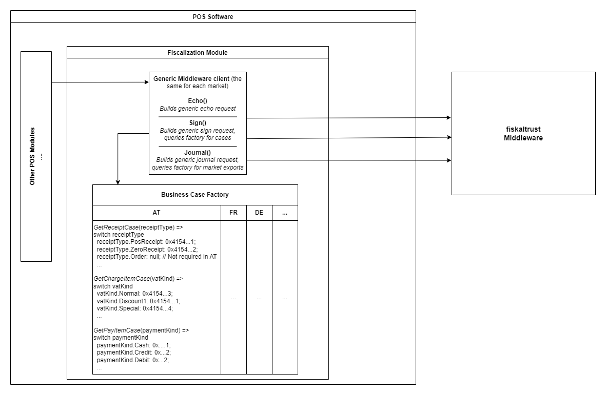

# Multi-Markets Integration

This guide provides an overview of the business cases that should be implemented for each supported market.

Market-specific behavior is automatically determined based on the configured fiskaltrust queue. POS systems no longer need to handle or map country codes manually, which simplifies multi-market integrations.

## Typical Sign Flow

### Generate generic receipt requests

The typical sign flow starts when a cash register transfers receipt data to the fiskaltrust.Middleware using the `ReceiptRequest` data structure. The request is then processed by the fiskaltrust.SecurityMechanism. After processing, the resulting data is added to the `ReceiptResponse`, which is returned to the cash register and can be used for printing or digital receipt delivery. For more information, see [Cash Register Integration](../../general/cash-register-integration/cash-register-integration-regular-workflow.md)

POS systems should generate generic receipt requests whenever possible. Market-specific behavior is automatically determined based on the configured fiskaltrust queue. Therefore, country-specific mappings for receipt cases, charge items, or pay items are generally no longer required in the POS implementation.

Some business cases may still differ between markets. If a specific operation is not supported in a market, no corresponding receipt case needs to be provided. For example, the `Order` operation is handled differently in Austria and France.

## Mapping Table

The following table provides an overview of common business cases (for example, **ftReceiptCase**, **ftChargeItemCase**, and **ftPayItemCase**) across the supported markets.

The market context is automatically determined by the configured fiskaltrust queue. The table is intended as a reference for understanding market-specific differences and supported business cases.

More detailed information about **ftReceiptCase**, **ftPayItemCase**, and **ftChargeItemCase** values can be found in the corresponding country-specific appendices.

|**Business Cases** | **AT** | **DE** |**FR** |**ME**|**IT**|
|----------------------|-----------|-----------------------|--------------------------------------|-----------------------------|-----------------------------|
|**ftReceiptcase**|||||||
|Cash sales / POS-receipt / Ticket|`0x4154000000000001`|`0x4445000100000001`|`0x4652000000000001`|`0x4D45000000000001`| `0x4954200000000001`|
|Zero receipt|`0x4154000000000002`|`0x4445000000000002`|`0x465200000000000F`|`0x4D45000000000002`| `0x4954200000002000`|
|Initial operation/start receipt|`0x415400000000000`|`0x4445000000000003`|`0x4652000000000010`|`0x4D45000000000003`| `0x4954200000004001`|
|Out of operation/stop receipt|`0x4154000000000004`|`0x4445000000000004`|`0x4652000000000011`|`0x4D45000000000004`| `0x4954200000004002`|
|Monthly closing|`0x4154000000000005`|*optional* `0x4445000000000005`|`0x4652000000000006`|`0x4D45000000000005`||
|Yearly closing|`0x4154000000000006`|*optional* `0x4445000000000006`|`0x4652000000000007`|`0x4D45000000000006`||
|Daily closing|| `0x4445000000000007`|`0x4652000000000005`||`0x4954200000002011`|
|Opening balance||||`0x4D45000000000007`||
|Cash withdrawal||||`0x4D45000000000008`||
|Start-transaction Receipt||`0x4445000000000008`||||
|Update-transaction Receipt||`0x4445000000000009)`|||
|Fail transaction Receipt||`0x444500000000000B` (single) `0x444500010000000B` (multiple) |||||
|Initiate SCU switch||`0x4445000000000017`||||
|Finish SCU switch||`0x4445000000000018`||||
|Archives|||`0x4652000000000015`|||

|**Business Cases** | **AT** | **DE** |**FR** |**ME**|**IT**|
|----------------------|-----------|-----------------------|--------------------------------------|-----------------------------|-----------------------------|
|**ftChargeItemcase**| | | | | |
|Unknown type of service/product normal|`0x4154000000000003`|`0x4445000000000001`|`0x465200000000003`|`0x4D45000000000001`|`0x4954200000000003`|
|Unknown type of service/product discounted-1|`0x4154000000000001`|`0x4445000000000002`|`0x465200000000001`|`0x4D45000000000002`|`0x4954200000000001`|
|Unknown type of service/product discounted-2|`0x4154000000000002`||`0x465200000000002`||`0x4954200000000002`|

|**Business Cases** | **AT** | **DE** |**FR** |**ME**|**IT**|
|----------------------|-----------|-----------------------|--------------------------------------|-----------------------------|-----------------------------|
|**ftPayItemcase** ||||||
|Cash payment in national currency|`0x4154000000000001`|`0x4445000000000001`|`0x4652000000000001`|`0x4D45000000000001`|`0x4954200000000001`|
|Cash payment in foreign currency|`0x4154000000000002`|`0x4445000000000002`|`0x4652000000000002`|`0x4D45000000000002`||
|Crossed cheque|`0x4154000000000003`|`0x4445000000000003`|`0x4652000000000003`|`0x4D45000000000003`|`0x4954200000000003`|
|Debit card payment|`0x4154000000000004`|`0x4445000000000004`|`0x4652000000000004`|`0x4D45000000000004`|`0x4954200000000004`|
|Credit card payment|`0x4154000000000005`|`0x4445000000000005`|`0x4652000000000005`|`0x4D45000000000005`|`0x4954200000000005`|
|Online payment|`0x4154000000000007`|`0x4445000000000006`|`0x4652000000000007`|`0x4D45000000000008`|`0x4954200000000007`|
|Customer card payment|`0x4154000000000008`|`0x4445000000000007`|`0x4652000000000008`|`0x4D45000000000009`|`0x4954200000000008`|
|Sepa transfer|`0x415400000000000C`|`0x4445000000000008`|`0x465200000000000C`|`0x4D4500000000000A`|`0x495420000000000A`|
|Internal material consumption|`0x4154000000000011`|`0x444500000000000A`|`0x4652000000000011`|`0x4D4500000000000C`|`0x495420000000000D`|
