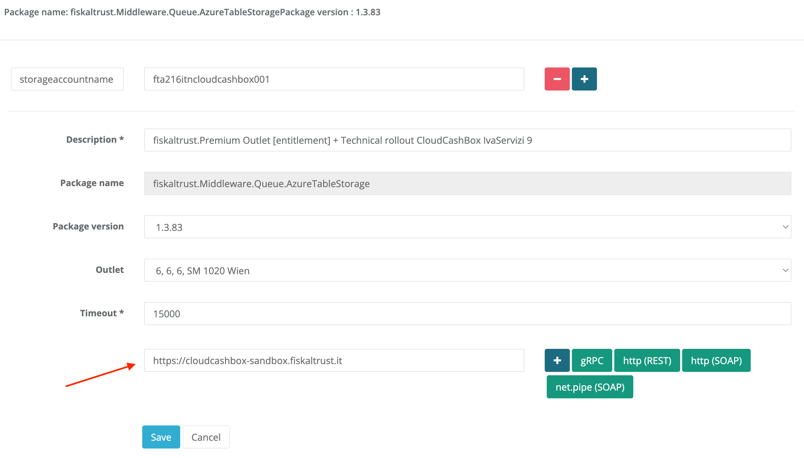
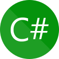

# Communication

The fiskaltrust.Middleware supports different communication protocols, effectively giving our users the possibility to use it on all currently available platforms and implement the interface in all state-of-the-art programming languages. This enables our users to choose the communication type that suits their scenario best.

The communication protocol is specified by setting the respective URL in the package configuration of the fiskaltrust.Portal. The buttons to the right of the URL field can be used to quickly insert the respective URL:

:::note

Buttons for other URL options (e.g. gRPC) may be available depending on the selected country or market.

:::

:::info

Depending on the version of the Middleware, different protocols are supported. For a summarized overview, please see the table at the end of this section. We are continuously working on unifying the Middleware experience across all markets to provide the same communication protocols and operating system.

:::

## gRPC

The gRPC protocol is currently available only in the Middleware for Germany. For more information, see the [German appendix](../../middleware-de-kassensichv/communication/communication.md).

We recommend using gRPC for new implementations, as it has several advantages (including performance, reliability, asynchronous streams, and static message contracts) and is supported by most programming frameworks.

## REST web service

When selecting REST (_Representational State Transfer_), the Middleware hosts a HTTP service that can be used like any commonly used web service. Messages can be encoded in either _JSON_ or _XML_, depending on the user's preference.

The offered REST functions accept POST request. The URL is composed as follows: `http://[specified-url]/[xml|json]/[v0|v1]/[echo|sign|journal]`.

For sample requests of the most commonly used receipt cases and journals, see the [Postman Collection](https://github.com/fiskaltrust/middleware-demo-postman).

XSD files which describe the REST interface of the fiskaltrust.Middleware are available at [dist/XSD](https://github.com/fiskaltrust/interface-doc/tree/master/dist/XSD).

We recommend using REST in case you're already familiar with its principles and don't want to use gRPC for any reasons.

### Country specifics

In Austria and France, REST can currently only be used by adding a _helper_ package provided by fiskaltrust. For more information, see the [Austrian appendix](../../middleware-at-rksv/communication/communication.md). In Germany, the Middleware natively supports REST without using a helper.

## WCF Web Service

_Windows Communication Foundation_ (WCF) provides access to the fiskaltrust.Middleware with SOAP calls, either via a network or a pipes based communication approach. Further information about WCF can be found in the [official Microsoft documentation](https://docs.microsoft.com/en-us/dotnet/framework/wcf/bindings).

WCF supports different underlying protocols, including _http, https, net.tcp_, and _net.pipe_ (which is most interesting in cases where the system's configuration prevents opening TCP ports). To configure a custom message size and a custom time out, it is possible to specify the parameter `messagesize` (in bytes) and the parameter `timeout` (in seconds) on the configuration page.

A WSDL file which describes the WCF interface of the fiskaltrust.Middleware is available at [dist/WSDL](https://github.com/fiskaltrust/interface-doc/tree/master/dist/WSDL).

## User specific protocols

With the Middleware's _helper_ topology, it is possible to connect the Middleware to POS systems in every scenario, as it can be easily extended to support any other protocol as well. Contact our support if you require assistance for a special case.

## Summary

The following table provides an overview of which communication protocols are currently available in each country.

| Communication service | AT                         | DE            | FR                         | IT            |
|-----------------------|----------------------------|---------------|----------------------------|---------------|
| **gRPC**              | not yet supported          | **supported** | not yet supported          | **supported** |
| **REST**              | **supported (via helper)** | **supported** | **supported (via helper)** | **supported** |
| **WCF**               | **supported**              | **supported** | **supported**              | **supported** |
| **serial/TCP**        | **supported (via helper)** | not supported | not supported              | not supported |

As mentioned above, the Middleware versions will be unified in the upcoming version 2.0. 

## Sample implementations

The latest sample implementations, demonstrating the recommended communication protocols for the respective programming languages, are available as follows:

| C# | Java | Node.js | Android | Postman |
|----|------|---------|---------|---------|
|  |  |  |  |  |

Additional sample implementations, including legacy examples, are available in our [demo repository](https://github.com/fiskaltrust/demo).
