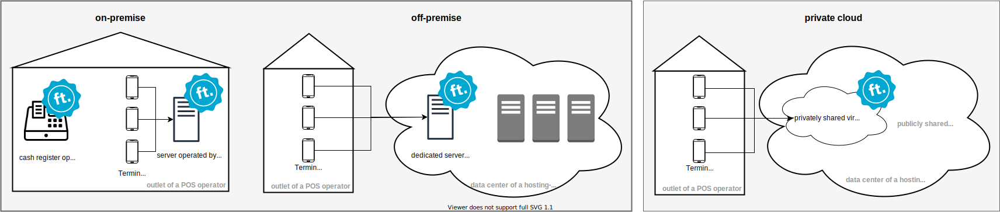

# Operation Modes

The fiskaltrust.Middleware can be operated in following operational environments:

([click to enlarge](images/operational-environments.svg))

Identification of the operational environment from the perspective of a POS operator:

| hosted in-house | hosted in a different building         | dedicated hardware resource                                      | privately shared (hardware) resource        | operational environment |
|-----------------|----------------------------------------|------------------------------------------------------------------|---------------------------------------------|-------------------------|
| **yes**         | no                                     | **yes** *(e.g. on a cash register or local network server)* | no                                          | **on-premise**          |
| no              | **yes** *(e.g. in a data center)* | **yes** *(e.g. dedicated server)*                           | no                                          | **off-premise**         |
| no              | **yes**                                | no                                                               | **yes** *(e.g. virtualised resources)* | **private cloud**       |

Availability of supported operational environments is dependent on the market as shown in the following table:

| operation mode                                   | AT                                                               | DE                                               | FR                                                            | IT            |
|--------------------------------------------------|------------------------------------------------------------------|--------------------------------------------------|---------------------------------------------------------------|---------------|
| **on- & off-premise**                            | **available**                                                    | **available**                                    | **available**                                                 | **available** |
| **private Cloud** *operated by a 3rd party* | **available**                                                    | **available**                                    | not available *generally supported, but not offered*     | **available** |
| **private Cloud** *operated by fiskaltrust* | **available** *(by the fiskaltrust product SignatureCloud)* | not available *due to legal restrictions* * | **available** *(by the fiskaltrust product ChaîneCloud)* | **available** |

*In Germany, the fiskaltrust.Middleware must always be operated as a local component of the electronic recording system. For example, if the electronic recording system runs on a local Windows based cash register, the fiskaltrust.Middleware has to be operated on the same operational environment (this could be the same machine, or a local network server). If the electronic recording system is a SaaS solution operated in the Cloud, the fiskaltrust.Middleware has to be operated in the same data center.
