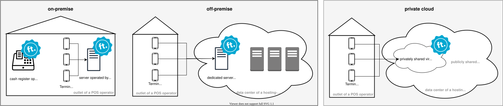

# Operation Modes

The fiskaltrust.Middleware can be operated in following operational environments:

Identification of the operational environment from the perspective of a POS operator:

| Hosted in-house | Hosted in a different building | Dedicated hardware resource | Privately shared (hardware) resource | Operational environment |
|-----------------|------------------------|------------------|---------------------|-------------------------|
| **Yes** | No | **Yes** *(e.g. on a cash register or local network server)* | No | **On-premise** |
| No | **Yes** *(e.g. in a data center)* | **Yes** *(e.g. dedicated server)* | No | **Off-premise** |
| No | **Yes** | No | **Yes** *(e.g. virtualised resources)* | **Private Cloud** |

The availability of supported operational environments depends on the market, as shown in the following table:

| Operation mode | AT | DE | FR | IT |
|----------------|----|----|----|----|
| **On- & off-premise** | **Available** | **Available** | **Available** | **Available** |
| **Private Cloud** *operated by a third party* | **Available** | **Available** | Not available *generally supported, but not offered* | **Available** |
| **Private Cloud** *operated by fiskaltrust* | **Available** *(by the fiskaltrust product CloudCashbox)* | **Available** *(by the fiskaltrust product CloudCashbox)*  | **Available** *(by the fiskaltrust product CloudCashbox)* | **Available** |
