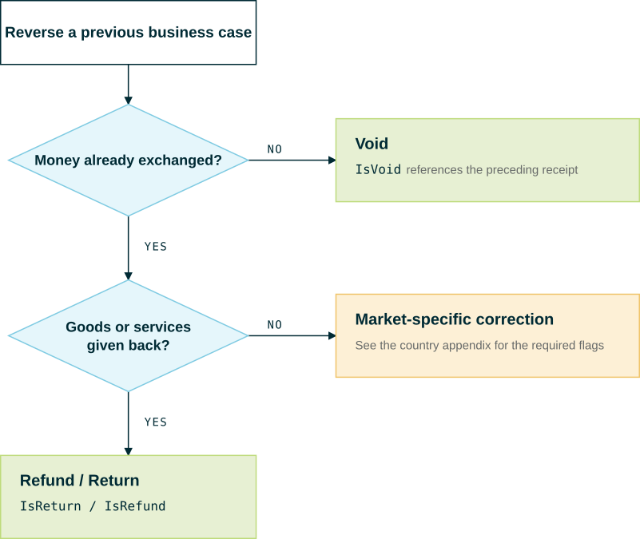

# Void vs. Refund/Return

**Voiding** a transaction and **returning/refunding** goods or services are two distinct ways to reverse a previously recorded transaction, tagged with different case flags in the fiskaltrust.Middleware interface. A **void** corrects or cancels a **receipt** before its payment is settled, referencing the receipt it supersedes. A **return/refund** records a **new business case** that offsets an earlier, already-paid sale — the original receipt stays on record, since data sent to the Middleware cannot be deleted. The two operations use separate flags (IsVoid and IsReturn/IsRefund); selecting the wrong one yields a receipt that passes validation but misrepresents the business case and produces incorrect fiscal and legal records.

This page explains the difference, when to use each, and how they map to the interface tagging system. Country-specific rules can further restrict or rename these operations. For more information, see [Market-specific considerations](#market-specific-considerations).

## The core distinction

The deciding question is: **has the exchange of money already been executed?**

| | **Void** | **Refund / Return** |
| --- | --- | --- |
| **Meaning** | Cancels/corrects a receipt as if the business case had **not happened**. | Reverses a **completed** sale — goods or services are given back after the fact. |
| **Money already exchanged?** | **No** — payment was not (yet) settled. | **Yes** — the customer already paid and is being paid back. |
| **Typical trigger** | Cashier error, wrong item, customer changes their mind before paying, mis-punched receipt. | Customer returns a purchased product later; service is refunded. |
| **Relates to** | The **immediately preceding** receipt/position that is being corrected. | An **earlier, already-closed** sale. |
| **Interface flag (receipt)** | `IsVoid` — `0x...0004...` | `IsReturn/IsRefund` — `0x...0100...` |
| **Interface flag (charge/pay item)** | `IsVoid` — `0x...0001` | `IsReturn/IsRefund` — `0x...0002` |

:::tip Rule of thumb
**Money not yet moved → Void. Money already moved → Refund/Return.**
:::

## Void

A **void** cancels or corrects a receipt that should not stand, *before the payment has been finally settled*. Because data sent to the fiskaltrust.Middleware can never be deleted (for legal reasons), a void is **not a deletion** — it is a **new receipt** that neutralizes the original.

To void a receipt:

- Send the **same** ticket again with **negative** quantities and amounts.
- Keep the original `ftReceiptCase`, but set the **`IsVoid` flag** (value `4` at position 12), e.g. `"ftReceiptCase": "0x0000000000040000"`.
- Mark the affected line items with the `IsVoid` charge-item flag (`0x...0001`) to signal that the data is cleared.
- Reference the original receipt via **`cbPreviousReceiptReference`**, set to the `cbReceiptReference` of the receipt being voided.

> For the full step-by-step workflow, see [Voided receipt regular workflow](../cash-register-integration/voided-receipt-regular-workflow.md).

For **pay items**, `IsVoid` is defined as: *"Used when the exchange of money has **not** been executed yet."* This is the technical anchor for the distinction on this page.

## Refund / Return

A **refund/return** reverses a sale that was **already completed and paid**. The goods or services come back (or the service is undone) and the customer is paid back. This is a genuine new business case that reduces turnover, not a correction of a mistake at the point of sale.

To process a return/refund:

- Send a receipt with **negative** quantities and amounts for the returned positions.
- Set the **`IsReturn/IsRefund` flag** on the receipt (`0x...0100...`) and on the affected charge items (`0x...0002`). Quantity and amount are inverted relative to the original item.
- Where the original receipt is known, reference it (e.g. via `cbPreviousReceiptReference`, or the market-specific reference block when the source receipt lives in a different queue/system).

For **pay items**, `IsReturn/IsRefund` is defined as: *"Used when the exchange of money **has already** been executed."*

:::info Unreferenced refunds
Some scenarios require refunding a customer **without** a reference to an original receipt (e.g. goodwill, or the original receipt is unknown). Support for and handling of *unreferenced* refunds is **market-specific** — do not assume it is allowed everywhere. For more information, see [Market-specific considerations](#market-specific-considerations).
:::

## Decision flow

Use this decision path to choose the correct operation:

1. **Was the original transaction already paid / money exchanged?**
   - **No** → this is a **Void**. Reverse it as a correction of the preceding receipt (`IsVoid`).
   - **Yes** → continue.
2. **Are goods/services being given back (or a paid service reversed)?**
   - **Yes** → this is a **Refund/Return** (`IsReturn/IsRefund`).
   - **No** (e.g. pure correction of an already-settled receipt) → follow the **market-specific** correction rules; the allowed mechanism can differ per country.

*Figure 1. Choosing between Void, Refund/Return, and a market-specific correction.*

## Worked examples

### Example 1 — Void (mistake before payment)
A cashier rings up 2 × coffee but the customer only ordered 1, and payment has not been finalized. The cashier voids the receipt: the same ticket is re-sent with quantity `-2`, `IsVoid` set on the receipt and line item, and `cbPreviousReceiptReference` pointing to the erroneous receipt. A corrected receipt for 1 × coffee is then issued.

### Example 2 — Refund/Return (goods returned after purchase)
A customer bought a jacket last week (paid, receipt closed) and returns it today. The POS issues a return receipt with quantity `-1` for the jacket, `IsReturn/IsRefund` set on the receipt and charge item, and a reference to the original sale. Money is paid back to the customer.

### Example 3 — Discount interaction
A charge item flagged as **Discount** (`0x...0004`) has its behavior **inverted** when combined with `IsVoid` or `IsReturn/IsRefund`. When reversing a discounted position, apply the reversal flag consistently across the position and its discount so the totals invert correctly.

## Market-specific considerations

The general model above is the interface default. National fiscalization law can **restrict, rename, or add constraints** to these operations. Always consult the relevant country appendix before implementing:

- **Whether unreferenced refunds are permitted**, and under which conditions.
- **Mandatory references** to the original document (e.g. Z-number, document number, RT serial number) when the source receipt is in a different queue or system.
- **Document-type naming** on the printed receipt (e.g. Italy's *Reso* / *Annullo* document types), and required reference lines.
- **Time limits or approval requirements** for voids vs. returns.

> Country appendices: [Austria (RKSV)](../../middleware-at-rksv/appendix-at-rksv.md), [Germany (KassenSichV)](../../middleware-de-kassensichv/appendix-de-kassensichv.md), [France](../../middleware-fr-boi-tva-decla-30-10-30/appendix-fr-boi-tva-decla-30-10-30.md), and the other market guides under **Country-Specific Guides**.

## Related pages

- [Voided receipt regular workflow](../cash-register-integration/voided-receipt-regular-workflow.md)
- [Receipt Case Definitions](../receipt-case-definitions/receipt-case-definitions.md)
- [Reference tables](../reference-tables/reference-tables.md) — `ftReceiptCaseFlag`, `ftChargeItemCaseFlag`, `ftPayItemCaseFlag`

<!--
TODO before publishing (for lead review):
- Confirm exact hex placement/examples for IsVoid vs IsReturn/IsRefund with an engineer.
- Review the decision-flow SVG (images/void-vs-refund-flow.svg).
- Fill in concrete market-specific rules per country appendix (unreferenced refund support, reference requirements, document types).
- Reviewers: @Tjark-fiskaltrust, @LGuichet.
-->
