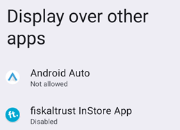
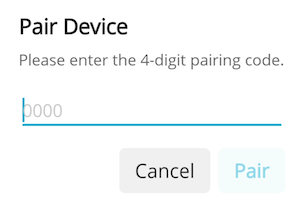

# Getting Started

To install the fiskaltrust InStore App and connect it to your cash register, complete the following steps.

## Step 1: Install the app

Refer to the [installation guides](../installation-guides/installation-guides.md) for detailed intructions.

## Step2: Start the app and grant permissions

* Once installed, launch the app.
* If prompted, enable the **Display over other apps** option (this allows the app to stay in the foreground while you work in other apps). 

:::tip

If this option is disabled, a prompt appears asking you to enable it. Confirm the setting.

:::

## Step 3: Access the fiskaltrust Portal

* If you want to test your setup in the Sandbox environment, open the fiskaltrust [Sandbox Portal](https://portal-sandbox.fiskaltrust.at/) for your country in your web browser.
* If you’re ready to go live in Production, use the [Production Portal](https://portal.fiskaltrust.at/Account/Login?returnUrl=%2fCashBox#/) for your country.

Make sure to select the correct country in the portal to match your region.

## Step 4: Select your Cashbox

In the portal, navigate to **Configuration** > **CashBox** and select your Cashbox. This is the virtual cash register you will connect to the app.
  

## Step 5: Copy the PIN for InStore App

In the CashBox overview, you will find your **PIN for InStore App**. This PIN is used to pair your app with the Cashbox. Example pairing PIN: 8639. Copy this code.

## Step 6: Enter the PIN code in the app

* Open the InStore App on your device and enter the previously copied pairing PIN into the designated field.
* Click **Pair** to connect the app to your CashBox. 

Once the pairing is successful, your app is connected to your CashBox and ready to use.

If you have any questions or encounter issues during installation, first check the following FAQ section for possible solutions. If you still need assistance, contact our support team at support@fiskaltrust.eu.

## Frequently Asked Questions (FAQ)

**Q: The printer is not showing up. What should I do?**

- **A:** Ensure that **Bluetooth** is enabled on your device. The app requires
    Bluetooth to connect to the printer. You can check the Bluetooth settings in your
    device's settings menu.

**Q: How can I reconnect the app to my Cashbox?**

- **A:** If the connection between the app and the Cashbox is lost, open the
    fiskaltrust Portal again, copy the **pairing PIN** , and re-enter it in the app. This will
    re-establish the connection.

**Q: The app isn't opening after installation. What should I do?**

- **A:** Make sure that your device has sufficient storage and that all necessary
    permissions (e.g., storage access and Bluetooth access) are granted. Try restarting
    your device and reinstalling the app if necessary.

**Q: I received an error message when pairing. What does it mean?**

- **A:** This may indicate an issue with the pairing PIN. Double-check the
    code you entered. You can also try copying it again from the fiskaltrust Portal.

**Q: How can I update the fiskaltrust InStore App?**

- **A:** To ensure you have the latest version, revisit the download page
    and install the newest version. The app will automatically update when a new
    version is available.

**Q: Can I use the app without an internet connection?**

- **A:** The app requires an internet connection for initial setup and communication
    with the fiskaltrust Portal. However, once set up, the app can function offline for
    day-to-day use, provided it has been previously paired with the CashBox.

**Q: The app is not responding or freezing. What should I do?**

- **A:** If the app freezes or becomes unresponsive, try restarting the app on your
    device. If the issue persists, check for available updates or reinstall the app to
    ensure you are running the latest version.
