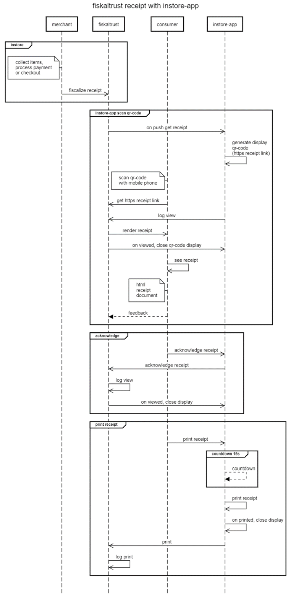
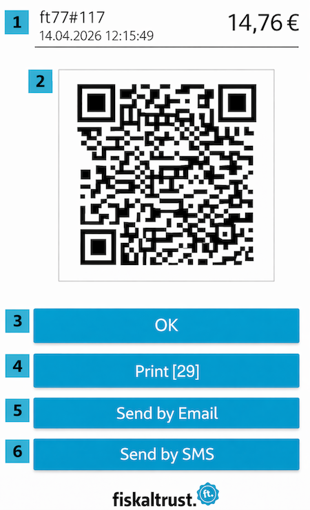
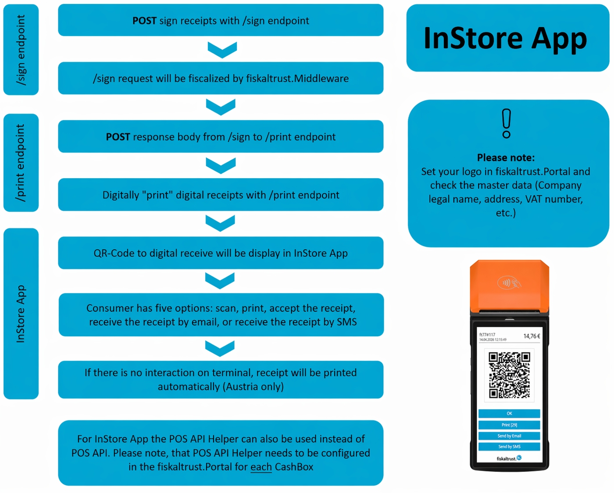
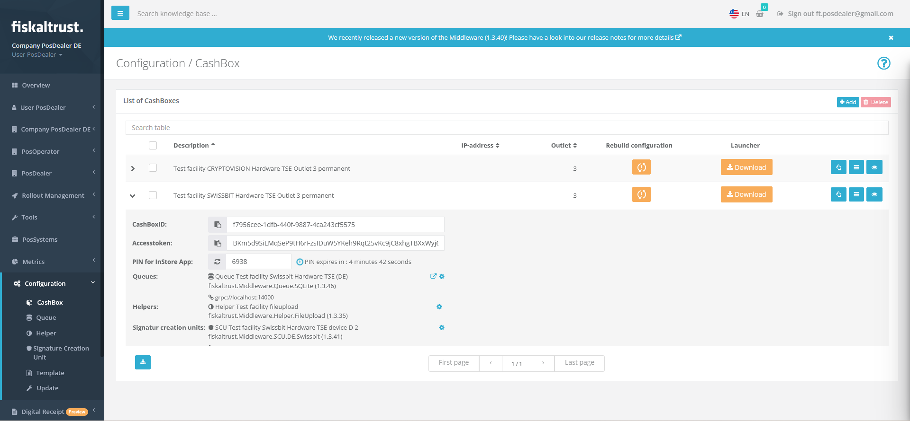
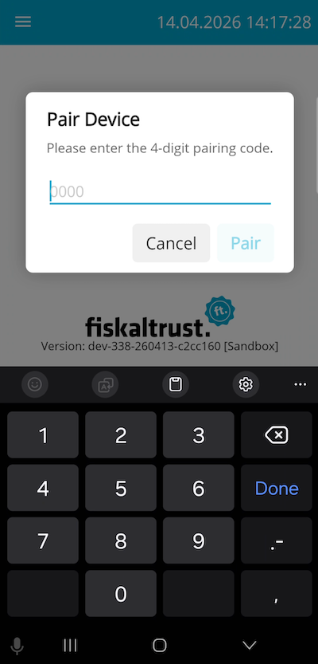

# Introduction

The fiskaltrust InStore App can be used on touch-enabled devices with an integrated thermal printer. The fiskaltrust InStore App can listen to receipt issuing of multiple CashBoxes, filtered by provided terminal-identification by each CashBox. Each time a related CashBox issues a receipt, the fiskaltrust InStore App appears on the consumer-facing touchscreen and shows the following elements: 

* The receipt number, creation time, and total amount.
* A QR code containing the HTTPS receipt link for the consumer to access the receipt.
* An OK button to manually acknowledge receipt.
* A Print button with a countdown timer to print receipt.
* A Send by Email button to send the receipt via email.
* A Send by SMS button to send the receipt via SMS.

When the QR code is scanned and the HTTPS receipt link is used to download the receipt, an acknowledgement of receipt by the consumer is logged in the background, and the current receipt display is closed. 

When the OK button is tapped by the consumer, a manual acknowledgement of receipt is logged, and the current receipt display is closed. 

When the Print button is tapped by the consumer, or when the countdown expires, a paper receipt is printed and the event is logged for analytics. The current receipt display is closed after successful printing.

When the Send by Email button is tapped by the consumer, a screen is displayed prompting the consumer to enter their email address.

When the Send by SMS button is tapped by the consumer, a screen is displayed prompting the consumer to enter their phone number.

Setting up the InStore App requires no implementation into the point-of-sale software.

Since all operations within the app (including QR code scanning, accepting, and printing) are fully logged in the fiskaltrust.Portal, the InStore App ensures compliance with Austria's obligation to issue receipts ("Belegausgabepflicht") and to accept receipts ("Belegannahmepflicht"), as well as Germany's obligation to issue receipts ("Belegausgabepflicht"). Furthermore, the app ensures that the receipt is always issued to the consumer. 

fiskaltrust appointed Dr. Markus Knasmüller from BMD to create an external assessment of the conformity of digital receipt in Austria. The final assessment can be requested via the [request form](https://forms.office.com/e/0PcMDYWC2B).

## Receiving Digital Receipts with InStore App

The following diagram describes the process of generating a digital receipt with the InStore App. The participants in the process are the merchant, fiskaltrust, the consumer and the InStore App. 



The InStore App offers five options: scanning the QR code to receive the digital receipt on a mobile phone, tapping the OK button to manually acknowledge receipt, printing the receipt on thermal paper, sending the receipt via email, or sending it via SMS.

In-store, the merchant collects items and processes the payment or checkout. The merchant then sends a sign message to fiskaltrust for fiscalization purposes. 

- **Scan QR code:** The InStore App continuously listens to the fiskaltrust receipt backend for incoming receipt push events. When an HTTPS receipt link is received, it displays a QR code on the device screen. The consumer scans the QR code with their mobile phone and receives the HTTPS receipt link. The InStore app sends a log to the fiskaltrust backend indicating that the receipt was scanned by the consumer. The fiskaltrust backend renders the receipt, and the QR code display on the InStore App device is closed. The consumer can now accesses the HTML receipt document and provide feedback regarding the receipt. 

- **Acknowledge:** The consumer manually acknowledges receipt by tapping the OK button in the InStore App. The InStore app sends a log to the fiskaltrust backend indicating that the receipt was acknowledged manually. The InStore app receives a response from the fiskaltrust backend to close the display. 

- **Print receipt:** Consumers can manually initiate paper receipt printing on the InStore App device by tapping the Print button. Additionally, if there is no user interaction, a paper receipt is automatically printed after a default countdown of 15 seconds. Once the receipt is printed, the display closes and the print command is logged.

- **Send receipt via email:** Consumers can choose to receive the digital receipt via email by tapping the Send by Email button on the InStore App device. A screen will then be displayed where the consumer can enter their email address.

- **Send receipt via SMS:** Consumers can choose to receive the digital receipt via SMS by tapping the Send by SMS button on the InStore App device. A screen will then be displayed where the consumer can enter their phone number.

## Displaying Receipts in the InStore App



| Number | Description |
|--------|-------------|
| 1 | Receipt number (ft77#117), date, time, and total amount |
| 2 | QR code to access the digital receipt document |
| 3 | `OK` button to confirm and close the receipt view |
| 4 | `Print` button to print the receipt |
| 5 | `Send by Email` button to send the receipt via email |
| 6 | `Send by SMS` button to send the receipt via SMS |

## Configuring InStore App

This high-level overview shows the steps required to implement and configure the InStore App in your point-of-sale software.



## Configuring Master Data

For more information about the configuration steps for the master data, see [Digital Receipt Introduction](https://docs.fiskaltrust.cloud/docs/posdealers/buy-resell/products/digital-receipt#introduction).

## Implementing InStore App 

fiskaltrust provides two implementation methods for the InStore App. The first approach is via the POS API Helper, which is recommended for testing/sandbox environments as well as for small installations. Configuring the POS API Helper within the fiskaltrust.Portal requires no implementation effort in your point-of-sale software.

The POS API is the latest addition to the digital receipt ecosystem. It is a superset of the Middleware's original IPOS interface and uses the same models for `/sign`, `/journal`, and `/echo`. The core features of this API provides a variety of functionalities for point-of-sale software and serve as the central entry point to the fiskaltrust.Middleware. For the InStore App, the `/print` endpoint is required to digitally print digital receipts.

This means that existing implementations can be easily reused by adapting them to the asynchronous flow. The IPOS interface will continue to be fully supported by the Middleware.

As most operations, especially `/print` requests, may take an extended amount of time, this API is designed to be fully asynchronous. After sending a request to the `/print` endpoint, the InStore App immediately displays the QR code. Note that the `/sign` operation does not necessarily need to be implemented for the InStore App. 

A general sample of this process flow is illustrated as follows:


:::warning

The fiskaltrust InStore App requires a permanent and stable internet connection.

:::

## Availability

The production API is available at https://pos-api.fiskaltrust.cloud as for all fiskaltrust services, the sandbox instance should be used for development and testing and is available at https://pos-api-sandbox.fiskaltrust.cloud.

The same endpoints will also be added to the on-premise Launcher (natively in version 2.0, and via additional Helper packages for earlier versions).

:::info

- **Sign** endpoint is only available in Austria with the Cloud CashBox.
- **Print** endpoint is available in Austria and Germany.

:::

## Authentication

Authentication is handled via the `CashBoxID` and `Accesstoken` headers, which are mandatory for each request. These values can be obtained by creating a CashBox in the one of the country-specific fiskaltrust.Portal.

## Operation Flow (Digital Receipt)

Typically, a complete receipt flow when using digital receipt (sign, print, and response) looks as follows:

1. Call the `/sign` endpoint and wait asynchronously for the result.
2. If signing is successful, call the `/print` endpoint. The InStore App then displays the QR code to the digital receipt.

## Asynchronously Sign a Receipt According to Local Regulations (Sign Endpoint)

This method can be used to sign different types of receipts in accordance with local fiscalization regulations. After signing the receipt according to fiscal law, the method asynchronously returns the data that will be displayed on the digital receipt.

The format of the receipt request is documented in the Middleware API documentation. The exact behavior of the method is determined by the cases sent within the properties (for example, `ftReceiptCase`, `ftChargeItemCase`, and `ftPayItemCase`).

**POST:**

https://pos-api.fiskaltrust.cloud/v0/sign (Production)

https://pos-api-sandbox.fiskaltrust.cloud/v0/sign (Sandbox) 

**Header parameters:**

cashboxid (required): string <br/>
accesstoken (required): string

<details>
<summary>Request body schema (JSON):</summary>


```json
{
  "ftCashBoxID": "string",
  "ftQueueID": "string",
  "ftPosSystemId": "string",
  "cbTerminalID": "string",
  "cbReceiptReference": "string",
  "cbReceiptMoment": "2019-08-24T14:15:22Z",
  "cbChargeItems": [
    {
      "position": 0,
      "quantity": 0,
      "description": "string",
      "amount": 0,
      "vatRate": 0,
      "ftChargeItemCase": 0,
      "ftChargeItemCaseData": "string",
      "vatAmount": 0,
      "accountNumber": "string",
      "costCenter": "string",
      "productGroup": "string",
      "productNumber": "string",
      "productBarcode": "string",
      "unit": "string",
      "unitQuantity": 0,
      "unitPrice": 0,
      "moment": "2019-08-24T14:15:22Z"
    }
  ],
  "cbPayItems": [
    {
      "position": 0,
      "quantity": 0,
      "description": "string",
      "amount": 0,
      "ftPayItemCase": 0,
      "ftPayItemCaseData": "string",
      "accountNumber": "string",
      "costCenter": "string",
      "moneyGroup": "string",
      "moneyNumber": "string",
      "moment": "2019-08-24T14:15:22Z"
    }
  ],
  "ftReceiptCase": 0,
  "ftReceiptCaseData": "string",
  "cbReceiptAmount": 0,
  "cbUser": "string",
  "cbArea": "string",
  "cbCustomer": "string",
  "cbSettlement": "string",
  "cbPreviousReceiptReference": "string"
}
```


</details>

**Responses:**

200 - Returns a unique identifier, which can be used to obtain the result of the operation via the response endpoint.

<details>
<summary>Response sample (JSON):</summary>


```json
{
  "type": "sign",
  "identifier": "fdf2a983-0c30-4d40-bda3-e4e339551e5e"
}
```


</details>

400 - Bad request (Please check the request)

401 - Unauthorized (No or wrong Accesstoken or CashBoxID in header)

## Asynchronously Create a Digital Receipt (Print Endpoint) 

This method is used to "print" a digital receipt, based on the receipt request and response pair from signing a receipt via the sign endpoint. The asynchronously created response contains the URL to the digital receipt. 

**POST:**

https://pos-api.fiskaltrust.cloud/v0/print (Production)

https://pos-api-sandbox.fiskaltrust.cloud/v0/print (Sandbox)

**Header parameters:**

cashboxid (required): string <br/>
accesstoken (required): string 

<details>
<summary>Request body schema (JSON):</summary>


```json
{
  "request": {
    "ftCashBoxID": "string",
    "ftQueueID": "string",
    "ftPosSystemId": "string",
    "cbTerminalID": "string",
    "cbReceiptReference": "string",
    "cbReceiptMoment": "2019-08-24T14:15:22Z",
    "cbChargeItems": [
      {
        "position": 0,
        "quantity": 0,
        "description": "string",
        "amount": 0,
        "vatRate": 0,
        "ftChargeItemCase": 0,
        "ftChargeItemCaseData": "string",
        "vatAmount": 0,
        "accountNumber": "string",
        "costCenter": "string",
        "productGroup": "string",
        "productNumber": "string",
        "productBarcode": "string",
        "unit": "string",
        "unitQuantity": 0,
        "unitPrice": 0,
        "moment": "2019-08-24T14:15:22Z"
      }
    ],
    "cbPayItems": [
      {
        "position": 0,
        "quantity": 0,
        "description": "string",
        "amount": 0,
        "ftPayItemCase": 0,
        "ftPayItemCaseData": "string",
        "accountNumber": "string",
        "costCenter": "string",
        "moneyGroup": "string",
        "moneyNumber": "string",
        "moment": "2019-08-24T14:15:22Z"
      }
    ],
    "ftReceiptCase": 0,
    "ftReceiptCaseData": "string",
    "cbReceiptAmount": 0,
    "cbUser": "string",
    "cbArea": "string",
    "cbCustomer": "string",
    "cbSettlement": "string",
    "cbPreviousReceiptReference": "string"
  },
  "response": {
    "ftCashBoxID": "string",
    "ftQueueID": "string",
    "ftQueueItemID": "string",
    "ftQueueRow": 0,
    "cbTerminalID": "string",
    "cbReceiptReference": "string",
    "ftCashBoxIdentification": "string",
    "ftReceiptIdentification": "string",
    "ftReceiptMoment": "2019-08-24T14:15:22Z",
    "ftReceiptHeader": [
      "string"
    ],
    "ftChargeItems": [
      {
        "position": 0,
        "quantity": 0,
        "description": "string",
        "amount": 0,
        "vatRate": 0,
        "ftChargeItemCase": 0,
        "ftChargeItemCaseData": "string",
        "vatAmount": 0,
        "accountNumber": "string",
        "costCenter": "string",
        "productGroup": "string",
        "productNumber": "string",
        "productBarcode": "string",
        "unit": "string",
        "unitQuantity": 0,
        "unitPrice": 0,
        "moment": "2019-08-24T14:15:22Z"
      }
    ],
    "ftChargeLines": [
      "string"
    ],
    "ftPayItems": [
      {
        "position": 0,
        "quantity": 0,
        "description": "string",
        "amount": 0,
        "ftPayItemCase": 0,
        "ftPayItemCaseData": "string",
        "accountNumber": "string",
        "costCenter": "string",
        "moneyGroup": "string",
        "moneyNumber": "string",
        "moment": "2019-08-24T14:15:22Z"
      }
    ],
    "ftPayLines": [
      "string"
    ],
    "ftSignatures": [
      {
        "ftSignatureFormat": 0,
        "ftSignatureType": 0,
        "caption": "string",
        "data": "string"
      }
    ],
    "ftReceiptFooter": [
      "string"
    ],
    "ftState": 0,
    "ftStateData": "string"
  }
}
```


</details>

**Responses:**

200 - Returns a unique identifier, which can be used to obtain the result of the operation via the response endpoint.

<details>
<summary>Response sample (JSON):</summary>


```json
{
    "type": "print",
    "identifier": "0ccf5ada-7d0d-4531-bc2c-9c602d26e4fe"
}
```


</details>

400 - Bad request "not supported" (Please check the request) 

401 – Unauthorized (No or wrong Accesstoken or CashBoxID in header)

## Configuring POS API Helper

The POS API Helper is available in all countries. This Helper is responsible for uploading data from the local Queue to the digital receipt endpoint. It is configured in the fiskaltrust.Portal and assigned to each CashBox that uses digital receipts. The POS API Helper enables direct upload of digital receipts.

To proceed with the configuration, log in to your fiskaltrust.Portal account first. 

### Queue

To configure the Queue, complete the following steps:

1. Navigate to **Configuration** > **Queue**.
2. Click the **Configure Queue** icon.
3. Copy the URLs to your local machine (required for CashBox configuration later).
4. For all countries: change port to the next free port (+1). If no suffix exists after the port, add the suffix `/name_queue` to the URL ("name" can be freely chosen). If a suffix already exists, add the suffix `_queue` to the URL.
5. For Germany and France only: change the gRPC port to the next free port. If the port is free, no need to go to the next free port. Then add the suffix `/name_queue` to the URL ("name" can be freely chosen).
6. Save the changes.

### Helper

To configure the Helper, complete the following steps:

1. Navigate to **Configuration** > **Helper**.
2. Create a new helper by clicking the **+Add** button.
3. Add a description.
4. Select the package name "fiskaltrust.service.helper.posapi".
5. Select the latest package version.
6. Select the outlet of the CashBox.
7. Save the configuration.
8. Configure the helper by clicking the **Configuration** icon.
9. For all countries: insert the previously saved queue URLs into the helper URLs and add the suffix `/name` to the URL (analogous to the naming used in the queue configuration).
10. For Germany and France only: also add the gRPC URL with the next free port and add the suffix `/name` to the URL (analogous to the naming used in the queue configuration).
11. Save configuration and close.

### CashBox

To configure the CashBox, complete the following steps:

1. Navigate to **Configuration** > **CashBox**.
2. Select your CashBox and click the **Edit** icon.
3. Navigate to **Helpers**.
4. Activate the POS API Helper.
5. Save the configuration.
6. Click the **Rebuild configuration** icon for your CashBox.

After completing the POS API Helper configuration, restart the fiskaltrust.Middleware to apply the changes. 

## Pairing InStore App

After installing the InStore App on your Android device, establish a connection with your preferred CashBox by completing the following steps:

1. Log in to your fiskaltrust.Portal account and navigate to **Configuration** > **CashBox**.
2. Select the CashBox that you want to pair with the InStore App.
3. Expand the CashBox overview.
4. On **PIN for InStore App**, click the refresh button to generate a new temporary pairing PIN. The pairing PIN is valid for five minutes. After it expires, you must generate a new PIN by clicking the refresh button again.<br/>
5. Enter the four-digit PIN into your InStore App and confirm the connection by clicking **Pair**. You can pair multiple InStore App installations with one CashBox. To open the pairing-to-CashBox screen or pair with a different CashBox, press and hold the touchscreen for one second.<br/>
