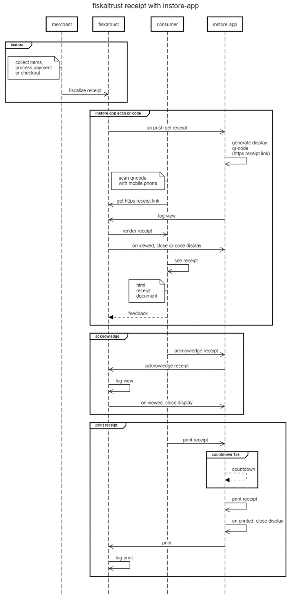
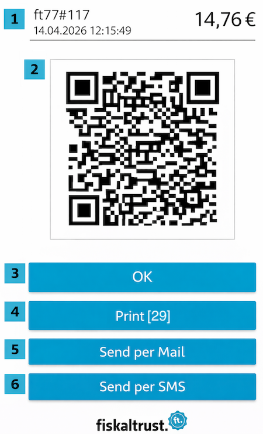
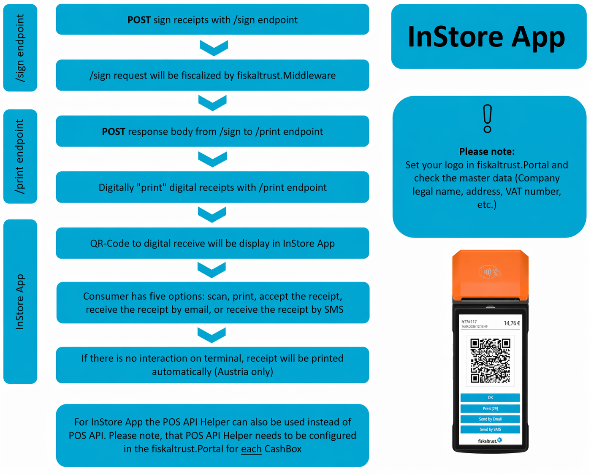
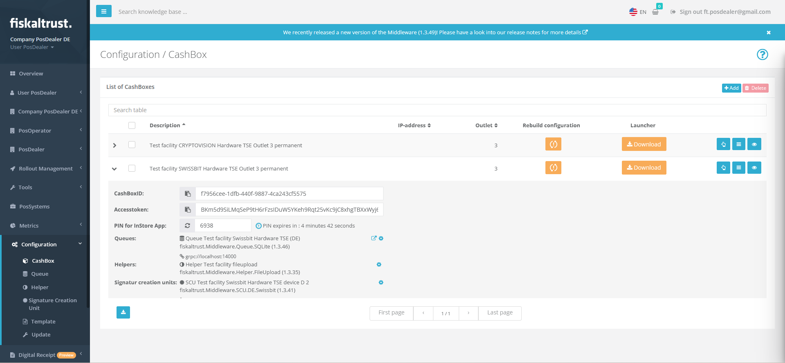
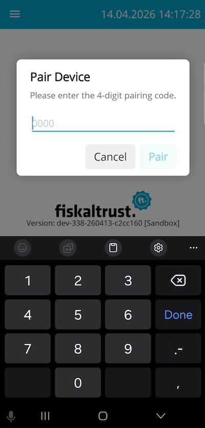

---
slug: /poscreators/middleware-doc/instore-app/introduction
title: Introduction
---

# Introduction

The fiskaltrust InStore App can be used on touch-enabled devices with an integrated thermal printer. The fiskaltrust InStore App can listen to receipt issuing of multiple CashBoxes, filtered by provided terminal-identification by each CashBox. Each time a related CashBox issues a receipt, the fiskaltrust InStore App appears on the consumer-facing touchscreen and shows the following elements: 

* The receipt number, creation time, and total amount.
* A QR code containing the HTTPS receipt link for the consumer to access the receipt.
* An OK button to manually acknowledge receipt.
* A Print button with a countdown timer to print receipt.
* A Send by Email button to send the receipt via email.
* A Send by SMS button to send the receipt via SMS.

When the QR code is scanned and the HTTPS receipt link is used to download the receipt, an acknowledgement of receipt by the consumer is logged in the background, and the current receipt display is closed. 

When the OK button is tapped by the consumer, a manual acknowledgement of receipt is logged, and the current receipt display is closed. 

When the Print button is tapped by the consumer, or when the countdown expires, a paper receipt is printed and the event is logged for analytics. The current receipt display is closed after successful printing.

When the Send by Email button is tapped by the consumer, a screen is displayed prompting the consumer to enter their email address.

When the Send by SMS button is tapped by the consumer, a screen is displayed prompting the consumer to enter their phone number.

Setting up the InStore App requires no implementation into the point-of-sale software.

Since all operations within the app (including QR code scanning, accepting, and printing) are fully logged in the fiskaltrust.Portal, the InStore App ensures compliance with Austria's obligation to issue receipts ("Belegausgabepflicht") and to accept receipts ("Belegannahmepflicht"), as well as Germany's obligation to issue receipts ("Belegausgabepflicht"). Furthermore, the app ensures that the receipt is always issued to the consumer. 

fiskaltrust appointed Dr. Markus Knasmüller from BMD to create an external assessment of the conformity of digital receipt in Austria. The final assessment can be requested via the [request form](https://forms.office.com/e/0PcMDYWC2B).

## Receiving Digital Receipts with InStore App

The following diagram describes the process of generating a digital receipt with the InStore App. The participants in the process are the merchant, fiskaltrust, the consumer and the InStore App. 

*Figure 1. Sequence diagram of the digital receipt process between the merchant, fiskaltrust, the consumer, and the InStore App.*

The InStore App offers five options: scanning the QR code to receive the digital receipt on a mobile phone, tapping the OK button to manually acknowledge receipt, printing the receipt on thermal paper, sending the receipt via email, or sending it via SMS.

In-store, the merchant collects items and processes the payment or checkout. The merchant then sends a sign message to fiskaltrust for fiscalization purposes. 

- **Scan QR code:** The InStore App continuously listens to the fiskaltrust receipt backend for incoming receipt push events. When an HTTPS receipt link is received, it displays a QR code on the device screen. The consumer scans the QR code with their mobile phone and receives the HTTPS receipt link. The InStore app sends a log to the fiskaltrust backend indicating that the receipt was scanned by the consumer. The fiskaltrust backend renders the receipt, and the QR code display on the InStore App device is closed. The consumer can now access the HTML receipt document and provide feedback regarding the receipt. 

- **Acknowledge:** The consumer manually acknowledges receipt by tapping the OK button in the InStore App. The InStore app sends a log to the fiskaltrust backend indicating that the receipt was acknowledged manually. The InStore app receives a response from the fiskaltrust backend to close the display. 

- **Print receipt:** Consumers can manually initiate paper receipt printing on the InStore App device by tapping the Print button. Additionally, in Consumer mode, a paper receipt is automatically printed if there is no user interaction before the configured [Print Delay](../available-settings/settings.md#print-delay) expires. Once the receipt is printed, the display closes and the print command is logged.

- **Send receipt via email:** Consumers can choose to receive the digital receipt via email by tapping the Send by Email button on the InStore App device. A screen will then be displayed where the consumer can enter their email address.

- **Send receipt via SMS:** Consumers can choose to receive the digital receipt via SMS by tapping the Send by SMS button on the InStore App device. A screen will then be displayed where the consumer can enter their phone number.

## Displaying Receipts in the InStore App

*Figure 2. InStore App receipt display; the numbered elements are described in Table 1.*

| Number | Description |
|--------|-------------|
| 1 | Receipt number (ft77#117), date, time, and total amount |
| 2 | QR code to access the digital receipt document |
| 3 | `OK` button to confirm and close the receipt view |
| 4 | `Print` button to print the receipt |
| 5 | `Send by Email` button to send the receipt via email |
| 6 | `Send by SMS` button to send the receipt via SMS |

*Table 1. Interface elements shown on the InStore App receipt display in Figure 2.*

## Status Information on the Home Screen

Since version 1.3.2, the home screen of the InStore App shows four status icons in the top right corner. A green icon means that the related function is ready.

| Icon | Description |
|------|-------------|
| Cloud | The InStore App is connected to the fiskaltrust cloud and can receive actions (show receipt, start payment) from the POS System API. |
| On device | Apps on the same device can start payments locally via the fiskaltrust Android launcher. This also works offline. |
| Printer | A printer is configured. |
| Payment | A payment provider is configured. |

*Table 2. Status icons shown on the InStore App home screen.*

Tapping the icons opens a **Status** popup with further details, such as the configured printer and payment provider.

## Configuring InStore App

This high-level overview shows the steps required to implement and configure the InStore App in your point-of-sale software.

*Figure 3. High-level overview of the steps to implement and configure the InStore App.*

## Configuring Master Data

For more information about the configuration steps for the master data, see [Digital Receipt Introduction](../../../../posdealers/buy-resell/products/digital-receipt.md#introduction).

## Implementing InStore App

There are two ways to connect your point-of-sale software to the InStore App:

- **POS System API (recommended):** Your point-of-sale software calls the fiskaltrust POS System API directly. This is the integration path described below.
- **POS API Helper (for existing integrations):** If your point-of-sale software is already integrated with the classic Middleware interface (`/sign` via IPOS v0 or the SignatureCloud API), the POS API Helper can push the signed receipts to the paired InStore App without changing that existing integration. The Helper is configured on the CashBox in the fiskaltrust.Portal (see [Configuring POS API Helper](#configuring-pos-api-helper)). It is a bridge rather than a replacement for the POS System API: it does not log delivery statuses (scanned, acknowledged, printed), which are required in Austria to prove compliance with the obligations to issue and accept receipts, and it does not support payments via the InStore App. For production rollouts, migrate to the POS System API following the [Migration Guide](../../possystem-api/migration-guide.md).

:::info

The [POS System API documentation](https://docs.fiskaltrust.eu/apis/pos-system-api) is the source of truth for endpoints, headers, request and response schemas, and environments (sandbox and production). This page only gives a brief overview.

:::

### How it works

At a high level, the point-of-sale software performs the following steps:

1. Optionally, call `/echo` to verify connectivity and authentication.
2. Call `/sign` to fiscalize the receipt according to local regulations. The response contains the signed receipt data.
3. Call `/issue` with the `ReceiptRequest` and `ReceiptResponse` from `/sign` to issue the receipt digitally. The InStore App paired with the CashBox then displays the QR code with the link to the digital receipt.
4. Optionally, use the `/issue/{QueueId}/{QueueItemId}` endpoints to retrieve the receipt in other formats, to query the delivery status (`/delivered`), or to update the receipt status.

Every request must carry the authentication and idempotency headers (CashBox ID, access token, operation ID, and POS system ID) as defined in the POS System API documentation. The CashBox ID and access token are obtained by creating a CashBox in the fiskaltrust.Portal.

For details on each endpoint, see the [POS System API documentation](https://docs.fiskaltrust.eu/apis/pos-system-api).

### Development kit

The [POS System API development kit](https://github.com/fiskaltrust/possystemapi-devkit/blob/main/README.MD) provides runnable C# samples for the InStore App and the POS System API, including a dummy payment provider for sandbox testing. Use it to get familiar with the flow before implementing it in your point-of-sale software.

:::warning

The fiskaltrust InStore App requires an internet connection for the initial configuration, and a permanent and stable internet connection for actions received via the fiskaltrust cloud backend.

Since version 1.3.2, payments can optionally also be triggered locally by a POS app on the same device via the fiskaltrust Android launcher (see [Android Intent Integration](../../possystem-api/android-intent.md)). This local communication path works offline and requires a fiskaltrust Android launcher version that supports it.

:::

## Configuring POS API Helper

The POS API Helper is available in all countries. This Helper is responsible for uploading data from the local Queue to the digital receipt endpoint. It is configured in the fiskaltrust.Portal and assigned to each CashBox that uses digital receipts. The POS API Helper enables direct upload of digital receipts.

The POS API Helper is only needed for point-of-sale software that still uses the classic Middleware interface. It is not the same as the LocalPosSystemApi Helper, which provides the POS System API locally with Launcher 2.0 (see the [Migration Guide](../../possystem-api/migration-guide.md)). A Cloud CashBox used with the POS System API needs no additional Helper.

To proceed with the configuration, log in to your fiskaltrust.Portal account first. 

### Queue

To configure the Queue, complete the following steps:

1. Navigate to **Configuration** > **Queue**.
2. Click the **Configure Queue** icon.
3. Copy the URLs to your local machine (required for CashBox configuration later).
4. For all countries: change port to the next free port (+1). If no suffix exists after the port, add the suffix `/name_queue` to the URL ("name" can be freely chosen). If a suffix already exists, add the suffix `_queue` to the URL.
5. For Germany and France only: change the gRPC port to the next free port. If the port is free, no need to go to the next free port. Then add the suffix `/name_queue` to the URL ("name" can be freely chosen).
6. Save the changes.

### Helper

To configure the Helper, complete the following steps:

1. Navigate to **Configuration** > **Helper**.
2. Create a new helper by clicking the **+Add** button.
3. Add a description.
4. Select the package name "fiskaltrust.service.helper.posapi".
5. Select the latest package version.
6. Select the outlet of the CashBox.
7. Save the configuration.
8. Configure the helper by clicking the **Configuration** icon.
9. For all countries: insert the previously saved queue URLs into the helper URLs and add the suffix `/name` to the URL (analogous to the naming used in the queue configuration).
10. For Germany and France only: also add the gRPC URL with the next free port and add the suffix `/name` to the URL (analogous to the naming used in the queue configuration).
11. Save configuration and close.

### CashBox

To configure the CashBox, complete the following steps:

1. Navigate to **Configuration** > **CashBox**.
2. Select your CashBox and click the **Edit** icon.
3. Navigate to **Helpers**.
4. Activate the POS API Helper.
5. Save the configuration.
6. Click the **Rebuild configuration** icon for your CashBox.

After completing the POS API Helper configuration, restart the fiskaltrust.Middleware to apply the changes. 

## Pairing InStore App

After installing the InStore App on your Android device, establish a connection with your preferred CashBox by completing the following steps:

1. Log in to your fiskaltrust.Portal account and navigate to **Configuration** > **CashBox**.
2. Select the CashBox that you want to pair with the InStore App.
3. Expand the CashBox overview.
4. On **PIN for InStore App**, click the refresh button to generate a new temporary pairing PIN. The pairing PIN is valid for five minutes. After it expires, you must generate a new PIN by clicking the refresh button again.  *Figure 5. Generating a temporary pairing PIN for the InStore App in the fiskaltrust.Portal.*
5. Enter the four-digit PIN into your InStore App and confirm the connection by clicking **Pair**. You can pair multiple InStore App installations with one CashBox. To open the pairing-to-CashBox screen or pair with a different CashBox, press and hold the touchscreen for one second.  *Figure 6. Entering the pairing PIN in the InStore App to connect it to a CashBox.*
