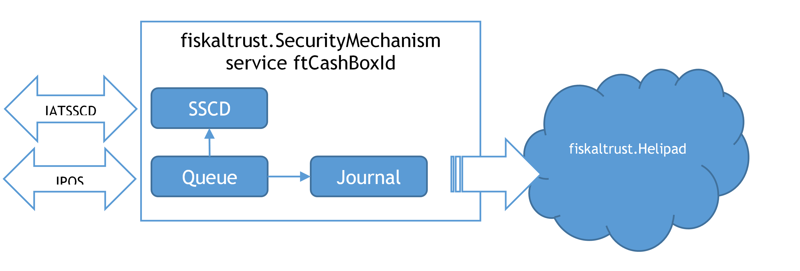
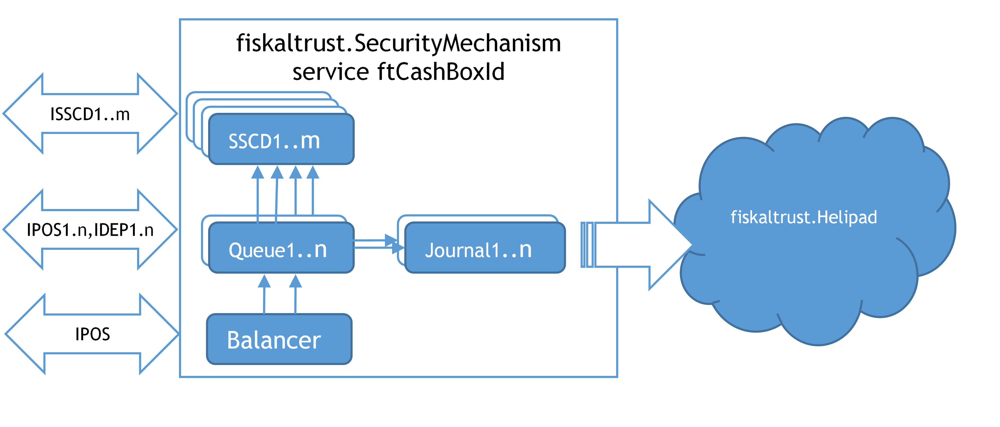
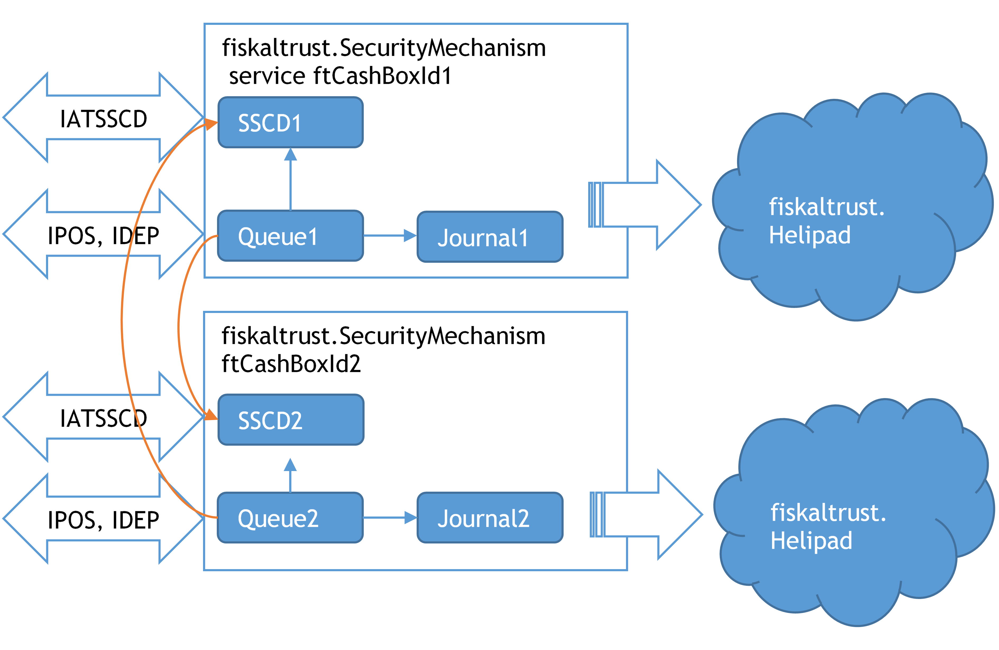

# Operation Modes

This page describes how the fiskaltrust.Middleware is set up for the Austrian market. The operational environments it can be operated in - on-premise, off-premise and private cloud - are market-independent and described in [Operation Modes](../../general/operation-modes/operation-modes.md) of the General Part.

## Components of the fiskaltrust.Middleware

### REST service

An ASP.NET application provides the functionality of a queue via the REST service. It is available at:

`https://signaturcloud.fiskaltrust.at`

This application is the bridge between the fiskaltrust.Queue and fiskaltrust.SignatureCloud. The fiskaltrust.SignatureCloud can be used across platforms and can be run directly in a computing centre or on a server. As a signature creation device, an HSM, or another software signature creation device, can provide an overall closed system.

### fiskaltrust.SignatureCloud

The fiskaltrust.SignatureCloud is the online-only Austrian product, which requires no installation on the client. See [fiskaltrust.SignatureCloud](../installation/installation.md#fiskaltrustsignaturecloud) on the Installation page.

The `service-version` request header used to select between the backend versions 1.1 and 1.2. The version endpoint now reports `Service product version:1.2` with and without that header:

```
curl -X GET https://signaturcloud.fiskaltrust.at/api/version
curl -X GET https://signaturcloud.fiskaltrust.at/api/version -H 'service-version: 1.1'
```

## Signature Creation Devices (SSCD)

In Austria, it is mandatory to have an unmodifiable smartcard (write once read many) which must store the issued certificate containing the PosOperator data. This smartcard must be read from a reader, which must be connected to the POS-System's machine via an internal device, a connected external device, a network-connected device, or a web service.

The signature creation device (SSCD) creates the signature; the Signature Creation Unit (SCU) is the part of the fiskaltrust.Middleware that drives it. The two are not the same - see [Terminology](../terminology/terminology.md) for the Austrian definitions and [SCU](../../general/components/components.md#scu) in the General Part for the component. Which SCU package is configured determines how the signature creation device is addressed.

Signature creation devices used in the Austrian market have various characteristics and requirements.

SmartCard - it is the most simple form of an SSCD. It is connected directly via a USB connection to the hardware, which runs the fiskaltrust.SecurityMechanism. A PCSC driver, supported by the respective operating system is necessary for the chip-card reader to operate such local signature creation devices. Windows provides this for many chip-card readers. For Linux or Mac the [PCSC lite project](https://pcsclite.apdu.fr/) can be consulted.

Online signature service - a signature creation device can also be used as an online service, where it is unnecessary to access any local hardware to use it. However, for each signature an internet connection is required. Such a device is addressed with the `fiskaltrust.signing.atrustonline` package.

Another type of signature creation device is an HSM module. Such a module is usually installed on the local network and is not dependent on the internet connection. By using an HSM module, signing can be done extremely efficiently. These devices are addressed with the `fiskaltrust.signing.primesignhsm` package.

On testing environments, a software-based private key can be used for signing. Such software-based certificate storage with public key and password encrypted private key is used in the `fiskaltrust.signing.pfx` package, which is offered on sandbox portals only.

All signature creation devices are addressed through the interface definition IATSSCD. A signature creation unit does not have to run on the machine that runs the queue: it is reached over the network at the URL configured for it.

## Configuration of the fiskaltrust.Middleware

### Online Portal

All configuration settings, as well as the relevant extensions, are managed via the online fiskaltrust.Portal, which for Austrian market is available at:

https://portal.fiskaltrust.at

### Queue

In this implementation, each receipt is processed accordingly with the RKSV requirements and signed with a configured signature creation device.

### Journal

The Journal in Austria extracts the RKSV-DEP and includes the machine-readable code with the receipt signatures. It can also export the E131-DEP, which provides a protocol for all receipt requests and responses. The journal also exports the processing protocol, which records all events happening in the queue.

### Notifications

Events are extracted from the notification-processing protocol. Special events have localized reporting requirements - for the Austrian market they also contain the FinanzOnline notification according to the RKSV.

## Configuration Scenarios

### Single queue scenario

In the simplest scenario, a fiskaltrust.SecurityMechanism consists of a single signature creation device and a single queue with a data collection protocol (RKSV-DEP).



*Figure 1. Single queue scenario (AT).*

### Scenario with several queues for performance improvement

To handle scenarios of higher complexity, a fiskaltrust.SecurityMechanism can also consist of several signature creation devices (SSCD) and several queues with data collection protocols (RKSV-DEP). If there are several queues in a fiskaltrust.SecurityMechanism, a load balancer can be used to maximize the performance, and also as a backup outage scenario. In a backup outage scenario, signature creation devices (SSCD) can also be used across services.

The fiskaltrust.SecurityMechanism illustrated below hosts several queues. Each queue runs a RKSV-DEP and an E131-DEP. The queues can address a signature creation device available within a pool.



*Figure 2. Scenario with several queues for performance improvement (AT).*

### Cash Register Network with Backup SSCD

As with the fiskaltrust.SecurityMechanism, the signature creation device is also available via network, and it is possible to use a signature creation device of a different cash register system in backup mode (indicated by the orange access line on the following illustration). Legal prerequisite for this is the registration of both signature creation devices with the same taxpayer.



*Figure 3. Several fiskaltrust.SecurityMechanisms use the SSCD via network.*

## Online and Offline Operation

Every receipt is processed by the fiskaltrust.Queue, whether the signature creation device is reached locally or over the network. The POS system can keep issuing receipts while the signature creation device is temporarily unreachable: the fiskaltrust.SecurityMechanism enters a failure state, reports that state back with every response, and stops calling the signature creation unit until a zero receipt triggers a retry. This behaviour is market-independent and described in [Failure Scenarios](../../general/cash-register-integration/cash-register-integration-failure-scenarios.md) of the General Part.

What follows from such an outage in Austria - the signed collective receipt that closes the failure, and the FinanzOnline report required when the failure lasts longer than 48 hours - is described on the Cash Register Integration page: [Signature Creation Device Failure](../cash-register-integration/cash-register-integration.md#signature-creation-device-failure), [fiskaltrust.SecurityMechanism Failure](../cash-register-integration/cash-register-integration.md#fiskaltrustsecuritymechanism-failure) and [End of Failure Receipt (Collective Failure Report)](../cash-register-integration/cash-register-integration.md#end-of-failure-receipt-collective-failure-report).

Failover between signature creation devices is a configuration decision rather than something the POS system triggers. More than one signature creation unit can be configured, and each one is set to a mode in the fiskaltrust.Portal - Normal, Backup or Deaktiviert. The queue signs with a Normal unit and moves on to the next one when it cannot be reached; deactivated units are skipped. This is how the pooled and backup setups shown in [Scenario with several queues for performance improvement](#scenario-with-several-queues-for-performance-improvement) and [Cash Register Network with Backup SSCD](#cash-register-network-with-backup-sscd) are configured.
