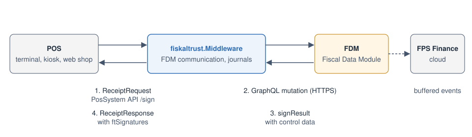

# Go-to-Market in Belgium

In Belgium, businesses that fall under the obligation must record their sales with a **registered cash register system** (RCRS, *geregistreerd kassasysteem* / *système de caisse enregistreuse*). The technical requirements are set out in the ministerial decree of 29 April 2024 and in the technical specifications published by the FPS Finance (*SPF Finances* / *FOD Financiën*) on [geregistreerdkassasysteem.be](https://www.geregistreerdkassasysteem.be). The central element is the **Fiscal Data Module (FDM)**: every event registered on the cash register system is sent to the FDM, which signs it, updates its counters, and forwards the data to the FPS Finance.

This page explains where the fiskaltrust.Middleware sits in this setup, what it takes over, and what remains with the PosCreator. The answers to the questions PosCreators most often ask before entering the Belgian market are collected in the [FAQ](./faq.md). The coverage of the individual FDM operations is listed in [FDM event operations](./fdm-event-operations.md).

:::caution Belgian localization in development

The Belgian localization of the fiskaltrust.Middleware is available in the sandbox and under active development. This chapter describes the target architecture and the current implementation status. Features marked as *in development* are not yet available and may change before release.

:::

## The parties involved

| Party | Role in the Belgian setup |
| ----- | ------------------------- |
| **PosCreator** | Produces the cash register system and applies for its certification with the FPS Finance. Responsible for the user interface, user management (including the INSZ of every user), the VAT receipt layout, and the data the cash register system keeps itself. |
| **fiskaltrust.Middleware** | Receives every business case from the POS through the [PosSystem API](../../possystem-api/introduction.md), turns it into the FDM event, communicates with the FDM, and returns the FDM's control data to the POS. Stores every request and response in its journals. |
| **FDM manufacturer** | Provides the certified Fiscal Data Module. The fiskaltrust.Middleware currently connects to the FDM of ZwarteDoos. |
| **PosDealer / installer** | Sets up the fiskaltrust.Middleware for the merchant in the fiskaltrust.Portal, connects it to the merchant's FDM, and is responsible for the correct and secure installation and configuration. |
| **PosOperator (merchant)** | The taxpayer. Registers the cash register system with the FPS Finance and remains responsible for issuing VAT receipts and for the retention of the data. |
| **FPS Finance** | Certifies cash register systems and FDMs, receives the FDM data, and answers questions on the scope of the obligation. |

## Architecture

*Figure 1. Data flow between the POS, the fiskaltrust.Middleware, the FDM, and the FPS Finance.*

The POS never talks to the FDM directly. It sends a `ReceiptRequest` to the fiskaltrust.Middleware and receives a `ReceiptResponse`. The fiskaltrust.Middleware translates the request into the FDM's GraphQL mutation, authenticates against the FDM with its device ID and shared secret, and maps the FDM's `signResult` back into the response: the digital signature, the short signature, and the verification URL for the QR code.

The fiskaltrust.Middleware can be managed by fiskaltrust in the cloud (**fiskaltrust.Middleware for Cloud**), or operated locally on **Windows, Linux, or Android**. In both cases it reaches the FDM over HTTPS; with the fiskaltrust.Middleware for Cloud, no cable or Wi-Fi connection between the POS terminal and an FDM is needed on site. Keep in mind that if the connection to the FDM is lost, the cash register system can no longer register sales. See [FAQ: FDM architecture](./faq.md#where-is-the-fdm-installed-and-how-does-the-fiskaltrustmiddleware-connect-to-it).

## What the fiskaltrust.Middleware provides

- **One interface for all channels.** POS terminals, kiosks, handhelds, and web shops send the same `ReceiptRequest`; the fiskaltrust.Middleware creates the matching FDM event.
- **FDM communication.** Building the GraphQL mutation, authentication, time-zone correct `posDateTime`, error handling, and the mapping of FDM errors, warnings, and messages into the response.
- **Mapping of the fiskaltrust data model to the FDM data model.** VAT codes (A, B, C, D, X), payment types, refund reasons, training mode (event label `T`), and the transaction lines. See [FDM event operations](./fdm-event-operations.md#mapping-of-the-fiskaltrust-data-model).
- **Control data for the VAT receipt.** The FDM's signature items are returned in `ftSignatures` so that the POS can print them together with the QR code.
- **Journals.** Every request, every FDM request and response, and the resulting `ReceiptResponse` are stored in the journals of the fiskaltrust.Middleware and can be exported through the journal endpoint. See [FAQ: data retention](./faq.md#does-fiskaltrust-take-over-the-data-retention-and-data-integrity-requirements).
- **Updates.** Changes to the FDM interface are implemented in the fiskaltrust.Middleware without changes to your PosSystem API integration.

## What remains with the PosCreator

- **The certification of the cash register system.** The FPS Finance certifies the cash register system as a whole. The fiskaltrust.Middleware is a component of your system; describe it in your certification application together with your own components. fiskaltrust provides the documentation of the fiskaltrust.Middleware's data storage and FDM communication for this purpose.
- **User management.** Every user must be logged in and identified by their INSZ (national register or BIS number), which is passed to the fiskaltrust.Middleware in `cbUser`. For orders without human intervention (web shop, kiosk) and automatically created reports, the robot user `00000000029` is used; external technicians use `00000000097`.
- **The VAT receipt.** Layout, the mandatory mentions (e.g. *VAT RECEIPT*, *PRO FORMA*, *COPY*, *THIS IS NOT A VALID VAT RECEIPT*), the control data returned by the fiskaltrust.Middleware, and the QR code generated from the verification URL.
- **The business process.** A VAT receipt may only be handed out once the FDM has signed the event. The POS must wait for the fiskaltrust.Middleware's response and handle errors. See [FAQ: sequence of operations](./faq.md#must-the-pos-wait-for-the-fdm-before-completing-a-transaction-and-what-happens-after-payment).
- **Cash rounding** to 5 cents and the order in which vouchers, cash, and electronic payments are registered.
- **Data kept outside the fiskaltrust.Middleware**, such as master data, the link between the user identification on the receipt and the INSZ, and anything the POS stores on its own.

## Onboarding steps

1. **Register in the Belgian fiskaltrust.Portal** for the [sandbox](https://portal-sandbox.fiskaltrust.be/Account/Register) and, when ready, for production, as described in [Portal Registration](../../../getting-started/portal-registration.md).
2. **Integrate against the sandbox.** In the sandbox, the fiskaltrust.Middleware is connected to the FDM manufacturer's test environment. Use the [FDM event operations](./fdm-event-operations.md) page to check which of your business cases are already supported.
3. **Run through the [Integration Checklist](../../../getting-started/integration-checklist.md)** with the Belgian specifics: initial-operation receipt, a sale, a refund, training mode, and a daily closing (Z report).
4. **Prepare your certification application** with the FPS Finance. Contact fiskaltrust for the documentation of the fiskaltrust.Middleware components you need to describe.
5. **Go live** with the production fiskaltrust.Middleware connected to the merchant's FDM.
