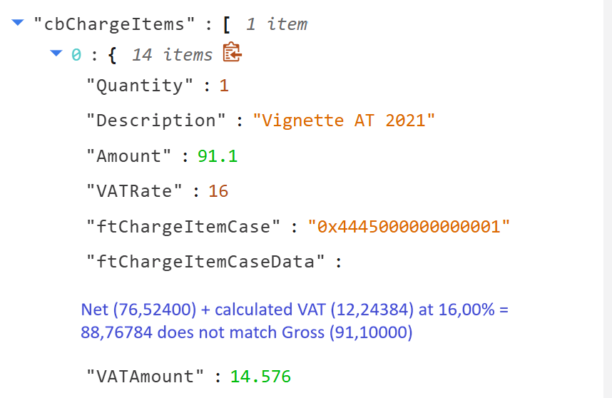
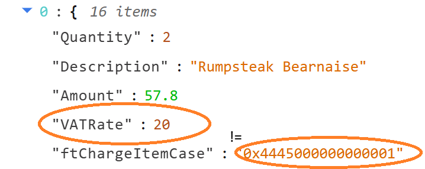
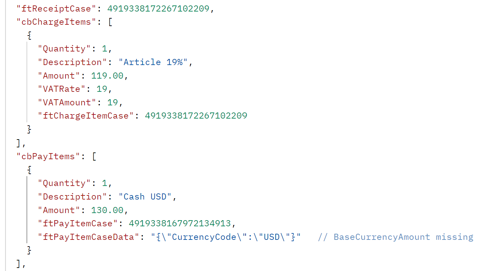
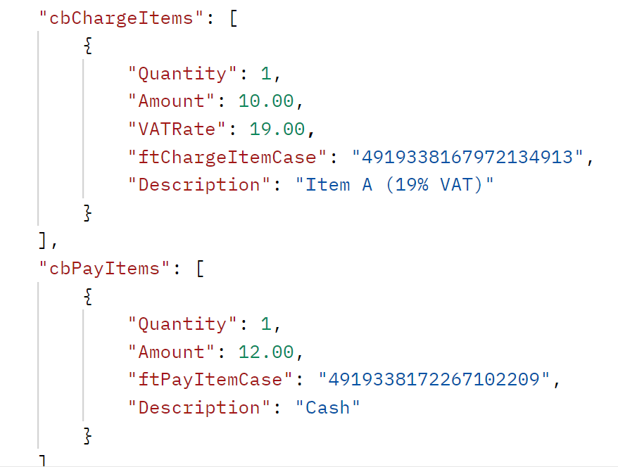
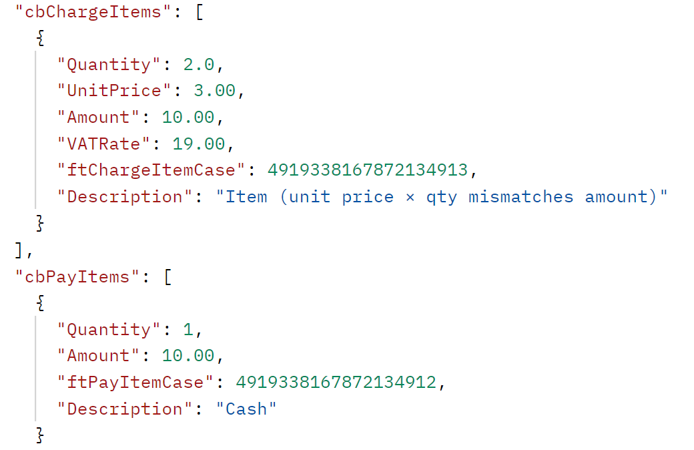
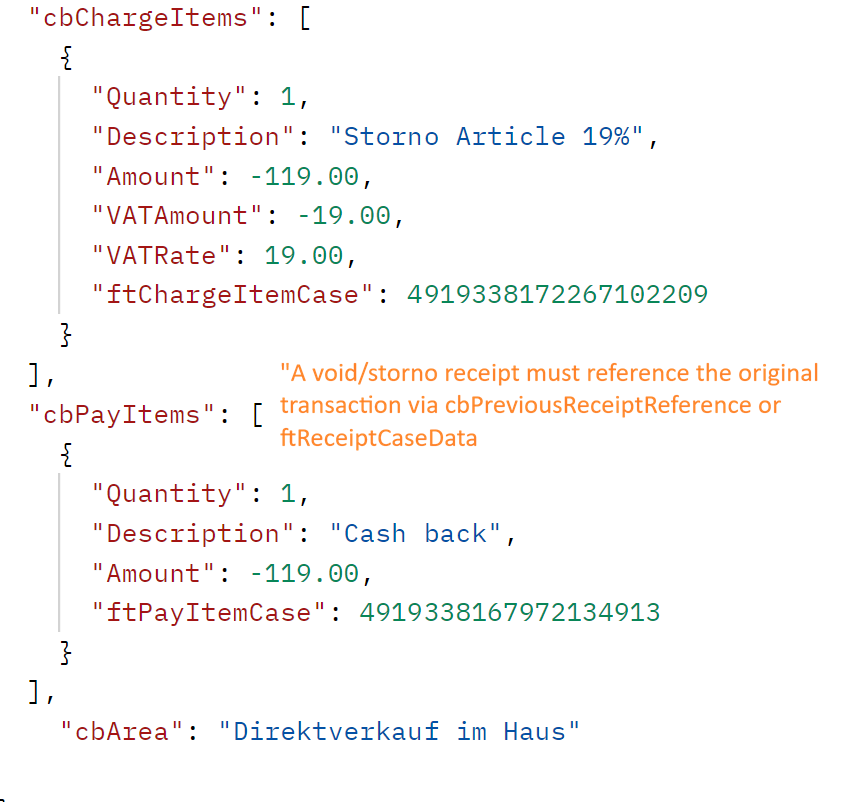

# Procedural documentation for clarifying errors shown in the fiskaltrust Receipt Validation

## Receipt Validation

The Fiskaltrust Receipt Validation provides the possibility to validate customer implementations based on queue data. The test cases are defined according to the DSFinV‑K specification. It provides customers with a tool to easily adjust their implementation to fully comply with the requirements set by the tax authorities.

Below you will find a list of all possible errors, including detailed descriptions of how to resolve them.

## Error overview

- [Error 1000 – Missing daily closing](#error-1000)
- [Error 5010 – VAT calculation mismatch](#error-5010)
- [Error 5011 – Gross amount mismatch](#error-5011)
- [Error 5020 – Cash payment total mismatch](#error-5020)
- [Error 5035 – Payment total does not match receipt gross turnover](#error-5035)
- [Error 5070 – Position quantity and unit price do not match position gross amount](#error-5070)
- [Error 5290 – Storno receipt without reference to the original transaction](#error-5290)

## Error 1000 – Missing daily closing

### Description
This error indicates that at least one receipt exists for the specified business day, but no daily closing receipt (DailyClosing) was found for that date. For every business day with fiscal receipts, a daily closing receipt is required to generate a valid DSFinV‑K export.

## Error-5010 - Vat Cross Net Missmatch

### Description
This error indicates an inconsistency between Net, VAT, and Gross amounts on a receipt line item.

**Example**
Position 1 in receipt ftD#IT14: Net (76,52400) + calculated VAT (12,24384) at 16,00% = 88,76784 does not match Gross (91,10000). Difference: -2,33216.

  

### Background
fiskaltrust applies the gross (brutto) calculation method.  
In this method, the net amount and VAT are derived from the gross amount using the applicable VAT rate.

The validation verifies that:
- Gross − VATAmount = Net
- Net × VATRate = VATAmount

Minor rounding differences may occur, depending on the POS calculation method.

### Cause
This error can occur in the following cases:
- The POS system uses a net-based calculation method, while fiskaltrust validates using the gross-based method
- A rounding difference occurs during the conversion between net, VAT, and gross values
- The rounding difference exceeds an acceptable tolerance
- Incorrect or inconsistent values were sent for Net, VATAmount, Gross, or VATRate
While small rounding differences are acceptable, larger deviations indicate incorrect data sent by the POS system.

### Resolution
To resolve this error, perform the following checks:

**Verify calculation method**
Ensure the POS system uses a gross-based (brutto) calculation or produces values compatible with it.

**Check rounding behavior**
Validate that rounding is applied consistently and only at the correct calculation step.

**Validate transmitted values**
Ensure that Net, VATAmount, Gross, and VATRate are mathematically consistent.  
Avoid manually mixing net-calculated and gross-calculated values.

**Review unreasonable differences**
If the difference is too large to be explained by rounding, incorrect values are being transmitted and must be corrected.

### Notes
- Small rounding differences may occur due to calculation order and decimal precision.
- Unreasonable or large differences are always treated as errors.
- The POS system is responsible for transmitting internally consistent fiscal values.

## Error-5011 - VAT rate does not match ftChargeItemCase

**Description**  
This error occurs when the VATRate specified on a charge item does not match the VAT rate implied by the given ftChargeItemCase. Each ftChargeItemCase represents a predefined VAT category and therefore implies an expected VAT rate. If the transmitted VATRate conflicts with that expectation, receipt validation fails.

**Example**
Position 1 in receipt ft19F#IT416: VATRate (20.00%) does not match the rate implied by ftChargeItemCase (0x4445000000000001, expected 19.00%).

  

**Cause**  
The POS system transmitted inconsistent VAT information for a charge item:
- The ftChargeItemCase implies a fixed VAT rate.
- The VATRate field contains a different percentage.

**Resolution**
Ensure that the VAT information is consistent:
- If the VATRate is correct, use a matching ftChargeItemCase.
- If the ftChargeItemCase is correct, adjust the VATRate accordingly.
- Verify that the POS tax configuration matches the fiscal country configuration.

**Notes**
This validation prevents incorrect VAT reporting in DSFinV-K exports and fiscal audits.

## Error-5020 – Cash payment total mismatch

### Description

This error occurs when the sum of cash pay items across individual receipts does not match the total cash payment amount reported in the cashpoint closing. Per-receipt cash payments are aggregated from receipt-process receipts only; non-receipt process types are excluded from the per-receipt sum but are still included in the closing total. A mismatch between these two values indicates inconsistent cash handling between the individual receipts and the aggregated closing.

### Example

The sum of per-receipt cash payments (-149.00) differs from the total cash payment amount (-19.00) by -130.00.

  

### Cause

The cash-related data in the cashpoint closing is not consistent with the individual receipts:

- A receipt-process receipt contains a cash pay item that is not reflected in the closing total.
- A non-receipt-process receipt (e.g. SonstigerVorgang) carries a cash pay item that is included in the closing total but not in the per-receipt aggregation.
- Cash pay items were incorrectly classified, transformed, or omitted when the closing was generated.

### Resolution

Ensure that all cash payments are reported consistently:

- Verify that every receipt-level cash pay item is included in the cashpoint closing total.
- Ensure that non-receipt-process receipts carrying cash pay items are accounted for in the closing, not in the per-receipt aggregation.
- Review the POS configuration for correct classification of cash payment types (IsCashPaymentType).

### Notes

This validation ensures that cash flow reported in DSFinV-K exports and fiscal audits is traceable between individual receipts and daily closings.

## Error-5035 – Payment total does not match receipt gross turnover

### Description

This error occurs when the **total payment amount** does not match the **sum of per‑receipt gross turnover**.

The check combines:
- the **overall payment total**, aggregated from all pay items (including transformed business case pay items), and
- the **gross turnover**, calculated from charge items and transformed pay items across all receipts.

Both values must be equal. Any difference indicates inconsistent aggregation or classification between payments and turnover data.

### Example

Total payment amount (12.00) does not match the sum of per-receipt gross turnover (10.00).  
Difference: 2.00.

  

### Cause

The payment side and the turnover side of the receipts do not balance:

- One or more payment items are missing from the payment total.
- Charge items or transformed pay items are missing from the gross turnover calculation.
- A pay item that must be transformed into a business case (e.g. tip, deposit) was not correctly sent.
- Payment or turnover items are incorrectly grouped, for example by VAT key.
- Signs or amounts of cancellation or void items differ between payment aggregation and turnover calculation.

### Resolution

Ensure that payments and turnover are consistent:

- Verify that all payment items are fully accounted for in the total payment amount.
- Verify that all charge items and transformed pay items contribute to the gross turnover.
- Ensure that transformed business case pay items are handled consistently in both calculations.
- Check that charge items and transformed pay items are correctly grouped by VAT key.
- Review cancellation and storno data for consistent signs and amounts.

### Notes

This validation ensures that, across all receipts, the money received (payments) equals the goods or services sold (gross turnover), as required for DSFinV‑K exports and fiscal audits.

## Error-5070 – Position quantity and unit price do not match position gross amount

### Description

This error occurs when, for an individual charge item (position) on a receipt, the **unit price × quantity** (optionally divided by the **unit quantity factor**) does not match the **position gross amount** (`POS_BRUTTO`).

The check compares:
- `STK_BR` × `MENGE` (÷ `FAKTOR`, if provided) – the amount recalculated from the position's unit price, quantity and unit quantity factor, and
- `POS_BRUTTO` – the gross amount actually recorded for the charge item.

Both values must be equal (within a tolerance of 0.01). Any deviation indicates an inconsistency between the per‑unit pricing data and the stored line amount.

### Example

Position 0 in receipt ft5#IT41279: STK_BR (3.00000) * MENGE (2.000) = 6.00000 does not match POS_BRUTTO (10.00000).

  

### Cause

The position's unit pricing data does not reconcile with its gross amount:

- `UnitPrice` is set incorrectly or out of sync with `Amount` and `Quantity`.
- `Quantity` does not reflect the actual number of units sold for the given `Amount`.
- `UnitQuantity` (the factor, e.g. for bulk/weight items) is missing, zero, or incorrect.
- The sign (positive/negative) of `Quantity` or `Amount` is handled inconsistently on cancellation or storno positions.
- Rounding was applied only to `Amount` but not to the per‑unit calculation (or vice versa), producing a difference larger than 0.01.

### Resolution

Ensure that the per‑unit pricing of every charge item reconciles with its gross amount:

- Verify that `UnitPrice` × `Quantity` (÷ `UnitQuantity`, when used) equals the charge item's `Amount`.
- When `UnitPrice` is not provided, ensure `Amount` and `Quantity` are mutually consistent.
- For bulk/weight items, check that `UnitQuantity` is correctly set and non‑zero.
- For cancellation and storno positions, apply signs consistently on quantity and amount so the recalculated line amount matches `POS_BRUTTO`.
- Avoid intermediate rounding that causes `STK_BR × MENGE` to drift from the stored gross amount by more than 0.01.

### Notes

This validation ensures that each position on a receipt is internally consistent: the unit‑based representation (`STK_BR`, `MENGE`, `FAKTOR`) must reproduce the recorded gross amount (`POS_BRUTTO`), as required for DSFinV‑K exports and fiscal audits at the line level.

## Error-5290 – Storno receipt without reference to the original transaction

### Description

This error occurs when a receipt is flagged as a **void/storno** (Storno) but does **not carry a reference** to the original transaction it cancels.

The check inspects void receipts for at least one of the following references:
- `cbPreviousReceiptReference` – the identifier of the previous/original receipt on the POS side, or
- `ftReceiptCaseData` – a JSON payload providing `RefType` **and** `RefReceiptId` that link the storno to the original transaction.

Both places are checked. If neither is populated on a void receipt, the receipt fails the check.

### Example

  

### Cause

A void/storno receipt was transmitted without linking it to the original transaction:

- `cbPreviousReceiptReference` was left empty on a storno receipt.
- `ftReceiptCaseData` does not contain both `RefType` and `RefReceiptId`, or the JSON is malformed and cannot be deserialized.
- The POS flags a receipt as void (e.g. for correction or cancellation) but omits the link to the originally issued receipt.
- The original receipt identifier is stored in a custom/unsupported field instead of the expected properties.

### Resolution

Ensure every storno receipt carries a verifiable reference to the original transaction:

- Populate `cbPreviousReceiptReference` on the POS side with the identifier of the receipt being cancelled, or
- Provide `ftReceiptCaseData` as a valid JSON object containing both `RefType` and `RefReceiptId` for the original transaction.
- Verify that the JSON stored in `ftReceiptCaseData` is well‑formed (parsable by the middleware's `ReceiptCaseData` model).
- If a receipt was incorrectly flagged as void, correct the receipt case so the check no longer applies.
- Do not emit standalone storno receipts without a traceable link to the receipt they cancel.

### Notes

This validation enforces traceability of cancellations as required for DSFinV‑K exports and fiscal audits: every void/storno transaction must be unambiguously linked to the original receipt it reverses, either via the POS‑side reference or via structured receipt case data.
