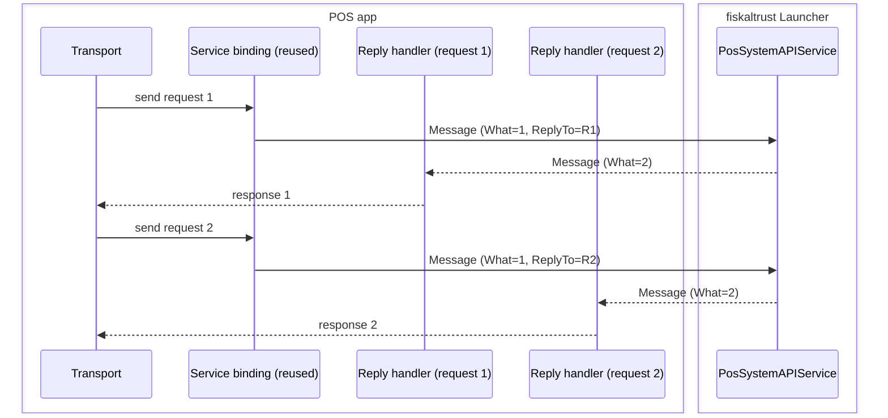

# Android IPC Transport

## Overview

<!-- possystem api but different transport -->

The launcher exposes the POS system API through Android IPC instead of a network
request. The protocol is modeled after HTTP: a request consists of a method, a
path, headers, and an optional body; the response consists of a status code,
content, and a content type. Which methods, paths, and headers are available is
defined by the POS system API itself; this document only covers the transport.

### Mapping

<!-- from http to our format -->

All base64url-encoded values use the base64url encoding (RFC 4648 §5) without
padding. If your platform only offers plain base64, this means replacing `+`→`-`
and `/`→`_` and stripping the trailing `=` padding (and the reverse when
decoding).

<a id="request-fields"></a>

#### Request (`Message.What = 1`)

| Bundle key | Content |
| --- | --- |
| `Method` | HTTP method (e.g. `POST`) |
| `Path` | Path of the API endpoint |
| `HeaderJsonObjectBase64Url` | Headers as a JSON object of string key/value pairs, base64url-encoded |
| `BodyBase64Url` | Optional request body, base64url-encoded |

<a id="reply-fields"></a>

#### Reply (`Message.What = 2`)

| Bundle key | Content |
| --- | --- |
| `StatusCode` | HTTP status code as a string (e.g. `"200"`) |
| `ContentBase64Url` | Response content, base64url-encoded |
| `ContentTypeBase64Url` | Content type, base64url-encoded |
| `HeaderJsonObjectBase64Url` | Response headers as a JSON object of string key/value pairs, base64url-encoded |

<a id="choosing-a-transport"></a>

### Choosing a transport

The launcher offers two transports for this API, and they differ operationally:

| | Bound Service IPC | Activity Intent |
| --- | --- | --- |
| UI | None: fully headless | Visible: shows a small progress screen (current endpoint, current stage) while the request runs |
| Call style | Asynchronous message-passing: the request and its reply are two independent `Message`s, matched by the reply channel | Effectively synchronous from the caller's perspective: the POS app is paused (`onPause`) until `onActivityResult` fires with the single result |
| Impact on the POS app | None: the POS app's own UI stays in the foreground | The POS app's screen is briefly interrupted by the launcher's Activity |

**The Bound Service IPC is the recommended transport** for new integrations and
is explained first below. The Activity Intent transport is documented in its
own section at the end, for existing integrations that still rely on it.

<a id="bound-service-ipc"></a>

## Bound Service IPC

_Recommended, see [Choosing a transport](#choosing-a-transport) above._

The launcher exposes the POS system API through an exported Android service that
POS apps talk to via Android's **bound service + `Messenger`** IPC mechanism.

| | Value |
| --- | --- |
| Launcher package | `eu.fiskaltrust.androidlauncher` |
| Service class | `eu.fiskaltrust.androidlauncher.PosSystemAPIService` |

### Prerequisites (client manifest)

On Android 11+ the launcher package must be declared visible, and binding requires
the launcher's signature permission:

```xml
<queries>
    <package android:name="eu.fiskaltrust.androidlauncher" />
</queries>
<uses-permission android:name="eu.fiskaltrust.androidlauncher.permission.POSSYSTEMAPI" />
```

Without the `<queries>` entry, `BindService` returns `false` on Android 11+.

### Architecture

The client side consists of two parts with different lifetimes:

- **One long-lived service binding.** The client binds to the service once and
  reuses the resulting `Messenger` for all requests. Binding is asynchronous and
  relatively expensive, so the connection is kept alive across requests and only
  re-established when it is lost (service process died, binder dead).
- **One short-lived reply handler per request.** Every request carries its own
  `ReplyTo` messenger, backed by a fresh handler created just for that request.
  The service sends its reply to exactly that messenger — so the response is
  matched to its request by the reply channel itself. No correlation IDs are
  needed, and any number of requests can be in flight concurrently over the same
  binding without their responses getting mixed up.



### Step by step

The samples in this section are simplified to show the mechanism; a complete,
production-ready example (connection reuse, rebinding, error handling,
async/await integration) can be found in the
[full reference implementation](#full-reference-implementation) below.

#### 1. Bind to the service

Binding requires an `IServiceConnection` implementation that receives Android's
connect/disconnect callbacks. Bind with an explicit intent; `Bind.AutoCreate`
starts the service if needed. Wrap the returned binder in a `Messenger`:

```csharp
class ServiceBinding : Java.Lang.Object, IServiceConnection
{
    private Messenger? _messenger;

    public void Bind(Context context)
    {
        var intent = new Intent();
        intent.SetClassName("eu.fiskaltrust.androidlauncher",
                            "eu.fiskaltrust.androidlauncher.PosSystemAPIService");

        // Bind.AutoCreate starts the service if it isn't running yet.
        if (!context.BindService(intent, this, Bind.AutoCreate))
            throw new InvalidOperationException("Could not bind to the PosSystemAPIService.");
    }

    // Called by Android when the binding succeeds; the Messenger is used to send requests.
    public void OnServiceConnected(ComponentName? name, IBinder? service)
        => _messenger = new Messenger(service);

    // Called by Android when the connection is lost (e.g. the service process crashed).
    public void OnServiceDisconnected(ComponentName? name)
        => _messenger = null; // rebind before the next request
}
```

Note that `OnServiceConnected` is called asynchronously — wait for it before
sending (the reference implementation below uses a `TaskCompletionSource` for
this). Keep the binding alive across requests and rebind if
`OnServiceDisconnected` fires or `Send` throws (dead binder).

#### 2. Send a request message

Each request is one `Message` with `What = 1`, the HTTP-style request data in
`Message.Data`, and a `ReplyTo` messenger that tells the service where to send
the response:

```csharp
// messenger:    obtained in OnServiceConnected above
// replyHandler: receives the reply, see step 3
void SendRequest(Messenger messenger, Handler.ICallback replyHandler,
                 string method, string path, string headersBase64Url, string? bodyBase64Url)
{
    var msg = Message.Obtain();
    msg.What = 1; // request
    msg.ReplyTo = new Messenger(new Handler(Looper.MainLooper!, replyHandler));

    msg.Data = new Bundle();
    msg.Data.PutString("Method", method);                              // e.g. "POST"
    msg.Data.PutString("Path", path);                                  // e.g. "/v2/..."
    msg.Data.PutString("HeaderJsonObjectBase64Url", headersBase64Url); // base64url-encoded JSON object
    if (bodyBase64Url != null)
        msg.Data.PutString("BodyBase64Url", bodyBase64Url);            // optional, base64url-encoded

    messenger.Send(msg);
}
```

#### 3. Receive the reply

The service processes the request asynchronously and sends a `Message` with
`What = 2` to the `ReplyTo` messenger. The reply is received by a
`Handler.ICallback` implementation and mirrors an HTTP response:

```csharp
class ReplyHandler : Java.Lang.Object, Handler.ICallback
{
    public bool HandleMessage(Message msg)
    {
        if (msg.What != 2) // ignore anything that is not a reply
            return false;

        var statusCode = msg.Data?.GetString("StatusCode");               // e.g. "200"
        var contentB64 = msg.Data?.GetString("ContentBase64Url");         // base64url-encoded
        var contentTypeB64 = msg.Data?.GetString("ContentTypeBase64Url"); // base64url-encoded
        // decode base64url → UTF-8 strings, then process the content
        return true;
    }
}
```

### Notes

- The service promotes itself to a foreground service on bind, so the middleware
  keeps running after the client unbinds (when allowed by the OS).
- Requests are handled on a background thread in the service; replies arrive
  asynchronously — never block the thread the reply handler runs on.
- Timeouts are the client's responsibility (e.g. `CancellationTokenSource` with a
  timeout).

### Minimal example

Stripped down to the essentials, with no reconnection or error handling, this
is the whole mechanism in one bind + send + receive:

import Tabs from '@theme/Tabs';
import TabItem from '@theme/TabItem';

<Tabs groupId="language">
<TabItem value="csharp" label="C#">

```csharp
var intent = new Intent();
intent.SetClassName("eu.fiskaltrust.androidlauncher", "eu.fiskaltrust.androidlauncher.PosSystemAPIService");
context.BindService(intent, connection, Bind.AutoCreate);

// once connection.OnServiceConnected(name, binder) has fired:
var service = new Messenger(binder);
var reply = new Messenger(new Handler(Looper.MainLooper!, replyHandler));

var msg = Message.Obtain();
msg.What = 1; // request
msg.ReplyTo = reply;
msg.Data = new Bundle();
msg.Data.PutString("Method", "POST");
msg.Data.PutString("Path", "/v2/echo");
msg.Data.PutString("HeaderJsonObjectBase64Url", headersBase64Url);
msg.Data.PutString("BodyBase64Url", bodyBase64Url);
service.Send(msg);

// in replyHandler.HandleMessage(msg), once msg.What == 2:
var statusCode = msg.Data?.GetString("StatusCode");
var contentBase64Url = msg.Data?.GetString("ContentBase64Url");
```

</TabItem>
<TabItem value="java" label="Java">

```java
Intent intent = new Intent();
intent.setClassName("eu.fiskaltrust.androidlauncher", "eu.fiskaltrust.androidlauncher.PosSystemAPIService");
boolean bound = context.bindService(intent, connection, Context.BIND_AUTO_CREATE);

// once connection.onServiceConnected(name, binder) has fired:
Messenger service = new Messenger(binder);
Messenger reply = new Messenger(new Handler(Looper.getMainLooper(), incoming -> {
    Bundle data = incoming.getData();
    String statusCode = data.getString("StatusCode");
    String contentBase64Url = data.getString("ContentBase64Url");
    return true;
}));

Message message = Message.obtain();
message.what = 1; // request
message.replyTo = reply;
Bundle data = new Bundle();
data.putString("Method", "POST");
data.putString("Path", "/v2/echo");
data.putString("HeaderJsonObjectBase64Url", headersBase64Url);
data.putString("BodyBase64Url", bodyBase64Url);
message.setData(data);
service.send(message);
```

</TabItem>
</Tabs>

For a complete, production-ready implementation (connection reuse, rebinding,
error handling), see the [full reference
implementation](#full-reference-implementation) below (C#), or the real,
working Java client in the
[middleware-demo-android](https://github.com/fiskaltrust/middleware-demo-android/tree/master/java/app/src/main/java/eu/fiskaltrust/middleware/demo/transport)
repo (`BoundServiceTransport.java`).

<a id="full-reference-implementation"></a>

### Full reference implementation

_This matches the real, working MAUI client in the
[middleware-demo-android](https://github.com/fiskaltrust/middleware-demo-android/tree/master/maui/Services)
repo (`BoundServiceTransport.cs`, `IPosSystemTransport.cs`)._

#### Transport

```csharp
using Android.Content;
using Android.OS;
using Platform = Microsoft.Maui.ApplicationModel.Platform;

// Communicates with the fiskaltrust PosSystemAPIService via Android's bound service / Messenger IPC mechanism.
// Each request is packed into an Android Message and sent to the service; the response arrives
// asynchronously on a reply Messenger that we pass along with the request.
public class BoundServiceTransport
{
    private const string LauncherPackage = "eu.fiskaltrust.androidlauncher";
    private const string ServiceClass = "eu.fiskaltrust.androidlauncher.PosSystemAPIService";

    private const int MsgRequest = 1;
    private const int MsgReply = 2;

    // Manages the connection (binding) to the possystemapi service. Reused across requests
    // so we only bind once and rebind automatically if the connection is lost.
    private readonly ServiceBinding _binding = new();

    // The caller controls how long to wait via the cancellation token
    // (e.g. by passing a token from a CancellationTokenSource with a timeout).
    public async Task<PosSystemApiResponse> SendAsync(PosSystemApiRequest request, CancellationToken cancellationToken = default)
    {
        // An Android Context is required to bind to the service.
        var context = Platform.CurrentActivity?.ApplicationContext
            ?? throw new InvalidOperationException("Current Android activity context is not available.");

        // The handler that will receive the service's reply message.
        var reply = new ReplyHandler();

        // Build the request message. 'What' identifies the message type defined by the service contract.
        var msg = Message.Obtain() ?? throw new InvalidOperationException("Could not allocate Android Message.");
        msg.What = MsgRequest;
        // 'ReplyTo' tells the service where to send its response.
        msg.ReplyTo = new Messenger(new Handler(Looper.MainLooper!, reply));
        // The request itself is described HTTP-style: method, path, headers, and an optional body.
        // Headers and body are transferred as base64url-encoded strings;
        // PosSystemApiRequest takes care of the encoding.
        msg.Data = new Bundle();
        msg.Data.PutString("Method", request.Method);
        msg.Data.PutString("Path", request.Path);
        msg.Data.PutString("HeaderJsonObjectBase64Url", request.HeadersBase64Url);
        if (!string.IsNullOrEmpty(request.BodyBase64Url))
        {
            msg.Data.PutString("BodyBase64Url", request.BodyBase64Url);
        }

        // Send the message to the service (binding first if necessary) ...
        await _binding.SendAsync(context, msg, cancellationToken);

        // ... and wait for the reply handler to receive the response.
        return await reply.Completion.Task.WaitAsync(cancellationToken);
    }

    // Holds the bound connection to the possystemapi service and exposes it as a Messenger.
    // Implements IServiceConnection to receive Android's connect/disconnect callbacks.
    private sealed class ServiceBinding : Java.Lang.Object, IServiceConnection
    {
        private readonly Lock _lock = new();
        private Context? _context;
        // Completes once the service is connected; awaiting it lets callers wait for the binding.
        private TaskCompletionSource<Messenger>? _service;

        public async Task SendAsync(Context context, Message msg, CancellationToken cancellationToken)
        {
            // Wait until the service is bound (or reuse the existing binding).
            var service = await GetServiceAsync(context).WaitAsync(cancellationToken);

            try
            {
                service.Send(msg);
            }
            catch
            {
                // The binder is most likely dead; reset so the next send rebinds.
                lock (_lock)
                {
                    Reset(new InvalidOperationException("PosSystemAPIService binder is dead."));
                }
                throw;
            }
        }

        private Task<Messenger> GetServiceAsync(Context context)
        {
            lock (_lock)
            {
                // Bind only if we are not already bound or in the process of binding.
                if (_service == null)
                {
                    _service = new TaskCompletionSource<Messenger>(TaskCreationOptions.RunContinuationsAsynchronously);
                    _context = context;

                    // Explicit intent targeting the fiskaltrust Android Launcher's PosSystemAPIService
                    // by package and class name.
                    var intent = new Intent();
                    intent.SetClassName(LauncherPackage, ServiceClass);

                    // Bind.AutoCreate starts the service if it isn't running yet.
                    if (!context.BindService(intent, this, Bind.AutoCreate))
                    {
                        Reset();
                        throw new InvalidOperationException($"Could not bind to {ServiceClass}.");
                    }
                }

                return _service.Task;
            }
        }

        // Called by Android when the binding succeeds; wrap the binder in a Messenger for sending messages.
        public void OnServiceConnected(ComponentName? name, IBinder? service)
        {
            lock (_lock)
            {
                _service?.TrySetResult(new Messenger(service));
            }
        }

        // Called by Android when the connection is lost (e.g. the service process crashed).
        public void OnServiceDisconnected(ComponentName? name)
        {
            lock (_lock)
            {
                Reset(new InvalidOperationException("PosSystemAPIService disconnected."));
            }
        }

        // Clears the current binding so the next send triggers a fresh bind.
        private void Reset(Exception? error = null)
        {
            if (error != null)
            {
                _service?.TrySetException(error);
            }
            _service = null;

            try
            {
                _context?.UnbindService(this);
            }
            catch (Java.Lang.IllegalArgumentException)
            {
                // Already unbound.
            }
            _context = null;
        }
    }

    // Receives the service's reply message and converts it into a PosSystemApiResponse.
    private sealed class ReplyHandler : Java.Lang.Object, Handler.ICallback
    {
        // Completes when the reply arrives; awaited by SendAsync above.
        public TaskCompletionSource<PosSystemApiResponse> Completion { get; } = new TaskCompletionSource<PosSystemApiResponse>(TaskCreationOptions.RunContinuationsAsynchronously);

        public bool HandleMessage(Message msg)
        {
            // Ignore anything that is not a reply message from the service.
            if (msg.What != MsgReply)
            {
                return false;
            }

            // The reply mirrors an HTTP response: status code, content, and content type.
            // Content and content type arrive base64url-encoded; PosSystemApiResponse decodes them.
            var data = msg.Data;
            Completion.TrySetResult(new PosSystemApiResponse
            {
                StatusCode = data?.GetString("StatusCode") ?? "500",
                ContentBase64Url = data?.GetString("ContentBase64Url") ?? string.Empty,
                ContentTypeBase64Url = data?.GetString("ContentTypeBase64Url") ?? string.Empty
            });
            return true;
        }
    }
}
```

#### Request/response models

```csharp
using System.Text;
using System.Text.Json;

// Describes a POS system API request HTTP-style: method, path, headers, and an optional body.
// The transport transfers headers and body base64url-encoded; the *Base64Url properties
// provide the encoded values so callers can work with plain strings.
public class PosSystemApiRequest
{
    public string Method { get; set; } = string.Empty;
    public string Path { get; set; } = string.Empty;
    public Dictionary<string, string> Headers { get; set; } = [];
    public string? Body { get; set; }

    public string HeadersBase64Url => ToBase64Url(JsonSerializer.Serialize(Headers));
    public string? BodyBase64Url => Body != null ? ToBase64Url(Body) : null;

    private static string ToBase64Url(string text)
    {
        var bytes = Encoding.UTF8.GetBytes(text);
        return Convert.ToBase64String(bytes).TrimEnd('=').Replace('+', '-').Replace('/', '_');
    }
}

// Describes a POS system API response, mirroring an HTTP response.
// The transport receives content and content type base64url-encoded; assigning the
// *Base64Url properties decodes them into the plain Content / ContentType values.
public class PosSystemApiResponse
{
    public string StatusCode { get; set; } = string.Empty;

    public string ContentBase64Url { set => Content = FromBase64Url(value); }
    public string Content { get; set; } = string.Empty;

    public string ContentTypeBase64Url { set => ContentType = FromBase64Url(value); }
    public string ContentType { get; set; } = string.Empty;

    public bool IsSuccess => StatusCode.StartsWith('2');

    private static string FromBase64Url(string base64Url)
    {
        var base64 = base64Url
            .Replace('-', '+')
            .Replace('_', '/');

        // Add padding if needed
        switch (base64.Length % 4)
        {
            case 2: base64 += "=="; break;
            case 3: base64 += "="; break;
        }

        var bytes = Convert.FromBase64String(base64);
        return Encoding.UTF8.GetString(bytes);
    }
}
```

#### Usage

```csharp
var transport = new BoundServiceTransport();

var request = new PosSystemApiRequest
{
    Method = method,   // HTTP method of the API endpoint
    Path = path,       // path of the API endpoint
    Headers = headers, // headers required by the API endpoint
    Body = body,       // optional request body (e.g. serialized JSON)
};

using var cts = new CancellationTokenSource(TimeSpan.FromSeconds(30));
var response = await transport.SendAsync(request, cts.Token);

if (!response.IsSuccess)
{
    throw new Exception(response.Content);
}

var content = response.Content; // e.g. deserialize JSON
```

## Activity Intent

> Prefer the [Bound Service IPC](#bound-service-ipc) above for new integrations:
> it never shows UI and doesn't interrupt the POS app's screen. This section
> documents the Activity transport for existing integrations that still use it.

Instead of binding to a service, the POS app starts an exported Activity via
`startActivityForResult` and receives the response through `onActivityResult`.
The request and response mimic an HTTP request/response the same way as the
Bound Service transport: it uses the identical
[request](#request-fields) / [reply](#reply-fields) field
mapping from above, just delivered as `Intent` extras instead of a `Message`
`Bundle`.

| | Value |
| --- | --- |
| Launcher package | `eu.fiskaltrust.androidlauncher` |
| Activity class | `eu.fiskaltrust.androidlauncher.PosSystemAPI` |

### Request

Build an `Intent` targeting the launcher's Activity, put the request fields as
extras (same keys as the [request mapping](#request-fields)), and start
it for a result:

<Tabs groupId="language">
<TabItem value="csharp" label="C#">

```csharp
var intent = new Intent();
intent.SetClassName("eu.fiskaltrust.androidlauncher", "eu.fiskaltrust.androidlauncher.PosSystemAPI");
intent.PutExtra("Method", method);
intent.PutExtra("Path", path);
intent.PutExtra("HeaderJsonObjectBase64Url", headersBase64Url);
if (bodyBase64Url != null)
    intent.PutExtra("BodyBase64Url", bodyBase64Url);

StartActivityForResult(intent, RequestCode);
```

</TabItem>
<TabItem value="java" label="Java">

```java
Intent intent = new Intent();
intent.setClassName("eu.fiskaltrust.androidlauncher", "eu.fiskaltrust.androidlauncher.PosSystemAPI");
intent.putExtra("Method", method);
intent.putExtra("Path", path);
intent.putExtra("HeaderJsonObjectBase64Url", headersBase64Url);
if (bodyBase64Url != null) {
    intent.putExtra("BodyBase64Url", bodyBase64Url);
}

activity.startActivityForResult(intent, requestCode);
```

</TabItem>
</Tabs>

### Response

The result is delivered to `OnActivityResult` as extras on the result `Intent`,
using the same field names as the [reply mapping](#reply-fields) above
(`StatusCode`, `ContentBase64Url`, `ContentTypeBase64Url`,
`HeaderJsonObjectBase64Url`):

<Tabs groupId="language">
<TabItem value="csharp" label="C#">

```csharp
protected override void OnActivityResult(int requestCode, Result resultCode, Intent? data)
{
    base.OnActivityResult(requestCode, resultCode, data);
    if (requestCode != RequestCode) return;

    var statusCode = data?.GetStringExtra("StatusCode");
    var contentBase64Url = data?.GetStringExtra("ContentBase64Url");
    var contentTypeBase64Url = data?.GetStringExtra("ContentTypeBase64Url");
    // decode base64url as in the mapping section, then process the content
}
```

</TabItem>
<TabItem value="java" label="Java">

```java
@Override
protected void onActivityResult(int requestCode, int resultCode, Intent data) {
    super.onActivityResult(requestCode, resultCode, data);
    if (resultCode != Activity.RESULT_OK || data == null) return;

    String statusCode = data.getStringExtra("StatusCode");
    String contentBase64Url = data.getStringExtra("ContentBase64Url");
    // decode base64url as in the mapping section, then process the content
}
```

</TabItem>
</Tabs>

For a complete, production-ready implementation, see the real, working Java
client in the
[middleware-demo-android](https://github.com/fiskaltrust/middleware-demo-android/tree/master/java/app/src/main/java/eu/fiskaltrust/middleware/demo/transport)
repo (`ActivityTransport.java`).

### Notes

- Because this launches a visible Activity, the POS app's own screen is paused
  (`onPause`) for the duration of the call and the launcher's progress UI is
  shown on top, however briefly.
- The call is effectively synchronous from the caller's perspective: there's
  exactly one request in flight, resolved by exactly one `onActivityResult`.
- Prefer the Bound Service transport (above) for anything that shouldn't
  interrupt the POS app's UI.
