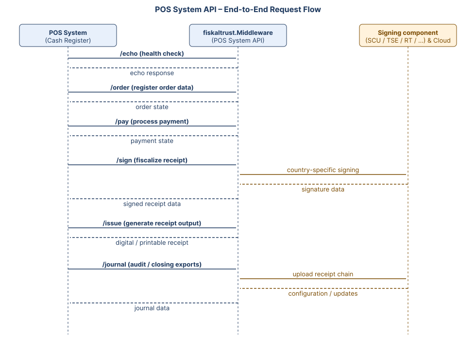

# Introduction

The **fiskaltrust POS System API** is the central, process-driven interface between a POS system and the **fiskaltrust.Middleware**. It provides a unified HTTP/JSON API to execute all fiscal-relevant operations required by a compliant POS integration.

Through this API, POS systems interact with the Middleware to:

- Register order and payment data.
- Fiscalize and cryptographically seal receipts.
- Issue digital or printable receipts.
- Export journal data for audits and closings.

The POS System API acts as the **single technical entry point** for fiscalization, payments, issuing, and data export, independent of country-specific fiscal rules.

## Process-Driven and Idempotent Design

The API follows a **processual, state-based design**. Each transaction is handled as a sequence of state transitions on the server side, comparable to a finite state machine.

Key characteristics:

- Each request represents one step in a fiscal process.
- Calls are **idempotent** and safe to retry.
- The backend guarantees deterministic results for repeated calls.

To enable safe retries, every request must include a unique **operation identifier** (`x-operation-id`). If a request is repeated with the same identifier, the Middleware either:

- Returns the already completed result, or
- Blocks until the original operation finishes

This approach ensures robustness against network interruptions and timeouts without risking duplicate fiscal actions.

## Authentication and Identification

The POS System API is always accessed **in the context of a CashBox**.

Each request must include:

- `x-cashbox-id` – identifies the target CashBox.
- `x-cashbox-accesstoken` – authenticates the caller.
- `x-possystem-id` – identifies the registered POS system variant.
- `x-operation-id` – ensures idempotent execution.

All access credentials are managed and issued via the **fiskaltrust Portal** as part of the CashBox configuration.

## Core API Endpoints

The API exposes a compact, consistent set of endpoints that cover the full fiscal lifecycle. The same endpoints are used across all supported markets — country-specific compliance is driven by the CashBox configuration, not by a separate API surface.

| Endpoint   | Purpose                                                                                              | Typical use case                                          |
|------------|------------------------------------------------------------------------------------------------------|-----------------------------------------------------------|
| `/echo`    | Connectivity and health check; can also be used to verify Middleware version and capabilities.       | Test the connection on POS startup.                       |
| `/order`   | Register order data and query the processing state of an order.                                      | Send sales lines, items, quantities, prices and VAT.      |
| `/pay`     | Execute and monitor payment processing, including timeouts and payment-method allocation.            | Settle an order with one or more payment methods.         |
| `/sign`    | Finalize and fiscalize the receipt according to national rules (signing, hash chaining, etc.).       | Produce an audit-proof, country-compliant receipt.        |
| `/issue`   | Generate and manage receipt output, and update its delivery state (digital or printable).            | Hand the signed receipt over to the customer.             |
| `/journal` | Retrieve audit-relevant journal data and ranges for closings, exports and inspections.              | Daily/monthly closings, audit exports, archive snapshots. |

Each endpoint performs a well-defined step within the overall fiscal workflow and contributes to a traceable, compliant transaction chain. For the full request/response models, payload schemas and per-endpoint error codes, see the [POS System API reference (v2.1)](https://docs.fiskaltrust.cloud/apis/pos-system-api).

## End-to-End Request Flow

The diagram below illustrates a typical fiscal transaction lifecycle, showing how a POS system interacts with the fiskaltrust.Middleware through the POS System API and how the Middleware in turn communicates with country-specific signing components and the fiskaltrust.Cloud.

Every request carries the headers `x-cashbox-id`, `x-cashbox-accesstoken`, `x-possystem-id`, and `x-operation-id`, so each step can be safely retried without producing duplicate fiscal actions.

## Versioning and Compatibility

The POS System API uses **semantic versioning**:

- Breaking changes are introduced only in major versions
- Non-breaking changes may add fields without altering existing models
- If no version is specified, the latest available version is used

This guarantees backward compatibility while allowing regulatory and functional extensions over time.

## FAQ

**Q: What is the difference between the POS System API and the fiskaltrust.Middleware?**

A: The fiskaltrust.Middleware is the component that performs the actual fiscalization, signing, and journaling logic. The POS System API is the HTTP/JSON interface exposed by the Middleware that POS systems use to drive these operations. POS systems do not call signing components (SCU, TSE, RT, …) directly — they always interact with the Middleware through the POS System API.

**Q: Do I need a different integration per country?**

A: No. The POS System API is unified across markets and abstracts country-specific fiscal rules behind the same set of endpoints (`/echo`, `/order`, `/pay`, `/sign`, `/issue`, `/journal`). Country-specific behaviour is driven by the CashBox configuration and the data sent in the requests, not by a separate API surface.

**Q: What is `x-operation-id` used for, and how should it be generated?**

A: `x-operation-id` is a unique identifier per logical operation that makes requests idempotent. If the same `x-operation-id` is sent twice (for example after a network timeout), the Middleware returns the result of the original operation or blocks until it completes, instead of executing the operation a second time. It should be a unique value per logical operation (typically a GUID/UUID) and must remain identical across retries of the same call.

**Q: Where do I get `x-cashbox-id`, `x-cashbox-accesstoken`, and `x-possystem-id`?**

A: These values are issued via the fiskaltrust Portal as part of configuring a CashBox and registering a POS system variant. They are tied to a specific CashBox configuration and must be stored securely on the POS side.

**Q: Is the POS System API safe to retry on network errors?**

A: Yes. The API is designed around an idempotent, state-based model. Retrying a request with the same `x-operation-id` is the recommended way to recover from transient network issues, timeouts, or interrupted responses without risking duplicate fiscal actions.

**Q: How are breaking changes handled?**

A: The API uses semantic versioning. Breaking changes are introduced only in major versions; non-breaking changes may add optional fields without altering existing models. If no version is specified, the latest available version is used, so pinning to a specific major version is recommended for production integrations.

**Q: Can `/pay` be used without `/sign`, or vice versa?**

A: Each endpoint represents a step in the fiscal workflow and is intended to be used as part of the overall process. Which steps are required depends on the country-specific fiscal rules and the business case being executed. The combination of steps performed for a given transaction must result in a complete, traceable, and compliant chain.
