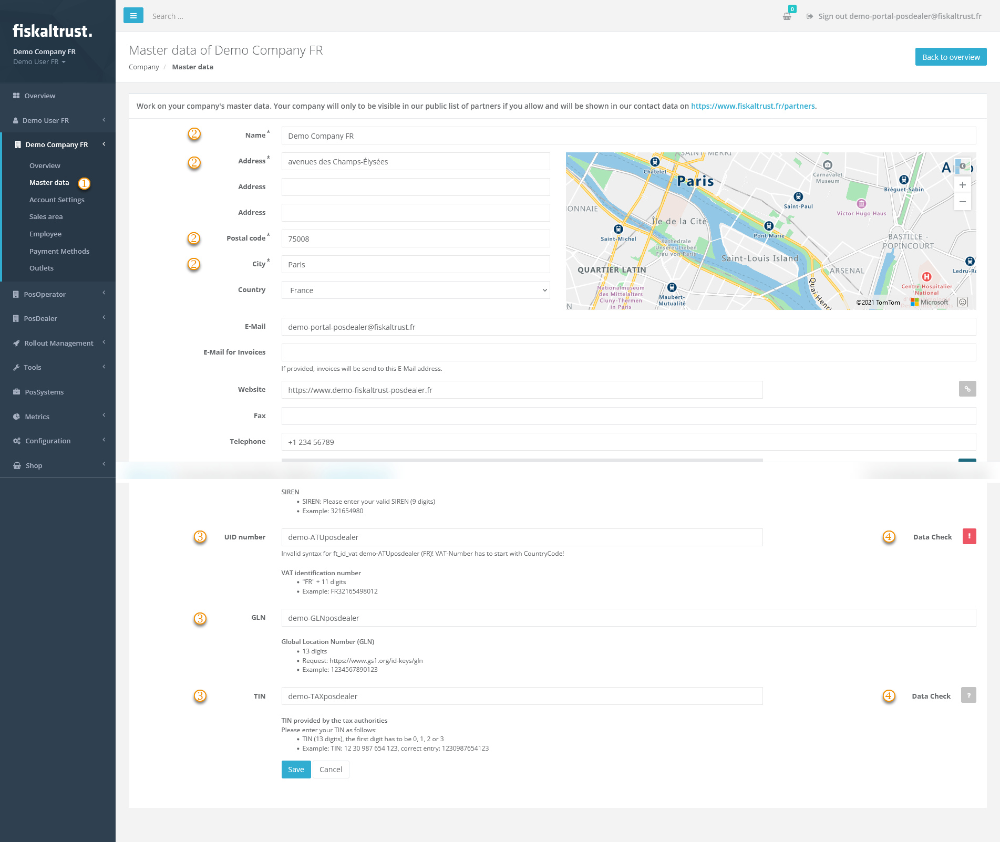
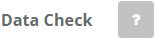
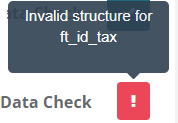
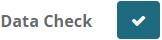

#### Preview

*Figure 1. Master data edit screen in the fiskaltrust.Portal.*

| Steps | Description                                                                                                                |
|:---------------------------:|--------------------------------------------------------------------------------------------------------------------------------|
| |Enter the fiskaltrust.Portal and choose `[COMPANY NAME]` / `Master data`  |
| |Check the fields marked with * for correct and complete data.  |
| |Check the values for tax identification numbers using the explanations arranged below the data fields. Observe the notes on notation, such as the number of digits and the omission of spaces. Also, note the information on whether one or more dates are required, as this varies from country to country.  |
| |Then check the entered values with the `Data Check` on the right of the data fields.  |

*Table 1. Steps for checking and validating master data fields.*

| data check results | options                                                                                                                |
|:----------------------:|-------------------------------------------------------------------------------------------------------------------------------------|
| |This symbol represents an unchecked value in the data field.  |
| |This symbol stands for invalid values. Hover with your mouse over the symbol and note the description. Change the values accordingly and repeat the data check. |
| |This symbol validates the value in the data field. Please note that this is no protection from using duplicates.|

*Table 2. Data check result symbols and their meaning.*

#### SIREN and SIRET

**SIREN** is the French trade register number. Every company in France has one, and it is nine digits long.

**SIRET** identifies a physical location of a company, including its head office, and is fourteen digits long. It is the SIREN followed by five more digits: four numbering the location and one check digit. A company therefore has one SIREN and as many SIRETs as it has locations.

:::caution enter and verify both before configuring anything

_fiskaltrust_ uses the SIRET as the base value for the fiskaltrust.SecurityMechanism. Both numbers must therefore be entered and verified **before** any CashBox is configured.

A configuration created without a verified SIRET is defective and cannot be used for legally compliant fiscalization — and it cannot be repaired afterwards, because the configuration, the SCU in particular, cannot be changed once it has been created and saved.

:::

**Entering the SIREN.** Open the company master data, enter the SIREN and use the button next to the field to run the data check. The number is verified against the French trade register. Once the check succeeds the field becomes read-only and the SIREN can no longer be changed.

**Entering the SIRET.** Outlets are managed from the company menu. A new account automatically has one outlet, the head office. Open it, **enter the address first**, then enter the SIRET and run the data check with the button to the right of the field. Here too the field becomes read-only once verified.

##### When the data check fails

The reason is shown as a tooltip: rest the mouse pointer on the data check button for a few seconds.

*The number is not found.* If the company or the outlet was registered recently, it may not be in the public register yet. Wait a few days and check again. Otherwise look for a typing mistake.

*The number does not match the company or the outlet.* Check the number for typing mistakes. Check that the company name in the first field is spelled correctly, and that it is the same name the trade register uses — not a trading name. For a SIRET, also confirm that the SIREN has already been entered and verified in the company master data, that the first nine digits of the SIRET are identical to the SIREN, and that the outlet address is correct.

*The number is definitely valid but the check still fails.* The data check queries the [Sirene API](https://www.sirene.fr). Look your number up there directly.

* If Sirene shows your company and the details match what you entered in the fiskaltrust.Portal, [contact us](../../../../../information-sources/contacting-support.md).
* If Sirene does not show your company, the problem is upstream of _fiskaltrust_. Ask whoever registered the company why it does not appear. If they confirm that everything was filed correctly, take it to [INSEE](https://www.insee.fr/fr) — under `Services` / `Aide`, the SIRENE FAQ has an entry for the message *"Aucun élément trouvé pour le numéro Siren"* that sets out the procedure. INSEE can also be reached by e-mail and by telephone.
