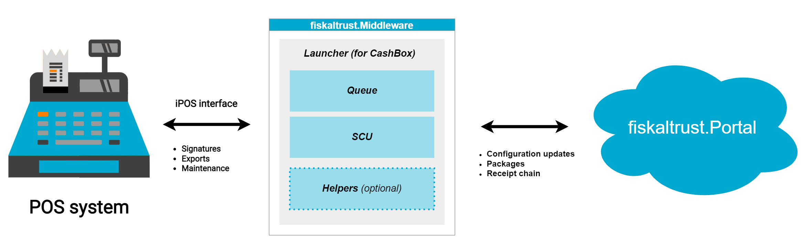

# Architecture

:::info summary

After reading this, you can explain the basic architecture of the fiskaltrust.Middleware and the purpose of a Queue, an SCU, a CashBox and a Launcher.

:::

## Introduction

A fiskaltrust setup consists of three tiers:

1. **Your POS System**
2. **fiskaltrust.Middleware**, which runs your _CashBox_ and provides the service
3. **fiskaltrust.Portal**, which manages your setup

*Figure 1. Overview of the interaction between the three tiers of a fiskaltrust setup.*

The fiskaltrust.Middleware is the autonomous service that provides the **core fiscalization functionality**:

* Your POS System connects to the Middleware to **sign and persist its receipts**.
* The Middleware connects to the fiskaltrust.Portal to upload its receipt chain and to receive the configuration changes you make in the Portal.

| Component | Purpose |
|---|---|
| [Portal](#portal) | Management hub for accounts, CashBoxes and updates |
| [CashBox](#cashbox) | Configuration set of a Middleware instance |
| [Launcher](#launcher) | Bootstraps the Middleware instance |
| [Queue](#queue) | Communication interface, receipt datastore and signing requests |
| [SCU](#scu) | Creates the legally compliant receipt signature |
| [Helpers](#helpers) | Additional components, for example Portal communication |

*Table 1. Components of a fiskaltrust setup.*

## Portal

The fiskaltrust.Portal is the central **management hub**. In it, you:

* Control your fiskaltrust account and, subject to their authorization, the accounts of your associated PosOperators.
* Set up and update your Middleware instances (_CashBoxes_).

The **Middleware** uses the fiskaltrust.Portal to receive its CashBox configuration, for package management, and to update its receipt chain.

:::info

fiskaltrust operates a Portal in each country at `https://portal.fiskaltrust.[CCTLD]`. See [Countries](countries.md).

:::

## CashBox

The CashBox is the **configuration set** of a Middleware instance. It contains all details the Middleware needs to run.

* You **configure CashBoxes in the fiskaltrust.Portal**.
* The Middleware fetches the latest CashBox configuration on each start.

See [CashBox](../technical-operations/middleware/cashbox.md).

## Middleware

The Middleware is the **fiskaltrust service** your POS System uses directly. It is modular: you combine components in a Middleware instance (_CashBox_) to fit your setup and requirements.

### Launcher

The Launcher is the bootstrap component of a Middleware instance. On start, it:

1. Downloads the **latest CashBox configuration** from the fiskaltrust.Portal.
2. Performs the necessary **maintenance**.
3. **Starts** the configured components.

| Launcher | Use case |
|---|---|
| [Desktop Launchers](../technical-operations/middleware/launchers/desktop.md) | On-premise installation on Windows, Linux and macOS |
| [Android Launcher](../technical-operations/middleware/launchers/android.md) | On-premise installation on Android |
| [Container setup (Helm chart)](../technical-operations/middleware/launchers/custom-data-center.md) | Container-based environments such as Kubernetes |

*Table 2. Launcher types.*

Wherever legally possible, fiskaltrust also offers a fully cloud-based, hosted Middleware. See [CloudCashbox](../technical-operations/middleware/launchers/cloudcashbox.md).

### Queue

The Queue is the **central component** of your fiskaltrust setup. It:

* Provides the **communication interface** (for example REST) for your POS System.
* Manages the **receipt datastore**.
* Handles the signing requests from your POS System.

### SCU

The _Signature Creation Unit_ (SCU) supports the Queue. It provides the Queue with the **legally compliant receipt signature** required by national regulations.

:::info

Depending on your market's regulations, the SCU may require an additional [SSCD](https://en.wikipedia.org/wiki/Secure_signature_creation_device). Typically, an externally attached hardware dongle or a third-party SaaS platform provides the signature to the SCU.

:::

### Helpers

Depending on the use case, you can configure helper components in addition to Queues and SCUs. The **Helipad** helper is deployed by default and handles the Middleware's communication with the fiskaltrust.Portal. See [Helper](../technical-operations/middleware/helper.md).
