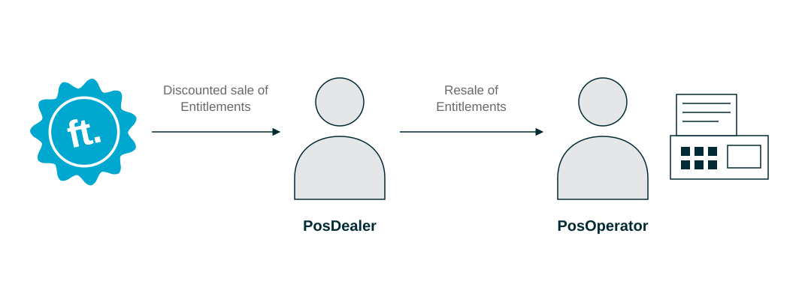

# Business Model

:::info summary

After reading this, you can explain how fiskaltrust's partner-based business model works and its advantages for PosCreators, PosDealers and PosOperators.

:::

fiskaltrust is a software company that develops Compliance-as-a-Service and add-on products for cash registers (**POS systems**) in Europe. The core product is the fiskaltrust.Middleware. Cash register manufacturers (**PosCreators**) integrate the Middleware directly to make their POS systems compliant with local fiscalization laws.

fiskaltrust distributes its **products** and **product bundles** in partnership with cash register dealers (**PosDealers**). Through their existing sales structures in each country, PosDealers offer a product portfolio tailored to the needs of each of their customers (cash register operators or **PosOperators**).

*Figure 1. Entitlements flow from fiskaltrust to the PosDealer and on to the PosOperator.*

In this model:

* The **PosOperator** remains the direct customer of the PosDealer.
* The **PosDealer** integrates fiskaltrust products into their own portfolio and pricing model, supported by volume discounts.
* The **PosDealer** supports the PosOperator; **fiskaltrust** supports the PosDealer.

## Advantages for PosDealers

### Products

| Advantage | Description |
|---|---|
| **Fiscalization from a single source** | fiskaltrust is an all-in-one fiscalization partner and your single point of contact for legally compliant fiscalization. |
| **Compliance-as-a-Service** | fiskaltrust keeps fiscalization up to date and legally compliant in the background, also when legal requirements change. You and your PosOperators can focus on your core business. |
| **Product bundles** | Market-specific bundles contain all products required for legally compliant fiscalization and follow a service model. Standalone products are available wherever possible. |
| **Flexibility** | You can configure the products to fit existing infrastructure and POS systems. PosCreators can configure Middleware packages for anything from standalone POS systems to highly interconnected cloud systems. |

*Table 1. Product advantages for PosDealers.*

### Distribution model

| Advantage | Description |
|---|---|
| **New customer segments** | Compliance-as-a-Service extends your product portfolio and lets you address new customer segments. |
| **Integration into your portfolio** | fiskaltrust develops its products for resale. You can configure and install them without involving the PosOperator, and bundle them into your own offering. |
| **Yearly recurring revenue** | Products are sold as subscriptions. PosOperators pay a fixed yearly price for fiscal compliance, also when legal requirements change; you receive calculable, recurring annual revenue. |
| **Volume discounts** | A volume purchase agreement gives you discounts starting from low purchase quantities. See [Volume purchase agreement](../buy-resell/overview.md#volume-purchase-agreement). |

*Table 2. Distribution model advantages for PosDealers.*

### Portal

| Advantage | Description |
|---|---|
| **Single point of purchase** | Buy digital and physical products, such as hardware signing devices from different manufacturers, in the fiskaltrust.Portal. |
| **Automation** | For large rollouts, use templates for CashBox configurations, bulk imports of customers and outlets, bulk purchases and assignments of products, and automated Middleware rollout. See [Rollout Automation](../technical-operations/rollout-automation/templates.md). |
| **Remote rollout preparation** | Prepare the commercial and technical prerequisites of a rollout remotely in the fiskaltrust.Portal. Configuration, purchase and resale are independent of on-site commissioning. |
| **After-sales support** | After a rollout, apply mass updates to configurations and Middleware versions. How-to guides and documentation templates help you support PosOperators. |

*Table 3. fiskaltrust.Portal advantages for PosDealers.*

## Country-specific products and contact details

All fiskaltrust products serve the same goal of carefree international fiscalization, but each market has its own sub-products and bundles. The market websites describe them in detail; you can also contact a Customer Success representative.

import Tabs from '@theme/Tabs';
import TabItem from '@theme/TabItem';
import SalesAT from '../_markets/at/overview/business-model/_sales.mdx';
import SalesBE from '../_markets/be/overview/business-model/_sales.mdx';
import SalesFR from '../_markets/fr/overview/business-model/_sales.mdx';
import SalesDE from '../_markets/de/overview/business-model/_sales.mdx';
import SalesGR from '../_markets/gr/overview/business-model/_sales.mdx';
import SalesIT from '../_markets/it/overview/business-model/_sales.mdx';
import SalesPL from '../_markets/pl/overview/business-model/_sales.mdx';
import SalesPT from '../_markets/pt/overview/business-model/_sales.mdx';
import SalesES from '../_markets/es/overview/business-model/_sales.mdx';

<Tabs groupId="market">

  <TabItem value="AT" label="Austria">
    <SalesAT />
  </TabItem>

  <TabItem value="BE" label="Belgium">
    <SalesBE />
  </TabItem>

  <TabItem value="FR" label="France">
    <SalesFR />
  </TabItem>

  <TabItem value="DE" label="Germany">
    <SalesDE />
  </TabItem>

  <TabItem value="GR" label="Greece">
    <SalesGR />
  </TabItem>

  <TabItem value="IT" label="Italy">
    <SalesIT />
  </TabItem>

  <TabItem value="PL" label="Poland">
    <SalesPL />
  </TabItem>

  <TabItem value="PT" label="Portugal">
    <SalesPT />
  </TabItem>

  <TabItem value="ES" label="Spain">
    <SalesES />
  </TabItem>

</Tabs>
