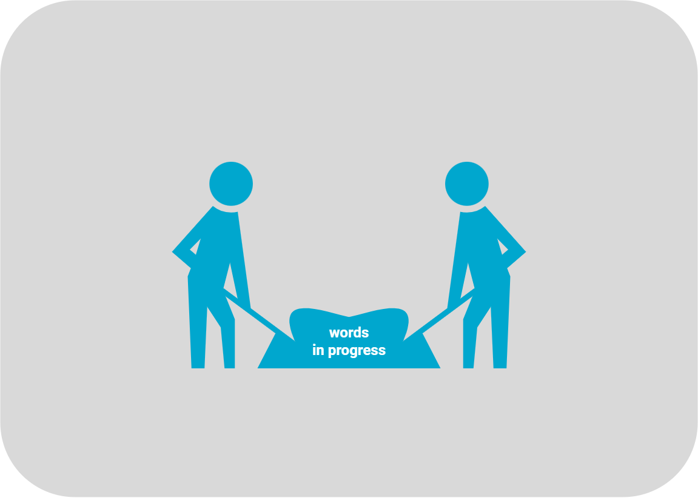

# Terms of Service

:::info summary
After reading this, you can explain _fiskaltrust_ terms of service.

:::

## Country-specific information

import Tabs from '@theme/Tabs';
import TabItem from '@theme/TabItem';
import TermsAT from '../../_markets/at/overview/legal-data-protection/terms-of-service/_terms-of-service.mdx';
import TermsBE from '../../_markets/be/overview/legal-data-protection/terms-of-service/_terms-of-service.mdx';
import TermsFR from '../../_markets/fr/overview/legal-data-protection/terms-of-service/_terms-of-service.mdx';
import TermsDE from '../../_markets/de/overview/legal-data-protection/terms-of-service/_terms-of-service.mdx';
import TermsGR from '../../_markets/gr/overview/legal-data-protection/terms-of-service/_terms-of-service.mdx';
import TermsIT from '../../_markets/it/overview/legal-data-protection/terms-of-service/_terms-of-service.mdx';
import TermsPL from '../../_markets/pl/overview/legal-data-protection/terms-of-service/_terms-of-service.mdx';
import TermsPT from '../../_markets/pt/overview/legal-data-protection/terms-of-service/_terms-of-service.mdx';
import TermsES from '../../_markets/es/overview/legal-data-protection/terms-of-service/_terms-of-service.mdx';

<Tabs groupId="market">

  <TabItem value="AT" label="Austria">
     <TermsAT />
  </TabItem>

  <TabItem value="BE" label="Belgium">
     <TermsBE />
  </TabItem>

  <TabItem value="FR" label="France">
     <TermsFR />
  </TabItem>

  <TabItem value="DE" label="Germany">
     <TermsDE />
  </TabItem>

  <TabItem value="GR" label="Greece">
     <TermsGR />
  </TabItem>

  <TabItem value="IT" label="Italy">
     <TermsIT />
  </TabItem>

  <TabItem value="PL" label="Poland">
     <TermsPL />
  </TabItem>

  <TabItem value="PT" label="Portugal">
     <TermsPT />
  </TabItem>

  <TabItem value="ES" label="Spain">
     <TermsES />
  </TabItem>

</Tabs>