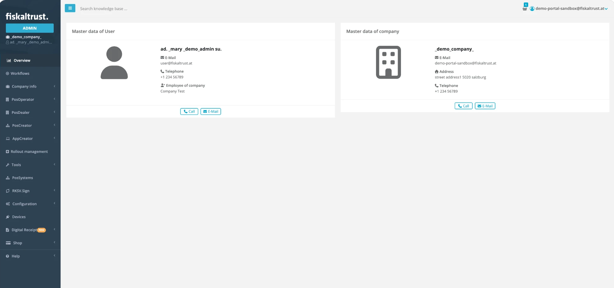

# Management Portal

:::info summary

After reading this, you can explain the tasks performed in the fiskaltrust.Portal.

:::

## Introduction

The fiskaltrust.Portal is the central **management dashboard** for your fiskaltrust account and services. It covers your account and company data, PosOperator associations, configuration and rollout of your Middleware instances, and orders for products and services.

*Figure 1. The dashboard of the fiskaltrust.Portal.*

| Task | Portal area |
|---|---|
| [Account Management](#account-management) | _Company_ and _User_ sections |
| [Operator Management](#operator-management) | _PosOperator_ section |
| [Surrogating](#surrogating) | Switching into a PosOperator account |
| [Data Management](#data-management) | Exports and third-party replication |
| [CashBox Maintenance](#cashbox-maintenance) | _Configuration_ section |
| [Shop](#shop) | Add-on products and rollout plans |

*Table 1. Tasks in the fiskaltrust.Portal.*

:::tip surrogating

[Surrogating](#surrogating) lets you, as a PosDealer, perform many steps for your associated PosOperators.

:::

## Account Management

In the _Company_ section:

1. Select the applicable **roles**. See [Company Roles](../getting-started/company-roles.md).
2. Sign the **contractual agreements** for your company.
3. Check the master data for completeness and the business data for validity.
4. Add your company's **outlets** and their configurations.
5. Create accounts for your **employees** and manage their permissions.

In the _User_ section, manage your user data: **contact and address details**, username and password.

## Operator Management

In the _PosOperator_ section, you **invite** your customers to fiskaltrust and manage their accounts. Once a PosOperator accepts your invitation and signs a **contract** for the PosOperator role, their **account is associated** with yours, which enables [surrogating](#surrogating).

See [Invitation process](../getting-started/operator-onboarding/invitation-process.md).

## Surrogating

As a PosDealer, you can switch into the accounts of your PosOperators. Depending on the permissions granted, you have:

* **read-only** access,
* **write** access, or
* the authority to **sign contracts** on behalf of the PosOperator.

Surrogating is an essential feature for PosDealers to establish and expand their business collaboration with PosOperators. See [Surrogating](../getting-started/operator-onboarding/surrogating.md).

## Data Management

In the fiskaltrust.Portal, you can **export your data** by various selection criteria and in **different export formats**. Where available, you can also configure data replication to **third-party service providers**. See [Exports](../technical-operations/maintenance/exports.md).

## CashBox Maintenance

The _Configuration_ section is the starting point for every CashBox:

1. Create and configure the **CashBox components** (Queue, SCU).
2. **Assemble** the components into a CashBox.
3. Download the **deployment package** for your target system.

See [Manual Configuration](../technical-operations/middleware/manual-configuration.md).

## Shop

The shop gives access to all fiskaltrust **add-on products and services**, for example product bundles, hardware solutions and archives. Purchase items individually or as part of pre-configured **rollout plans**. See [Shop](../buy-resell/shop.md) and [Rollout Plans](../buy-resell/rollout-plans.md).
