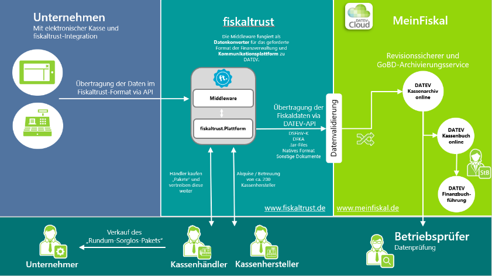
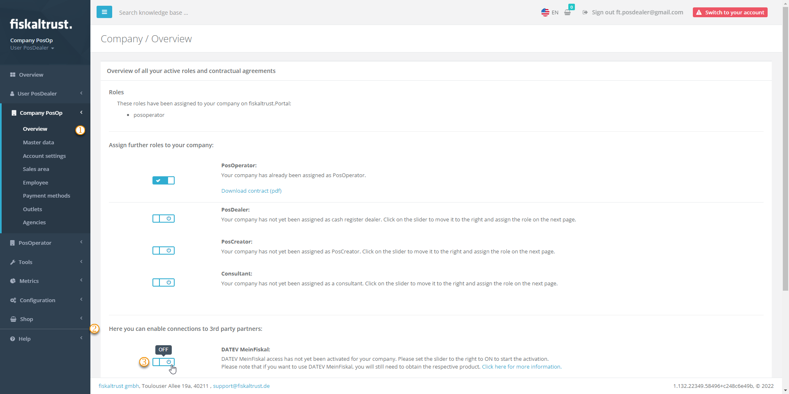
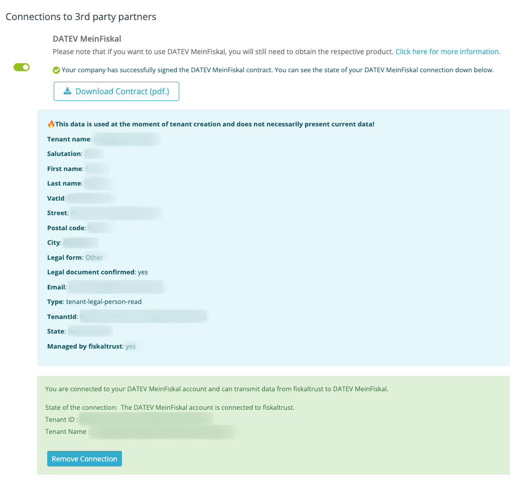
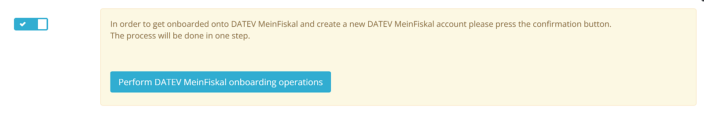
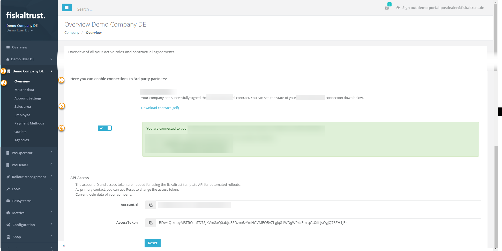

# DATEV MeinFiskal

:::info summary

After reading this, you will understand the benefits of connecting a **fiskaltrust.Account to DATEV MeinFiskal** for PosOperators, and how PosDealers can set up the integration.

:::

:::caution Austria / France

As **DATEV MeinFiskal** is only available in Germany, this tutorial does not apply to Austria or France.

Note that the included links in this section lead to DATEV, which only keeps its documentation in German.

:::

- [DATEV](https://www.datev.de/) offers fiscalization solutions for companies in Germany. The solutions for electronic cash management of DATEV meet all legal requirements.   
- [DATEV MeinFiskal](https://www.meinfiskal.de/) is an open cloud platform hosted by DATEV. PosCreators, providers of TSE (technical security equipment) and fiskaltrust joined this platform.  
- DATEV MeinFiskal is an integral part of the **fiskaltrust.Carefree** product bundle. The data is transferred from the fiskaltrust.Portal via an automated interface with the **DATEV MeinFiskal** platform.  

The **fiskaltrust.Carefree** product bundle also includes the [DATEV Kassenarchiv online](https://www.datev.de/web/de/berufsgruppenuebergreifend/mydatev/cloud-anwendungen/datev-kassenarchiv-online). Additionally, this service enables [revision-safe archiving](../revision-safe-archiving.md) in fiskaltrust's cloud, daily archiving of end-of-day totals, individual records and other tax-relevant documents as an **extended memory** of the PosSystem. Using DATEV Kassenarchiv online, your PosOperator benefits from a higher level of legally compliant data security:

* Additional storage to prevent data loss.
* Proof that nobody can change the PosSystem data.
* Accordance with the GoBD.
* Audit-proof archive for the duration of the statutory retention period.
* Storage of data in DATEV data centers.

Tax consultants and authorities are working on introducing digital workflows for their clients. The interface named [DATEV Kassenbuch online](https://www.datev.de/web/de/shop/produkt-details/kassenbuch-online-95150) is available from DATEV; data from PosSystems for financial accounting can be forwarded directly to the tax advisor's DATEV software solution. In addition, an up-to-date database without delays creates transparency in the event of an upcoming external audit.

## Process description

### PosCreator

The PosCreator adds a PosSystem in the fiskaltrust.Portal. Thereby a **PosSystemId** is assigned to it. Then the PosCreator invites PosDealers to use this PosSystem.
A valid PosSystemId is a prerequisite for successfully registering PosOperators with MeinFiskal.

The PosCreator checks their implementation by generating a DFKA-Export. If the validation report inside the DFKA contains no errors, then the PosDealer can start with the onboarding process. **Onboarding to MeinFiskal is only allowed if the validation report doesn't contain any errors**.

We highly recommend creating one daily-closing which contains all possible business cases your PosSystem offers in your check. That way it's easy to identify errors that would prevent the successful import into DATEV MeinFiskal in the future. 

#### How To: DFKA-Export & validation report

Generate a DFKA-Export by clicking the **Export** button on the desired queue and then selecting **DFKA**. Extract the downloaded .zip file and open the JSON file named **validation-report.json**.

Check if the **isValid** field is **true**. If the **isValid** field shows the value **false**, then your DFKA contains errors. The errors are listed under the **Errors** field and always refer to the DFKA itself (dfka.json). While exporting the DFKA, our backend checks if the data in the dfka.json is valid according to the schema in the **taxonomie-schema.json**. This is standard JSON schema validation and can be reproduced using tools like [JSON Schema Validator](https://www.jsonschemavalidator.net/). Invalid DFKA exports won't be imported into DATEV MeinFiskal.

#### Common errors in the validation report

| Error | Cause |
|-------|-------|
| Does not validate against content encoding `base64` cash_point_closing.security.tse.modules[0].certificate | Certificate of the TSE is missing. Check if TSE is active in fiskaltrust.Portal |
| JSON does not match any schemas from `anyOf` cash_point_closing.head.company | Tax ID or VAT ID missing, but at least one of them is required. Check **Master data** in fiskaltrust.Portal |
| String 'XXXX' does not match regex pattern `^[A-Z]{2}.{1,13}` cash_point_closing.head.company.location.vat_id_number | VAT ID has the wrong format. Check if VAT ID has the format DE123456789 in **Master Data** |
| Required properties are missing from object: brand, model, base_currency_code cash_point_closing.head.company.location.cash_register | PosSystem Master data is missing. Check if PosSystemId is included in all requests to the fiskaltrust.Middleware |
| JSON is valid against no schemas from `oneOf` cash_point_closing.transactions[X].head.references[X] | Reference to other system is missing mandatory data. Check [ReceiptCaseData reference rules](../../../../poscreators/middleware-doc/middleware-de-kassensichv/data-structures/data-structures.md#receipt-case-data-ftreceiptcasedata) |

*Table 1. Common errors in the DFKA validation report and their causes.*

### PosDealer

The PosDealer activates the **DATEV MeinFiskal** function in the fiskaltrust.Portal by signing the **user agreement** on behalf of the PosOperator.

Customer data such as **Email address** and **tax number** (St.-ldNr. or USt-ldNr.) are exchanged between the fiskaltrust.Portal and the [DATEV MeinFiskal](https://www.meinfiskal.de/) platform. 

A **DATEV MeinFiskal** user account and a password are created automatically at DATEV. 

After the automatic account creation, the PosDealer receives an email from DATEV with a link to reset the account's password.

### PosOperator

After the PosDealer has set a new password and prepared the account for the PosOperator, the PosOperator receives their own welcome email with a link to edit the password if they wish to do so.

After that, the DATEV MeinFiskal account is fully operational, and the PosOperator can use its services such as **DATEV Kassenarchiv online**.

Further services like the **DATEV Kassenbuch online** are available at the MeinFiskal platform.

Fiskaltrust handles the generation of the legally required data formats (DSFinV-K, DFKA taxonomy, .tar files, native format, other documents), as well as the connection and data transfer to **DATEV MeinFiskal** via the fiskaltrust.Portal.

*Figure 1. Interfaces and data flow between the fiskaltrust.Portal and the DATEV MeinFiskal platform.*

## Setup

### Prerequisites

As a PosDealer, you can get an overview of all your PosSystems and their **PosSystemId** in use.
1. Log in to **fiskaltrust.Portal** and select `PosSystems`.
2. If no PosSystem should be available, contact your PosCreator.

If the following requirements are not met, the [PosOperator Onboarding](../../../getting-started/operator-onboarding/invitation-process.md) must be completed first, or the PosOperator itself must perform the setup.

1. The PosOperator already has an account in the **fiskaltrust.Portal** and agreed to the general terms and conditions and the PosOperator user agreement of fiskaltrust.  
2. The [Master data](../../../getting-started/operator-onboarding/master-data.md "Master data") are checked by the PosOperator or by the PosDealer.  
3. As a PosDealer, you have full authorizations (Write/Read, Contract Conclusion) to the account of the PosOperator.

#### Master data limitations 

The following table lists the maximum number of characters allowed for the DATEV onboarding:

| Master data | Maximum number of characters | Regular Expression |
|-------------|------------------------------|--------------------|
| AccountName | 32 | ^\[^\s\].*\[^\s\]$ |
| City | 42 | ^\[^\s\].*\[^\s\]$ |
| Mail | 32 | Standard mail |
| Firstname | 32 | ^\[^\s\].*\[^\s\]$ |
| PostalCode | Max 5 min 5 | ^\d{5}$ |
| Street | 32 | ^\[^\s\].*\[^\s\]$ |
| Surname | 32 | ^\[^\s\].*\[^\s\]$ |
| VatId | 11 | ^DE[0-9]\{9\}$ |

*Table 2. Maximum number of characters and regular expressions for master data used in DATEV onboarding.*

#### Address data validation

DATEV has strict checks that verify the entered address data. The city and street must belong to the correct PLZ registered with Deutsche Post. Check whether your address can be found with the given PLZ. You can use the following website provided by the Deutsche Post [PLZ Check](https://www.postdirekt.de/plzserver/)

### Sign contract permission

1. Log in to **fiskaltrust.Portal** as a PosDealer. 
2. Go to `PosOperator` / `Overview`. 
3. If necessary, enter filter criteria to narrow the search results and select `Search`. 
4. Use the **Permissions** icon to check whether `Contract conclusion` is active.
5. If this permission is not active, contact the PosOperator to activate it for you.
6. Close the dialog box by clicking **OK**. 
  
### Master data

1. At `PosOperator` / `Overview`, select the link at `Name` and go to the account of the PosOperator.
2. Select `Company` / `Master data`.
3. Check if every mandatory field, like `Name*` or `Address*`, is filled in.
4. Check whether you can successfully perform a validity check using either `St-ldNr` or `USt-ldNr`.
5. Save your entries with `Save`. 

### Setup instructions

:::tip

Note that the **DATEV MeinFiskal** account is created automatically during the connection. Therefore, **do not create** a **DATEV MeinFiskal** account for your PosOperator in advance. Fiskaltrust can't delete accounts in the DATEV-Portal that have been created by other parties.

:::

#### Setup after the purchase of a fiskaltrust.Carefree subscription

:::info summary

In order for a PosOperator to use DATEV MeinFiskal, the PosDealer must purchase either at least one Carefree subscription or a standalone product [DATEV MeinFiskal Kassenarchiv online](https://portal.fiskaltrust.de/#/Shop/Product/4445-041040) for that PosOperator. 
Whether the [fiskaltrust.Carefree subscription](https://portal.fiskaltrust.de/#/Shop/Product/4445-021040) was purchased without or with the additional product [TSE-as-a-Service](https://portal.fiskaltrust.de/#/Shop/Product/4445-021050) is irrelevant when setting up the connection with DATEV MeinFiskal.
Furthermore, neither a queue nor a cashbox is necessary when setting up the connection. However, for a successful data backup via DATEV MeinFiskal, a queue and a cashbox must be set up and activated if required. In case of problems, check [Troubleshooting](#troubleshooting) below.

:::

##### Connection setup

*Figure 2. fiskaltrust.Portal Company overview with the section for enabling third-party connections to DATEV MeinFiskal.*

| Steps | Description |
|-------|-------------|
|  | After purchasing a fiskaltrust.Carefree subscription, select `Company` / `Overview`. |
|  | Scroll down until `Connections to 3rd party partners` / `DATEV MeinFiskal`. |
|  | Press the `slider`, if you have not yet. |
|  | You will be redirected to the page to read and `sign` the contract **(Nutzungsvertrag über die Nutzung von DATEV MeinFiskal)**. With your signature, a background process starts. Allow the process sufficient time to complete and refrain from refreshing the page. Navigating away from the page or logging out and back into the account will not have a negative effect. |

*Table 3. Steps to set up the DATEV MeinFiskal connection in the fiskaltrust.Portal.*

##### Best case: connection setup with success

If the background process for connecting your PosOperator's account to DATEV MeinFiskal was successful, you will see information similar to that shown in the image below.
As a PosDealer, you should have also received a welcome email with further instructions.

*Figure 3. Portal display of the automatically generated username and password after a successful connection.*

##### Worst case: connection could not be set up

*Figure 4. Portal view shown when the background connection process did not succeed.*

| Steps | Description |
|-------|-------------|
|  | If a problem occurs, we strongly recommend checking [Master data](#master-data). |
|  | Then select `Company` / `Overview` again. |
|  | Press `Perform DATEV MeinFiskal onboarding operations` for a retry. |

*Table 4. Steps to retry the DATEV MeinFiskal onboarding after an unsuccessful connection.*

## Status check for a single PosOperator

*Figure 5. Portal Company overview showing the DATEV MeinFiskal connection details and status.*

| Steps | Description |
|-------|-------------|
|  | Open the `Company` accordion in the sidebar. |
|  | Choose `Overview`. |
|  | Scroll down until `Connections to 3rd party partners` / `DATEV MeinFiskal`. |
|  | Details about the connection and status are given here. |
|  | The contract can be downloaded using this link again. It was sent to your email address when the contract was signed or changed. |

*Table 5. Steps to check the DATEV MeinFiskal connection status for a single PosOperator.*

## Troubleshooting

- The **PosDealer** cannot sign the **DATEV MeinFiskal** user agreement for the PosOperator, because they are not authorized to do so. The **PosDealer** must contact the PosOperator to obtain the necessary authorization.

- The **PosDealer** does not succeed on onboarding and receives messages like "Prüfen Sie die Stammdaten". Switch to `Company` / `Master data` and check, if the **Email Address** contains no "+". Check whether the **name fields** do not contain a ".". Both would interrupt the onboarding. Also, check that **no blanks** have been entered before or after the values.
Note that the fiskaltrust.Portal supports up to 100 characters in the fields for **names**, but DATEV MeinFiskal accepts a maximum of 32 characters.

- The **PosDealer** can no longer log into **DATEV MeinFiskal**, because they no longer have the login data. Therefore, they cannot request another password-reset email on the **DATEV MeinFiskal** website on their own. 
This is only possible via the PosOperator once they have received the welcome email with the link to change the password on the **DATEV MeinFiskal** website.

## Import troubleshooting

There are common mistakes that prevent the data from being uploaded to DATEV MeinFiskal or cause errors in the MeinFiskal overview.

| Error | Solution |
|-------|----------|
| No data visible in DATEV MeinFiskal | This is usually caused by the DFKA not being valid. See [How To: DFKA-Export & validation report](#how-to-dfka-export--validation-report) for common errors and help. |
| Data from one daily-closing is missing in DATEV MeinFiskal | This is usually caused by the DFKA not being valid. See [How To: DFKA-Export & validation report](#how-to-dfka-export--validation-report) for common errors and help. If a single daily-closing is affected then a rarely occurring receiptCase might be responsible. |
| Errors in the DATEV MeinFiskal overview regarding mismatches in the revenue sums | If the sums don't match then the error is most of the time caused by the ChargeItems and PayItems not matching in some receipts. Verify that your ChargeItem sums match the PayItem sums in all receipts. The middleware throws errors if the sums don't match and the receipt validation in the fiskaltrust.Portal shows errors. You can use the receipt check button in the fiskaltrust.Portal to identify affected receipts. |

*Table 6. Common data import issues in DATEV MeinFiskal and their solutions.*
