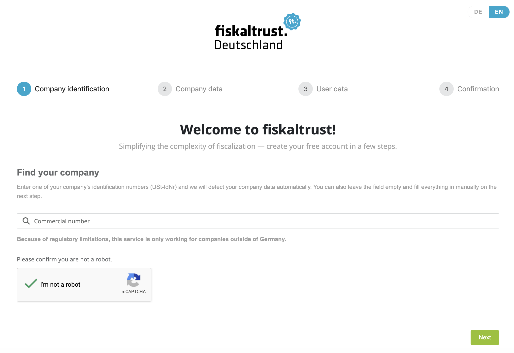
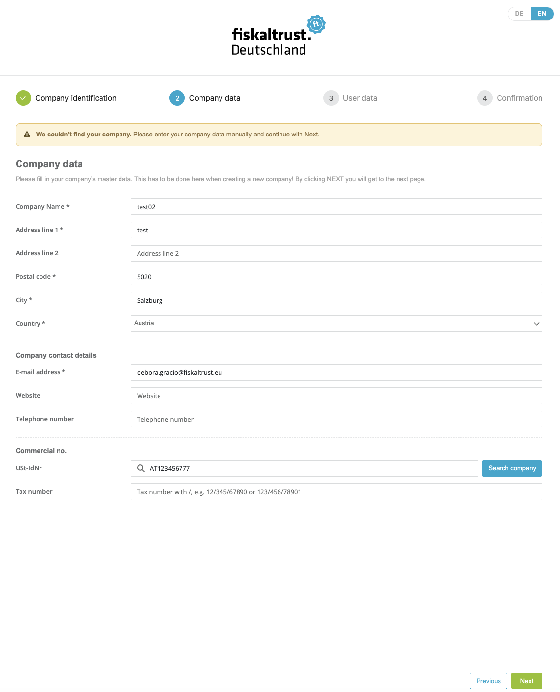
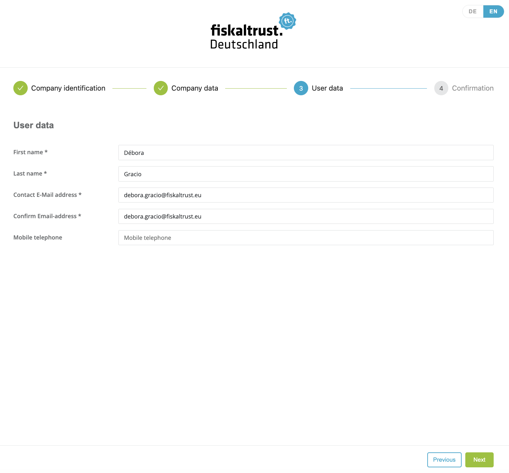
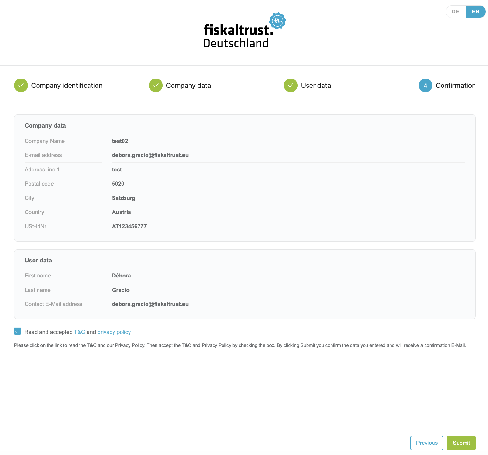
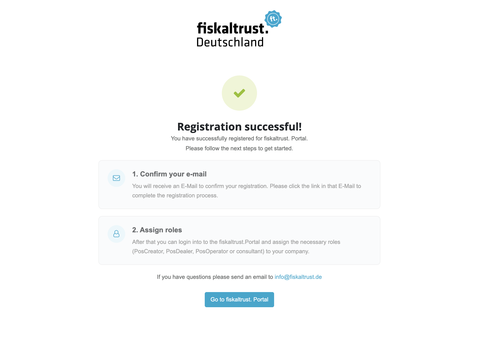
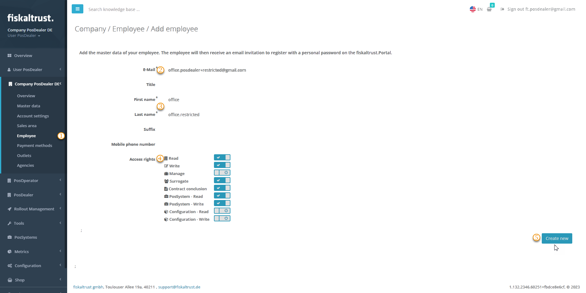
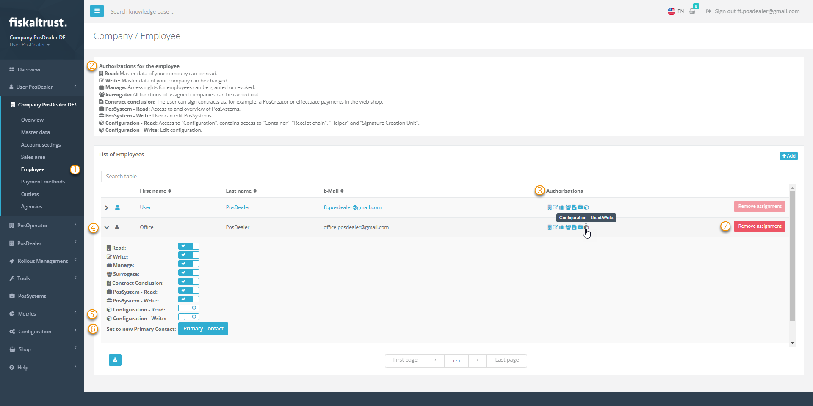
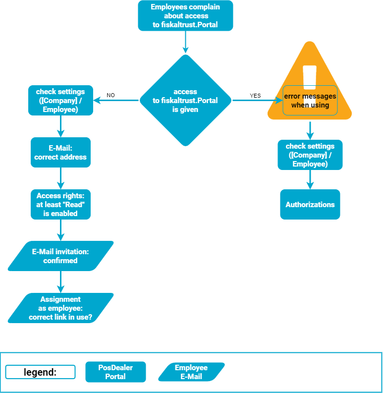
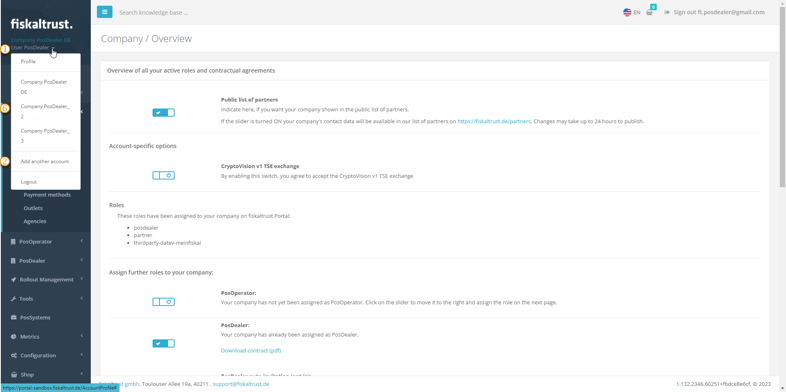

# Registration

:::info summary

After reading this, you can create an account in the fiskaltrust.Portal, log out and log in again, invite employees and assign them different rights.  

:::
## Explanation

You create an account for your company and a user for yourself on the fiskaltrust.Portal. With this, you can log in.  
For security reasons, you can create another user for yourself, as well as additional users for employees of your company.  
Then you use different authorizations to define what each user can do in the fiskaltrust.Portal.
Frequently asked questions about using the fiskaltrust.Portal are summarized in the Troubleshooting section.

### Country-specific information

You can reach the registration or login via a link on the _fiskaltrust_ website or by directly going to the URL:

import Tabs from '@theme/Tabs';
import TabItem from '@theme/TabItem';
import RegistrationAT from '../_markets/at/getting-started/registration/_registration.mdx';
import RegistrationBE from '../_markets/be/getting-started/registration/_registration.mdx';
import RegistrationFR from '../_markets/fr/getting-started/registration/_registration.mdx';
import RegistrationDE from '../_markets/de/getting-started/registration/_registration.mdx';
import RegistrationGR from '../_markets/gr/getting-started/registration/_registration.mdx';
import RegistrationIT from '../_markets/it/getting-started/registration/_registration.mdx';
import RegistrationPL from '../_markets/pl/getting-started/registration/_registration.mdx';
import RegistrationPT from '../_markets/pt/getting-started/registration/_registration.mdx';
import RegistrationES from '../_markets/es/getting-started/registration/_registration.mdx';

<Tabs groupId="market">

  <TabItem value="AT" label="Austria">
    <RegistrationAT />
  </TabItem>

  <TabItem value="BE" label="Belgium">
    <RegistrationBE />
  </TabItem>

  <TabItem value="FR" label="France">
   <RegistrationFR />
  </TabItem>

  <TabItem value="DE" label="Germany">
   <RegistrationDE />
  </TabItem>

  <TabItem value="GR" label="Greece">
    <RegistrationGR />
  </TabItem>

  <TabItem value="IT" label="Italy">
    <RegistrationIT />
  </TabItem>

  <TabItem value="PL" label="Poland">
    <RegistrationPL />
  </TabItem>

  <TabItem value="PT" label="Portugal">
    <RegistrationPT />
  </TabItem>

  <TabItem value="ES" label="Spain">
    <RegistrationES />
  </TabItem>

</Tabs>

By clicking `Register`, you start registering a company and an associated user in four steps. This process is independent of the company's future role (PosCreator, PosDealer, Consultant or PosOperator) in the fiskaltrust.Portal.

The four steps — _Company identification_, _Company data_, _User data_ and _Confirmation_ — are shown in a step tracker at the top of the wizard. Each step has its own address, so you can move between steps with the browser's Back and Forward buttons, reload a step without losing your entries, and click any completed step in the tracker to jump back to it. Pressing `Enter` in a field advances to the next step whenever that step's data is complete.

The wizard opens in your market's language; use the `DE`/`EN` toggle in the top corner to switch to English at any time.

:::caution Login Security
Whenever you enter your username and password for the fiskaltrust.Portal, make sure the URL is one of the above and look for the "lock" symbol in the browser. A secure site always has a closed padlock in the URL bar. That way, you can ensure you enter the data on the correct website and avoid becoming a website- or login-spoofing victim.
:::

## Work steps for registration

### Step 1: Company identification

The first step is headed **Find your company** and is a single search field. Enter any identification number your market supports — you do not need to choose the number type first — and select `Next` to have the Portal detect it and prefill your company data automatically. You can also leave the field empty and select `Next` to go straight to manual entry on the next step.

*Figure 1. Company identification — the "Find your company" search step.*

The numbers you can look a company up by depend on your market:

| Market   | Identification numbers |
|:---------|------------------------|
| Austria  | VAT number, Steuernummer, GLN, Firmenbuchnummer (company register number) |
| Belgium  | VAT number |
| France   | VAT number, TIN, GLN, SIREN |
| Germany  | VAT number (USt-IdNr) — because of regulatory limitations, this lookup only works for companies **outside** Germany |
| Greece   | VAT number |
| Italy    | VAT number |
| Poland   | VAT number |
| Portugal | VAT number |
| Spain    | VAT number |

*Table 2. Identification numbers you can search a company by, per market.*

Most markets look a company up by its VAT number only. Any additional market-specific commercial number — such as the German tax number or the Polish NIP — is entered on the company-data step and is not used for this lookup.

In the productive Portal, a reCAPTCHA appears under the search box; confirm it by checking the checkbox before the lookup runs. Sometimes reCAPTCHA opens a popup where you have to solve a task (e.g., select all images with traffic lights) before it finishes the verification. You solve the captcha once, and the same confirmation covers the rest of the registration. (The sandbox skips this check.)

### Step 2: Company data

Enter your company's master data here. If you used the lookup on the previous step, the fields are prefilled and the number you searched by is locked; otherwise, you enter everything yourself. You must fill in all fields marked with an asterix.

*Figure 2. Company data step of the fiskaltrust.Portal registration.*

The form is grouped into company master data, company contact details and commercial numbers:

| Steps | Description                                                                                                                |
|:----------------------:|-------------------------------------------------------------------------------------------------------------------------------------|
| |**Company data** — `Company Name`, `Address line 1`, `Postal code`, `City` and `Country` are required; `Address line 2` is optional. The company name has to match the name in the commercial registers and may not already be in use for a registration. |
| |**Company contact details** — a valid `E-mail address` is required and can only be used once for a company in the fiskaltrust.Portal. If your E-mail server supports "+" in the address (so username+tag@domain is delivered to username@domain), each alias is treated as a unique address, which is handy for testing. `Website` and `Telephone number` are optional. |
| |**Commercial no.** — enter the commercial and tax numbers your market uses (for example, in Germany the `USt-IdNr` and the `Tax number`). Select `Search company` next to a number to verify it against the registers and optionally prefill from it. |
| |By clicking on `Next` you verify the entered numbers and proceed to the 3rd step, _User data_. |

*Table 3. Company data fields shown in Figure 2.*

:::note Company not found
When you select `Next`, the Portal verifies every commercial number you entered that a register can check. If none of the registers recognises a number, a **Company not found** dialog names the number and lets you choose `Cancel` (stay on this step with your data intact and correct the number) or `Continue anyway` (keep the number as entered and move on to the user data).
:::

*Figure 3. The "Company not found" dialog shown when a number is not recognised.*

:::tip  Company or e-mail already registered
If a commercial number you entered already belongs to a registered company, the Portal tells you that a company with this number is already registered with _fiskaltrust_, together with the advice to have that company invite you or to log in. If the company E-Mail address is already in use, the Portal marks the E-Mail field and tells you that the address already belongs to a registered _fiskaltrust_ account — log in if the account is yours, or use a different company E-Mail address otherwise. To join an existing company, ask its Primary Contact to invite you as a new user.
:::

### Step 3: User data

The third step collects the personal data of the Primary Contact. You must enter correct data in all fields marked with a red star. The Primary Contact is the key user of the fiskaltrust.Portal.
This key user is the designated administrator of the newly registered company. You must enter a valid E-Mail address because this will serve for all messages from the fiskaltrust.Portal.
In addition, with their authorization, this user can invite other company employees. You enter the `First name`, `Last name` and `Contact E-Mail address` (which you re-enter in `Confirm Email-address`); the `Mobile telephone` is optional.

*Figure 4. User data form for the Primary Contact of the company.*

:::tip  Error message
If the E-Mail address entered in _E-Mail_ is already in use in the fiskaltrust.Portal, you will see a warning message. This message will show that a user with this E-Mail address already exists. By clicking the link in this information, you can initiate the password reset for this user.
:::

### Step 4: Confirmation

The last step shows a summary of the company and user data you entered. Read and accept the Terms & Conditions and Privacy Policy using the checkbox — the `Submit` button stays disabled until you do — then select `Submit` to create the registration.

*Figure 5. Confirmation step with the data summary and the Terms & Conditions checkbox.*

After you submit, you will receive a message about the successful registration, and the confirmation screen spells out your next two steps: confirm the E-Mail address, then assign the company's roles (PosCreator, PosDealer, PosOperator or Consultant). Additionally, the portal sends an E-Mail with all the necessary information to your Primary Contact's E-Mail.

*Figure 6. Successful registration message with the next steps.*

Open the mail in the Primary Contact's inbox and click on the confirmation link. If you don't find the E-Mail in your inbox, look at the spam folder of your E-Mail application. 
Depending on where you are registering, you will receive an E-Mail from one of these addresses:

<Tabs groupId="market">

  <TabItem value="AT" label="Austria">
     no-reply-sandbox@fiskaltrust.at or no-reply@fiskaltrust.at

  </TabItem>

  <TabItem value="BE" label="Belgium">
     no-reply-sandbox@fiskaltrust.be or no-reply@fiskaltrust.be

  </TabItem>

  <TabItem value="FR" label="France">
     no-reply-sandbox@fiskaltrust.fr or no-reply@fiskaltrust.fr

  </TabItem>

  <TabItem value="DE" label="Germany">
    no-reply-sandbox@fiskaltrust.de or no-reply@fiskaltrust.de

  </TabItem>

  <TabItem value="GR" label="Greece">
     no-reply-sandbox@fiskaltrust.gr or no-reply@fiskaltrust.gr

  </TabItem>

  <TabItem value="IT" label="Italy">
     no-reply-sandbox@fiskaltrust.it or no-reply@fiskaltrust.it

  </TabItem>

  <TabItem value="PL" label="Poland">
     no-reply-sandbox@fiskaltrust.pl or no-reply@fiskaltrust.pl

  </TabItem>

  <TabItem value="PT" label="Portugal">
     no-reply-sandbox@fiskaltrust.pt or no-reply@fiskaltrust.pt

  </TabItem>

  <TabItem value="ES" label="Spain">
     no-reply-sandbox@fiskaltrust.es or no-reply@fiskaltrust.es

  </TabItem>

</Tabs>

:::info Information
If your link is invalid or has expired (links expire after 24 hours), an information page appears when you click it, and you receive a new confirmation E-Mail automatically.
:::

Now your account is active. You can use the link in the final confirmation screen or the `PORTAL-LOGIN` button on the _fiskaltrust_ website to log into the fiskaltrust.Portal.

## Reset password

If you have lost or forgotten the password for logging into the fiskaltrust.Portal, you can request a password reset:

| Steps | Description                                                                                                                |
|:----------------------:|-------------------------------------------------------------------------------------------------------------------------------------|
| |Go to the login screen of the fiskaltrust.Portal and click on the link `If you have forgotten your password, please click here`.  |
| |Solve the CAPTCHA.  |
| |Enter the E-Mail address you used when registering your account.  |
| | You will see a confirmation that the password-reset link has been sent to the E-Mail address you entered. If it does not arrive, check that the E-Mail address is the same one you used when you registered your account.  |
| |After a few minutes, check the inbox of this E-Mail address. When you click the link in the E-Mail, a browser window opens and shows the password-reset page of the fiskaltrust.Portal.  |
| |Enter the E-Mail address of your _fiskaltrust_ account, the new password and confirm it by entering it a second time. Your click on `RESET` will save the new password; you see a confirmation page, and you can log in to the fiskaltrust.Portal again.  |

*Table 4. Steps to reset a forgotten fiskaltrust.Portal password.*

## Creation of new users

You can create another user for yourself, for example, for security reasons. You can also add users for your company's employees. Then you use different authorizations to define the options each user has in the fiskaltrust.Portal.

### Work steps to invite new users

With the user rights shown in the screenshot, an employee could read and change content, switch to the accounts of PosOperators, conclude contracts and create or change PosSystems. However, this user would have access to neither `Company` / `Employee` nor `Configuration` in their own company.

*Figure 7. Employee master data and authorizations for a new user.*

| Steps | Description                                                                                                                |
|:----------------------:|-------------------------------------------------------------------------------------------------------------------------------------|
| |Tick `Company` / `Employee` and `+Add`.   |
| |Enter the desired E-Mail address for the new user and tick `Search`. |
| |Complete the **necessary** master data for the new user with entries for `First name` and `Last name` and, if desired, additional information.  |
| |Set the authorizations by enabling the desired access rights; at least `Read` must be enabled. To activate, slide the slider to the right; to deactivate, slide it to the left. A confirmation message appears at the top right.|
| |Your click on `Create new` generates an invitation to the new user's E-Mail address. Inform them about the next steps, and ask them to check their spam folder in case the invitation is filtered out. The new user must use this invitation to confirm their E-Mail address, set a password and link their account in the fiskaltrust.Portal with your company. |

*Table 5. Steps to invite a new user, shown in Figure 7.*

:::tip  Attention

Note that no access is possible with the default access rights; you must at least enable `Read`.  

:::

### Work steps for new users

| Steps | Description                                                                                                                |
|:----------------------:|-------------------------------------------------------------------------------------------------------------------------------------|
| |The new user checks the inbox of that E-Mail address used by invitation. |
| |The usage of the confirmation link activates the invitation. Next, read and accept the T&C and Privacy Policy and add a password. |
| |The employee activates the new user by using the confirmation link and adding a password. |

*Table 6. Steps a new user follows to activate the invitation.*

From then on, all users log in using the links listed [above](registration.md#country-specific-information) or in the assignment message.

## Managing user rights

### Expand user rights

*Figure 8. Employee authorizations management in the fiskaltrust.Portal.*

| Steps | Description                                                                                                                |
|:----------------------:|-------------------------------------------------------------------------------------------------------------------------------------|
| |Tick `Company` / `Employee`. |
| |At `Authorizations for the employees`, you will find explanations of the permissions.   |
| |Check the existing `Authorizations`. You can recognize inactive rights with a black symbol and activated rights with a blue symbol.|
| |To change the authorizations of a particular user, expand the buttons with the arrow on the left edge of the line. |
| |To activate, set the slider to the right; to deactivate, set it to the left. A confirmation message appears at the top right. |
| |Choose `Set to new Primary Contact` **only if you want to hand over all** `Authorizations`. |
| |With `Remove assignment`, you delete the user's assignment. |

*Table 7. Steps to expand user rights, shown in Figure 8.*

### Remove Access rights

| Action | Description                                                                                                                |
|:-----------------------|-------------------------------------------------------------------------------------------------------------------------------------|
|`Remove assignment` |This action only removes the assignment of the E-Mail address to the company, but does not delete it for security reasons. |
|`Set to new Primary Contact`| The previous access rights are **completely and at once withdrawn from the own contact** with this action. This action **immediately and completely** revokes the access rights of the previously privileged contact. After the next logout, the former Primary Contact cannot even log in to the fiskaltrust.Portal. The new Primary Contact must grant the former contact access to the company again. |

*Table 8. Actions for removing access rights.*

## Troubleshooting

### Employees complain about access

*Figure 9. Employee access rights view used to diagnose access complaints.*

### Employees of PosOperators complain about access

The process described in this section for adding accounts for employees to your account (`Company` / `Employees` / `+Add`) also applies to adding accounts for employees to PosOperators. Please note that as a PosDealer, you cannot manage these data if you switch to a PosOperator account.

:::caution No access to employee data for PosDealer

Please note that as a PosDealer, you cannot manage the data of employees in the fiskaltrust.Portal if you switch to a PosOperator account due to data privacy reasons.

:::

### PosDealers have several companies

Each E-Mail address maps one-to-one to a single account. Because of this, the same address cannot be used for two or more companies, whether as a Primary Contact or as an employee.

#### Solution for employees

**We strongly recommend checking this process in the sandbox first!**

1. Select `Company` / `Employees` / `+Add`.
2. Add data records, if necessary, with fictitious information; only the E-Mail address must be correct, e.g., peter.pattern@mycompany.com.
3. If employees are assigned to several accounts, create alias addresses and use these, e.g.:

* peter.pattern+1@mycompany.com
* peter.pattern+2@mycompany.com  
etc.

#### Solution for Primary Contacts

*Figure 10. Switching between different companies from the user menu.*

**We strongly recommend checking this process in the sandbox first!**

You can use one E-Mail address to access different companies, but with three prerequisites only:

* The companies are not yet created and can be added manually in the fiskaltrust.Portal.
* You avoid creating Companies more than once.
* The E-Mail address is used exclusively as the Primary Contact in the new companies.

1. Select the `arrow symbol` next to your user name at the top left.
2. Select `Add another company`.
3. Add the desired data for the E-Mail address for the current registration.
4. Add an existing, correct VAT number to prevent problems with orders and commissioning.
5. Create a new company with the `Create` button.
6. Switch from company to company with another click on the arrow symbol next to your user name.
7. Note **not to create the same company** more than once.
8. Note that several companies mean **different legal bindings**, for example separate contracts.

### Invitation was sent to the wrong recipient

#### Solution for Primary Contacts

Suppose you have received your company's first invitation to the fiskaltrust.Portal, but you will not be working as the Primary Contact. The easiest approach is to accept the invitation, then invite your designated colleague yourself and set them as the new Primary Contact. If they do not reassign access rights to you, you will have no access or further responsibilities after that.

| Steps | Description                                                                                                                |
|:----------------------:|-------------------------------------------------------------------------------------------------------------------------------------|
| |You, as a new user, check the inbox of that E-Mail address used by the invitation. |
| |Use the confirmation link to activate the invitation. Next, read and accept the T&C and Privacy Policy and add a password. |
| |Tick `Company` / `Employee` and `+Add`. |
| |Enter the E-Mail address for the desired user and tick `Search`. |
| |Complete the **necessary** master data.  |
| |Set the authorizations by enabling all access rights. Note that this alone does not make the new user the Primary Contact. Then select `Create new`.|
| |Inform the new user about the next steps: _You, as a new user, must use this invitation to confirm your E-Mail address and set a password_. |
| |The new user checks the inbox of the E-Mail address used for the invitation and selects the included link. Next, they read and accept the T&C and Privacy Policy, add a password and inform you about their registration in the fiskaltrust.Portal. |
| |You, as the Primary Contact, tick `Company` / `Employee` and open the collapsible at the desired employee's entry. |
| |Select `Primary Contact` and log out. |
| |The new user becomes the Primary Contact the next time they log in. If they wish, they can grant you access rights; otherwise, you will have no further access or responsibilities. |

*Table 9. Steps for a Primary Contact to reassign the role to another user.*

#### Solution for PosDealers

Suppose you have sent an invitation to a PosOperator using the wrong E-Mail address. As a PosDealer, you can forward an incorrectly addressed invitation to another recipient, as long as the original recipient has not yet activated it.

| Steps | Description                                                                                                                |
|:----------------------:|-------------------------------------------------------------------------------------------------------------------------------------|
| |You, as a PosDealer, log in to fiskaltrust.Portal and select `PosOperator` / `Invitation`. |
| |Tick `History` and search for the wrongly used E-Mail address. |
| |Tick `Edit PosOperator again`. |
| |Switch back to `PosOperator` / `Invitation`. |
| |You may search for the wrongly used E-Mail address again, then select `Edit`. |
| |Change the E-Mail addresses, both at `E-mail address` and at `Contact E-mail address` and save your changes with `Save`.|
| |Use `Send invitation again` to resend the invitation E-Mail. |

*Table 10. Steps for a PosDealer to redirect a misaddressed invitation.*
