# How to use PosSystem API helper with an existing 1.2 cashbox

:::info summary

After reading this, you can configure the local PosSystem API Helper and use it with an existing 1.2 CashBox by setting up a new 1.3 CashBox alongside it.

:::

## Introduction

This guide describes how to use the local PosSystem API Helper when you already have a running Launcher with 1.2 CashBox. The Helper is configured in a new 1.3 CashBox and then connected to the existing 1.2 CashBox.

The process consists of the following main steps:

1. Add and configure the local PosSystem API Helper, following the same steps as described in [Local PosSystem API Helper](helper-possystemapi.md).
2. Create a new 1.3 CashBox with the Helper assigned.

## Navigate to the existing 1.2 CashBox

To locate your existing Launcher 1.2 CashBox, navigate to `Configuration` / `CashBox` in the fiskaltrust Portal.

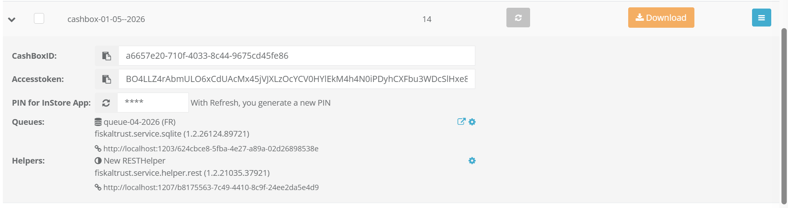

| steps | description |
|:---------------------:|-------------|
|  | Navigate to `Configuration` / `CashBox`. |
|  | Use the search field to filter CashBoxes by name or ID to locate the existing one. |
|  | Identify the CashBox running Launcher 1.2 by checking the version displayed in the list. |
|  | Click the expand arrow to reveal the CashBox configuration inline. |

You can verify that the packages are running version 1.2 for example, the Queue will show a package such as `fiskaltrust.service.sqlite` in version 1.2.

## Create a new 1.3 CashBox

Before creating the CashBox, ensure you have already added and configured the local PosSystem API Helper as described in [Local PosSystem API Helper](helper-possystemapi.md).

To create a new CashBox, navigate to `Configuration` / `CashBox` and follow the steps below.

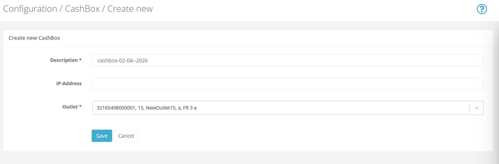

| steps | description |
|:---------------------:|-------------|
|  | Navigate to `Configuration` / `CashBox`. |
|  | Click `Add` to create a new CashBox. |
|  | Enter a **description** for the new CashBox. |
|  | Select the appropriate **outlet**. |
|  | `Save` the new CashBox. |

Once saved, click `Edit by list` to configure the components of the new CashBox. Note that for this setup, only the PosSystem API Helper is added to this CashBox, no Queue or SCU is required here.

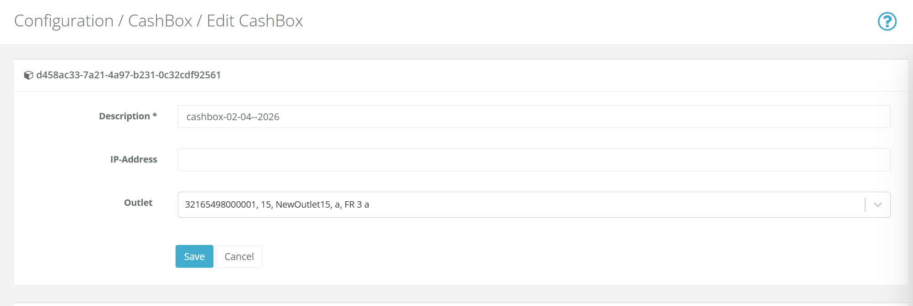

| steps | description |
|:---------------------:|-------------|
|  | Scroll down to the **Helpers** section and locate the `fiskaltrust.Middleware.Helper.LocalPosSystemApi` Helper. |
|  | Activate the Helper by selecting its checkbox. |
|  | `Save` the CashBox configuration. |

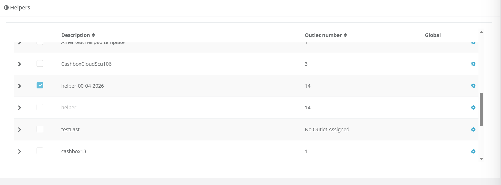

At this point you have two CashBoxes: the original 1.2 CashBox and the new 1.3 CashBox with the PosSystem API Helper assigned. You can now proceed with connecting them.

## Connect the Helper to the existing 1.2 CashBox

To open the Helper configuration, navigate to `Configuration` / `CashBox` and follow the steps below.

| steps | description |
|:---------------------:|-------------|
|  | Navigate to `Configuration` / `CashBox` and locate the new 1.3 CashBox. |
|  | Click the expand arrow to reveal the CashBox configuration inline. |
|  | Locate the PosSystem API Helper in the expanded view and click the gear icon next to it. |
|  | The Helper configuration window will open. |

In the configuration window, click `Add custom configuration` to reveal the Key and Value input fields.

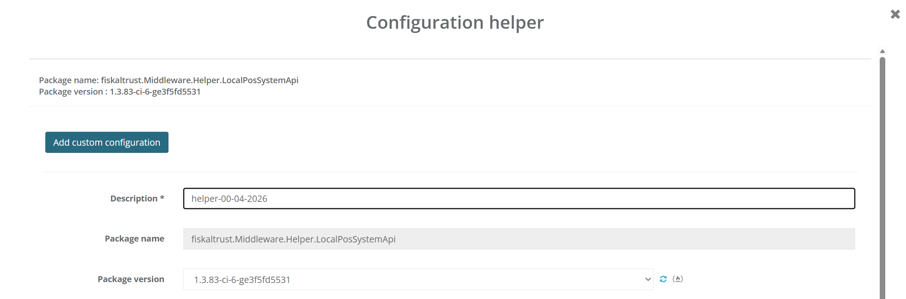

Enter the following parameters one by one. Use the `+` button next to each row to add the next entry.

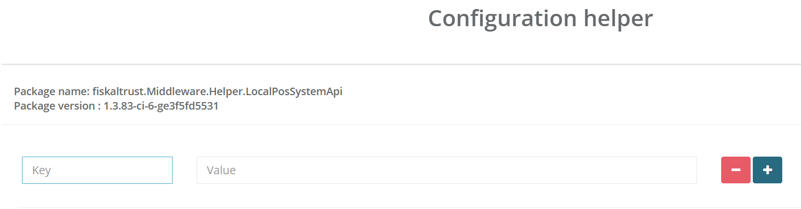

| Key | Value                                                                                                                                                                                                                   |
|-----|-------------------------------------------------------------------------------------------------------------------------------------------------------------------------------------------------------------------------|
| `middlewareaccesstoken` | The **AccessToken** of the existing 1.2 CashBox.                                                                                                                                                                        |
| `middlewarecashboxid` | The **CashBox ID** of the existing 1.2 CashBox.                                                                                                                                                                         |
| `middlewareservicefolder` | `C:/ProgramData/fiskaltrust` _(optional, only required if the service folder of the 1.2 CashBox has been changed from the default. Set this to the custom path so the Helper knows where to find the Middleware data.)_ |

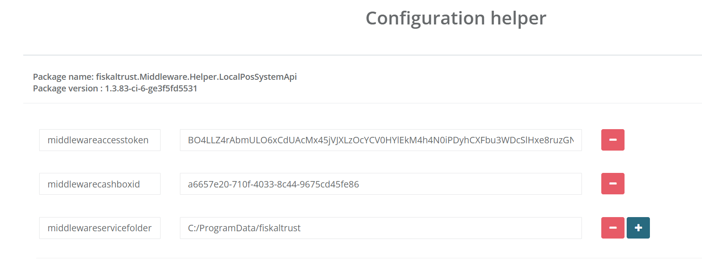

Scroll down to confirm the settings and click `Save`.

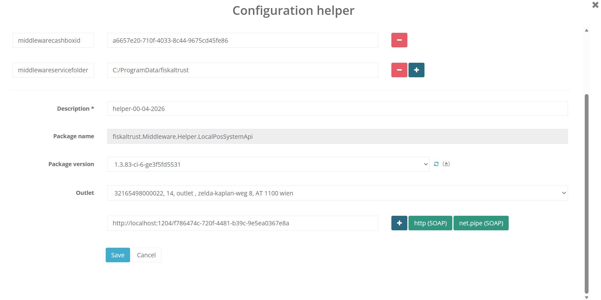

Both CashBoxes are now connected.

## Download the Launcher for the 1.3 CashBox

The 1.3 CashBox requires Launcher 2.0. To download it, navigate to `Configuration` / `CashBox`.

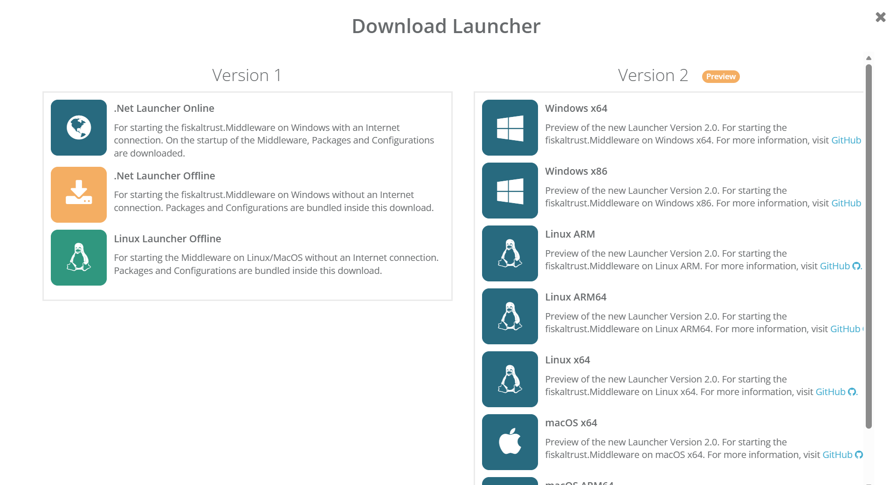

| steps | description |
|:---------------------:|-------------|
|  | Locate the 1.3 CashBox and click `Rebuild configuration`. Wait for the success confirmation. |
|  | Click `Download` and select the correct **Version 2** Launcher architecture for your system. |

## Run the Launcher for the 1.3 CashBox

Once the Launcher package is downloaded, extract it and run `launcher-test.cmd` (or `launcher-test.sh` on Unix-based systems) to start the Middleware. For detailed instructions on starting the Launcher and installing it as a service, see [Launcher 2.0 Getting Started](https://github.com/fiskaltrust/middleware-launcher?tab=readme-ov-file#getting-started).

## Download the Launcher for the 1.2 CashBox

The 1.2 CashBox supports Launcher 1.2 and Launcher 1.3. To download it, locate the existing 1.2 CashBox in the `Configuration` / `CashBox` view.

| steps | description |
|:---------------------:|-------------|
|  | Click `Rebuild configuration` and wait for the success confirmation. |
|  | Click `Download` and select the correct Launcher 1.2 or 1.3 architecture for your system. |

## Run the Launcher for the 1.2 CashBox

Extract and run `test.cmd` (or `test.sh` on Unix-based systems) to start the Middleware. For detailed instructions on starting the Launcher and installing it as a service, see [Launcher for Windows, Linux & macOS](launchers/desktop.md).

## Find the Helper URL

To get the Helper URL used for sending requests, navigate to `Configuration` / `CashBox`.

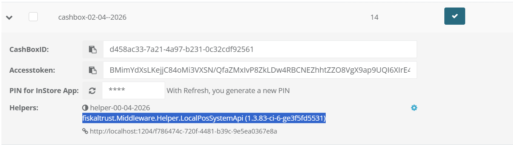

| steps | description |
|:---------------------:|-------------|
|  | Locate the 1.3 CashBox and click the expand arrow to reveal the CashBox configuration inline. |
|  | The Helper URL is displayed below the PosSystem API Helper entry. Use this URL to send requests to the Middleware. |

## Test the PosSystem API Helper

Once the Middleware is running, verify that the PosSystem API Helper is working correctly by sending a test request. The easiest way to do this is to use the [fiskaltrust Developer Portal](https://developer.fiskaltrust.eu/), which provides an interactive interface for sending requests to the Middleware and inspecting the responses.

Select **POS System API** from the available options.

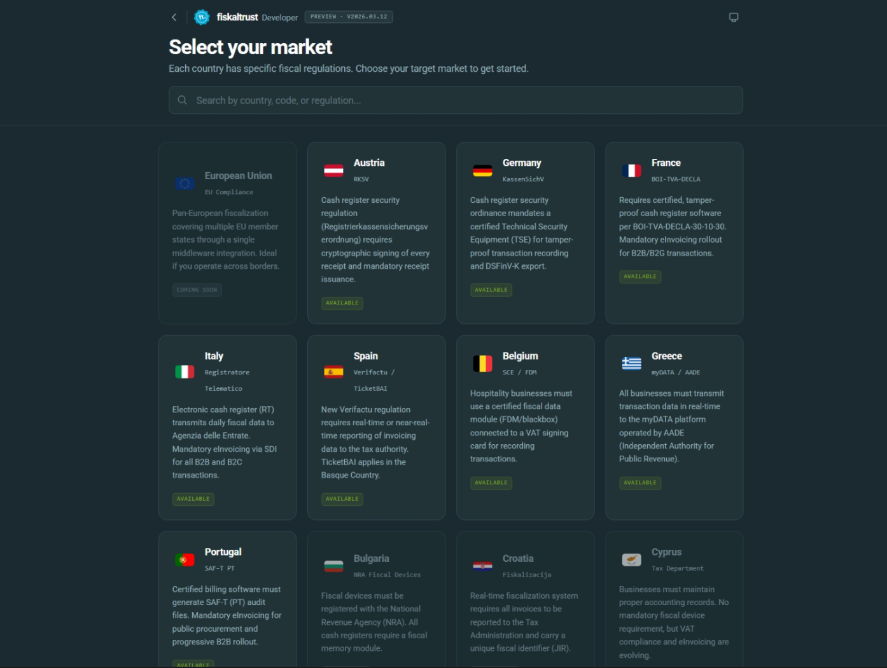

Select your market and then click **Settings** in the top-right corner.

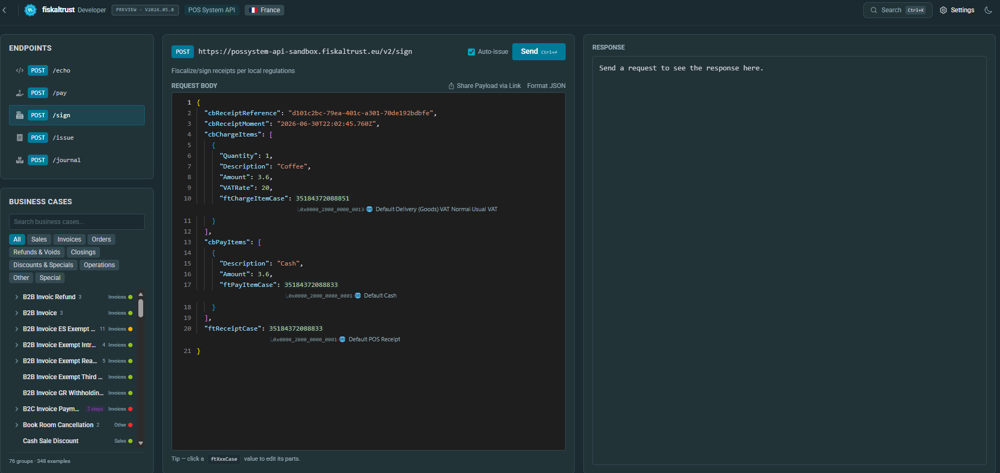

A settings panel opens where you can configure the connection to the local Middleware.

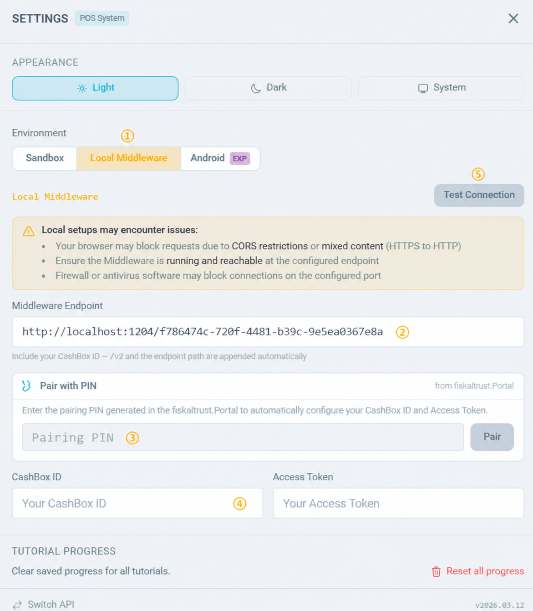

| steps | description |
|:---------------------:|-------------|
|  | In the `Environment` section, select `Local Middleware`. |
|  | In the `Middleware Endpoint` field, enter the Helper URL from the 1.3 CashBox found in the previous step. |
|  | Copy the PIN from the `Configuration` / `CashBox` page, enter it in the field below, then click `Pair`. A confirmation message should appear as shown below. |

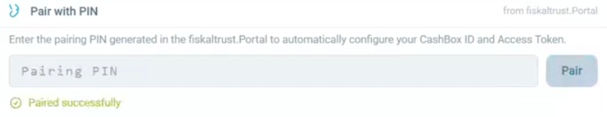

| steps | description |
|:---------------------:|-------------|
|  | The **CashBox ID** and **Access Token** fields will be populated with the values of the existing **1.2 CashBox**. |
|  | Click `Test Connection` — a green **201** response confirms the Helper is working correctly. |

Close **Settings**. You can now use the available endpoints to send requests to the Middleware and verify the Helper's functionality.
