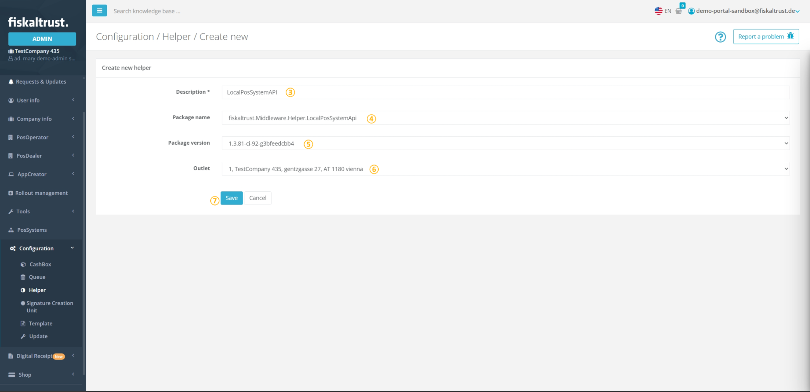
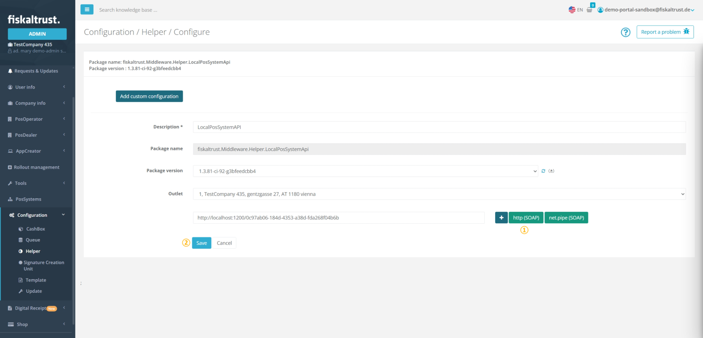
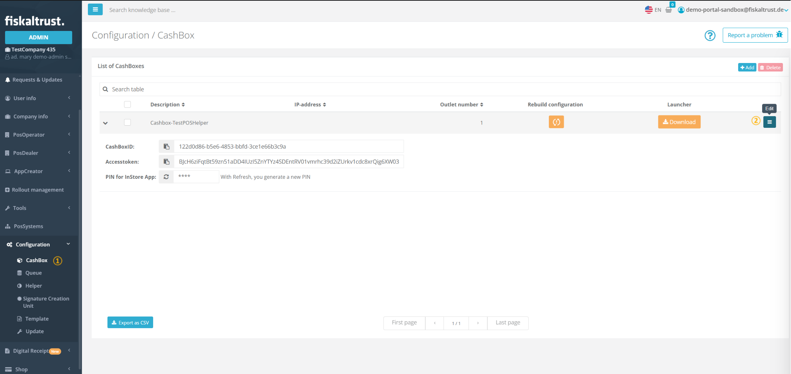
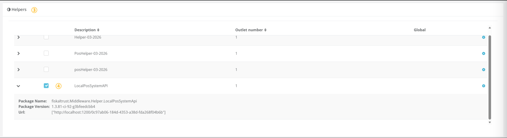
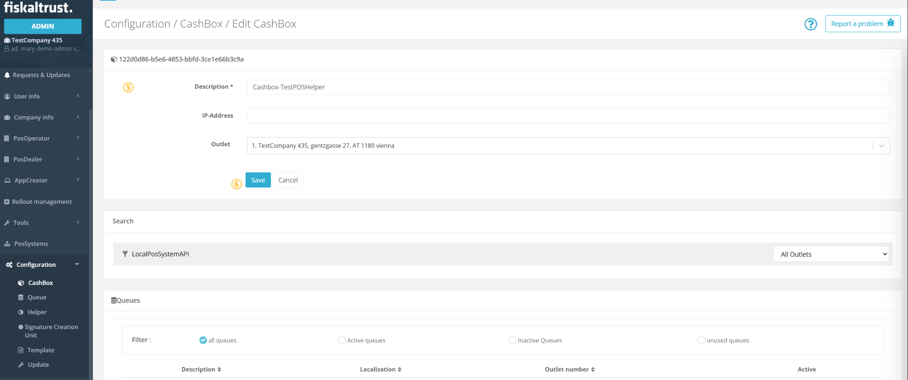
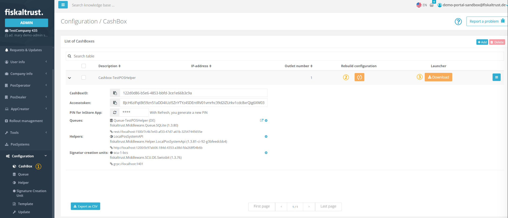
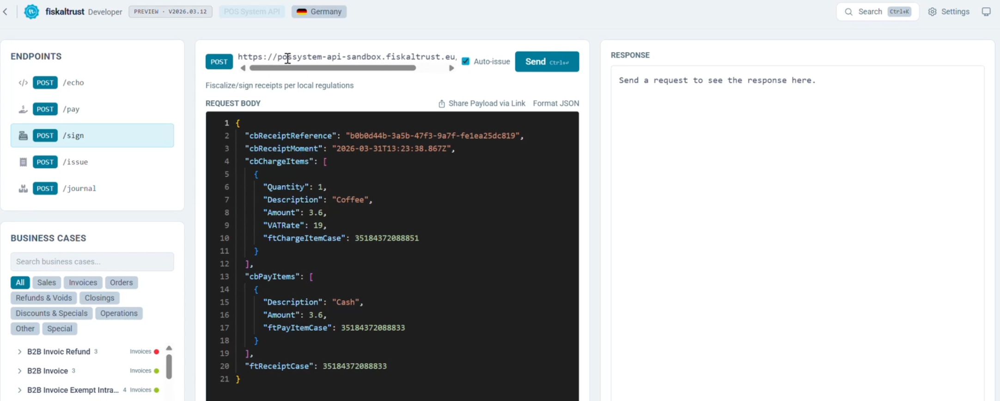
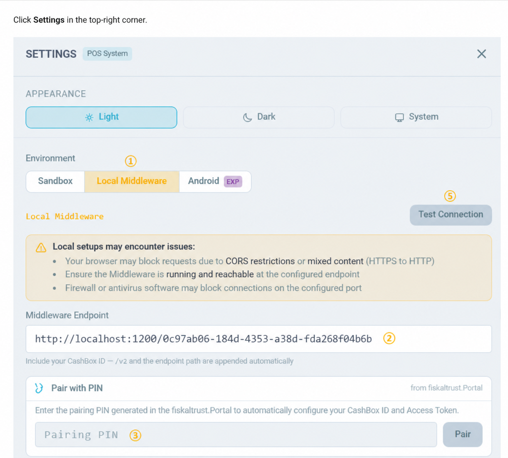
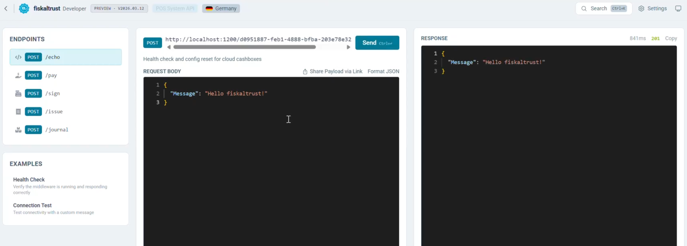

# How to Configure the Local PosSystem API Helper with Launcher 2.0

:::caution

The local PosSystem API Helper is currently in preview.

:::

:::info summary

After reading this, you can set up and configure the local PosSystem API Helper within a Launcher 2.0 deployment.

## Introduction

The local PosSystem API Helper is a Middleware component that exposes a local endpoint through which the POS System communicates with the fiskaltrust Middleware. It acts as a bridge between the POS System and the underlying Queue, and is required for Launcher 2.0 deployments.

:::caution

The PosSystem API Helper must be part of the **same [CashBox](cashbox.md)** as the Queue it is intended to serve.

:::

:::caution

As the local PosSystem API Helper is currently only supported on the Launcher 2.0 this setup does not work for France. If you're interested in running this in Austria reach out to us as the launcher 2.0 is not enabled per default there.

:::
## Add a Helper Local PosSystem API

To add the local PosSystem API Helper, navigate to `Configuration` / `Helper` in the fiskaltrust Portal and follow the steps below. 
Note that the following figures and steps are exemplary.

| steps | description                                                                                                                                 |
|:----------------------:|---------------------------------------------------------------------------------------------------------------------------------------------|
| | _Choose `Configuration`/ `Helper` to get to the Helper configuration._                                                                      |
| | _Click on `+Add` for creating a new Helper._                                                                                                |
| | Add or edit a **name** for your Helper at  `Description`.                                                                                   |
| | Select `fiskaltrust.Middleware.Helper.LocalPosSystemApi` from the **`Package name`** drop-down. Note that this selection **cannot be changed later**. |
| | Select the latest `Package version` using the drop-down menu.                                                                                      |
| | You can select one of the available outlets with the drop-down menu.                                                                        |
| | `Save` your changes.                                                                                                                        |

Once saved, a **success** notification will appear confirming that the Helper has been created. The configuration window for the new Helper will then open automatically, allowing you to proceed with the setup.

## Configure a PosSystem API Helper

| steps | description                                                                                                                                 |
|:----------------------:|---------------------------------------------------------------------------------------------------------------------------------------------|
| | Click `http` to generate a URL through which the POS-System can access the Helper. You may also rename the URL to one of your own choosing.                                                                |
| | `Save` your changes to return to `Configuration`/ `Helper`.                                                                                            |

:::info

Note down the URL you configured for the PosSystem API Helper as you will use it to connect to the cashbox.

:::

## Use a PosSystem API Helper

|                     steps                      | description                                                                            |
|:----------------------------------------------:|----------------------------------------------------------------------------------------|
| | Navigate to `Configuration` / `CashBox` and search for the desired CashBox. |
| | Click `Edit` to open the CashBox configuration. |

|                      steps                      | description                             |
|:-----------------------------------------------:|-----------------------------------------|
|  | Scroll down to the **Helpers** section and locate the PosSystem API Helper. |
|  | Activate the Helper by selecting its checkbox. |

:::info

The same LocalPosSystemApi Helper can be used in multiple cashboxes.

:::

|                      steps                      | description |
|:-----------------------------------------------:|-----------|
|  | Scroll back to the top of the page. |
|  | `Save` your configuration. |

## Download Launcher

:::caution

The minimum required Launcher version is **2.0.0-rc.25**. When downloading a launcher the latest version is automatically downloaded.

:::

| steps | description |
|:----------------------:|-------------|
| | Return to the `Configuration` / `CashBox` page. You should see the Helper URL you configured in the previous step. |
| | Click `Rebuild configuration` and wait for the success confirmation. |
| | Click `Download` and select the correct Version 2 Launcher architecture for your system. |

## Deploy the CashBox

Once the Launcher package is downloaded, extract it and run `launcher-test.cmd` (or `launcher-test.sh` on unix based systems) to start the Middleware. For detailed instructions on starting the Launcher and installing it as a service, see [Launcher 2.0 Getting Started](https://github.com/fiskaltrust/middleware-launcher?tab=readme-ov-file#getting-started).

## Test the PosSystem API Helper

Once the Middleware is running, verify that the PosSystem API Helper is working correctly by sending a test request. The easiest way to do this is to use the [fiskaltrust Developer Portal](https://developer.fiskaltrust.eu/), which provides an interactive interface for sending requests to the Middleware and inspecting the responses.

Select **POS System API** from the available options.

Select your market.

Click **Settings** in the top-right corner.

| steps | description                                                                                                                                                              |
|:----------------------:|--------------------------------------------------------------------------------------------------------------------------------------------------------------------------|
| | In the `Environment` section, select `Local Middleware`.                                                                                                                 |
| | In the `Middleware Endpoint` field, enter the **Helper URL** of the LocalPosSystemApi Helper found on the `Configuration` / `CashBox` page.                                                                  |
| | Copy the PIN from the `Configuration` / `CashBox` page, enter it in the field below, then click `Pair`. A confirmation message should appear as shown below. |

|                      steps                      | description                                                             |
|:-----------------------------------------------:|-------------------------------------------------------------------------|
|  | The `CashBox ID` and `Access Token` fields will be populated automatically. |
|  | Click `Test Connection` — a green **201** response confirms the Helper is working correctly. |

Close **Settings**. You can now use the available endpoints to send requests to the Middleware and verify the Helper's functionality.

