# How to use LocalPosSystemApi helper with an existing 1.2 cashbox

:::info summary

After reading this, you can configure the LocalPosSystemApi Helper and use it with an existing Middleware 1.2 CashBox by setting up a new Middleware 1.3 CashBox alongside it.

:::

:::caution

For markets other than AT and FR please refer to the [guide on setting up the Local PosSystem API Helper with the Launcher 2.0](./localpossystemapi-helper.md).

:::

## Introduction

This guide describes how to use the LocalPosSystemApi Helper when you already have a running Middleware 1.2 CashBox.

The LocalPosSystemApi Helper needs to run inside a Middleware 1.3 CashBox.

For that reason we need to setup a second cashbox that contains only the LocalPosSystemApi Helper which is connecting to the queue running in the existing 1.2 CashBox.

:::tip  

The packages starting with `fiskaltrust.service`, `fiskaltrust.signing` are part of the Middeleware 1.2 stack and packages starting with `fiskaltrust.Middleware` are part of the Middleware 1.3 stack.  

The Middleware 1.2 only supports the AT and FR markets. For new cashboxes in AT the Middleware 1.3 is also supported and should be preferred.  

:::

The process consists of the following main steps:

1. Prepare the 1.2 cashbox with a rest helper (if not already done).
2. Create and configure a new LocalPosSystemApi Helper.
2. Create a new 1.3 CashBox and assign the LocalPosSystemApi helper.

## Navigate to the existing 1.2 CashBox

To locate your existing Middleware 1.2 CashBox, navigate to `Configuration` / `CashBox` in the fiskaltrust Portal.

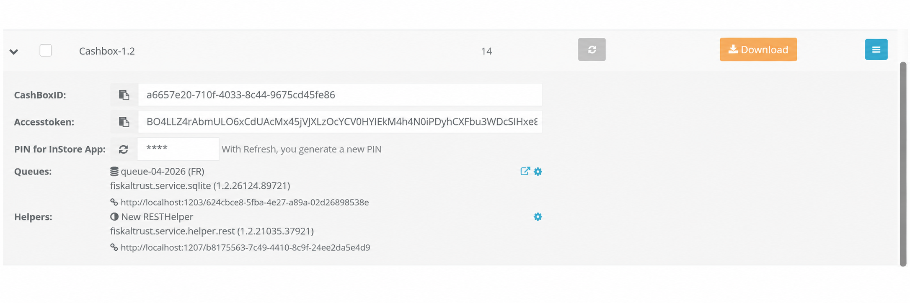

| steps                                           | description                                                                                           |
|-------------------------------------------------|-------------------------------------------------------------------------------------------------------|
|  | Navigate to `Configuration` / `CashBox`.                                                              |
|  | Use the search field to filter CashBoxes by name or ID to locate the existing one.                    |
|  | Identify the CashBox running Launcher 1.2 by checking the version displayed in the list.              |
|  | Click the expand arrow to reveal the CashBox configuration inline.                                    |
|  | Verify if a `fiskaltrust.service.helper.rest` is present. If it is present you can skip the next step |

You can verify that the packages are running version 1.2 for example, the Queue will show a package such as `fiskaltrust.service.sqlite` in version 1.2.

## Add a rest helper for the 1.2 CashBox

:::info

You can skip this step if a rest helper is already present in the 1.2 CashBox.

:::

To add the local rest Helper, navigate to `Configuration` / `Helper` in the fiskaltrust Portal and follow the steps below. 
Note that the following figures and steps are exemplary.

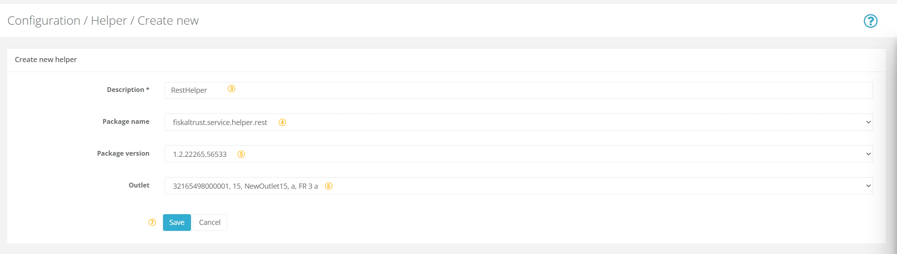

| steps                                           | description                                                                                                                           |
|-------------------------------------------------|---------------------------------------------------------------------------------------------------------------------------------------|
|  | _Choose `Configuration`/ `Helper` to get to the Helper configuration._                                                                |
|  | _Click on `+Add` for creating a new Helper._                                                                                          |
|  | Add or edit a **name** for your Helper at  `Description`.                                                                             |
|  | Select `fiskaltrust.service.helper.rest` from the **`Package name`** drop-down. Note that this selection **cannot be changed later**. |
|  | Select the latest `Package version` using the drop-down menu.                                                                         |
|  | You can select one of the available outlets with the drop-down menu.                                                                  |
|  | `Save` your changes.                                                                                                                  |

Once saved, a **success** notification will appear confirming that the Helper has been created. The configuration window for the new Helper will then open automatically, allowing you to proceed with the setup.

### Configure the Rest Helper

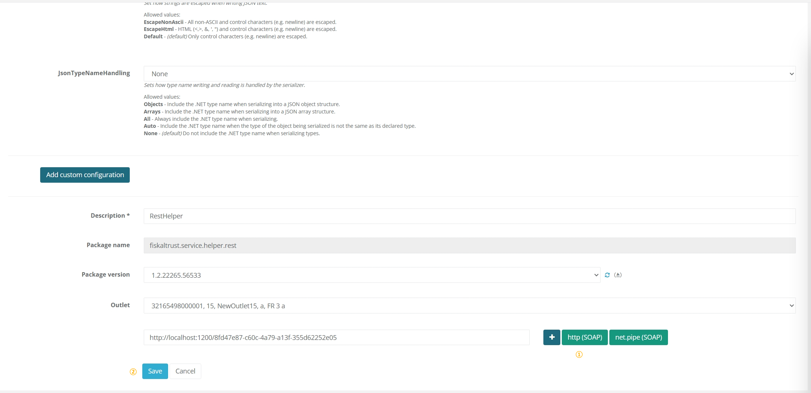

| steps                                           | description                                                                                                                              |
|-------------------------------------------------|------------------------------------------------------------------------------------------------------------------------------------------|
|  | Click `http (SOAP)` to generate a URL through which the Helper can be accessed. You may also rename the URL to one of your own choosing. |
|  | `Save` your changes to return to `Configuration` / `Helper`.                                                                             |

### Use the rest Helper in the 1.2 CashBox

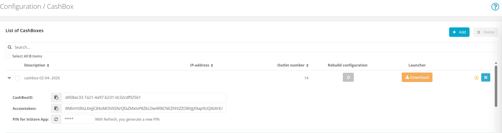

| steps                                           | description                                                             |
|-------------------------------------------------|-------------------------------------------------------------------------|
|  | Navigate to `Configuration` / `CashBox` and search for the 1.2 CashBox. |
|  | Click `Edit` to open the CashBox configuration.                         |

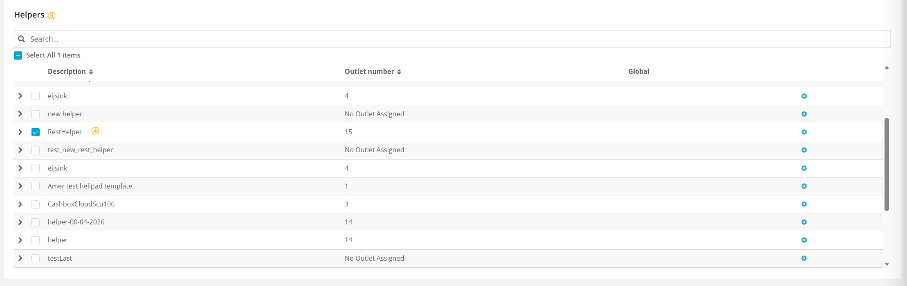

| steps                                           | description                                                                     |
|-------------------------------------------------|---------------------------------------------------------------------------------|
|  | Scroll down to the **Helpers** section and locate the just created rest Helper. |
|  | Activate the Helper by selecting its checkbox.                                  |

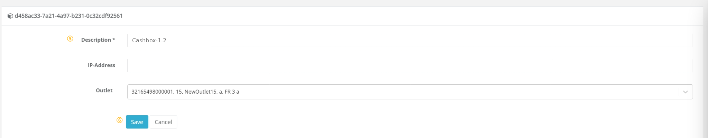

| steps                                           | description                         |
|-------------------------------------------------|-------------------------------------|
|  | Scroll back to the top of the page. |
|  | `Save` your configuration.          |

## Add a LocalPosSystemApi Helper

To add the LocalPosSystemApi Helper, navigate to `Configuration` / `Helper` in the fiskaltrust Portal and follow the steps below. 
Note that the following figures and steps are exemplary. At this point the Helper is only created as a standalone resource. It will be assigned to the new 1.3 CashBox later on.

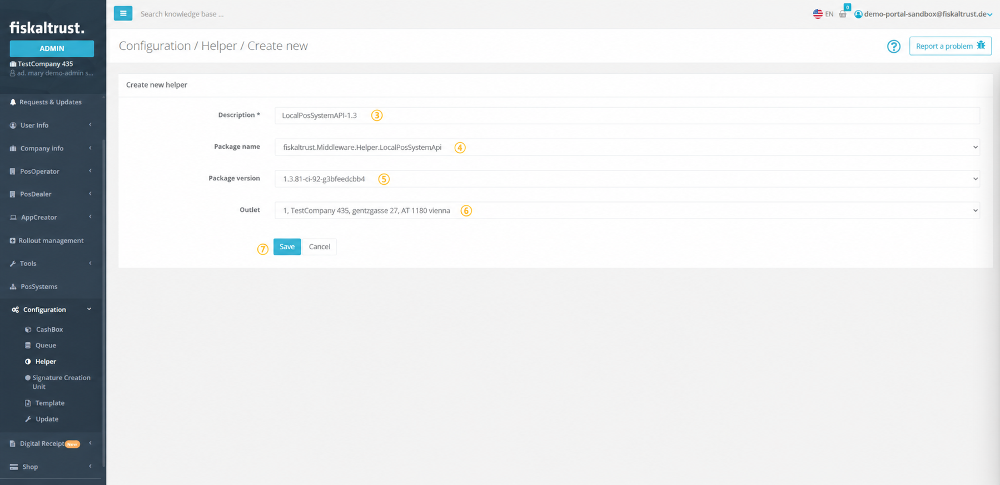

| steps                                           | description                                                                                                                                           |
|-------------------------------------------------|-------------------------------------------------------------------------------------------------------------------------------------------------------|
|  | _Choose `Configuration`/ `Helper` to get to the Helper configuration._                                                                                |
|  | _Click on `+Add` for creating a new Helper._                                                                                                          |
|  | Add or edit a **name** for your Helper at  `Description`.                                                                                             |
|  | Select `fiskaltrust.Middleware.Helper.LocalPosSystemApi` from the **`Package name`** drop-down. Note that this selection **cannot be changed later**. |
|  | Select the latest `Package version` using the drop-down menu.                                                                                         |
|  | You can select one of the available outlets with the drop-down menu.                                                                                  |
|  | `Save` your changes.                                                                                                                                  |

Once saved, a **success** notification will appear confirming that the Helper has been created. The configuration window for the new Helper will then open automatically, allowing you to proceed with the setup.

## Configure the LocalPosSystemApi Helper

These settings configure the Helper itself, before it is assigned to the new 1.3 CashBox, so that it points to the queue of the existing 1.2 CashBox.

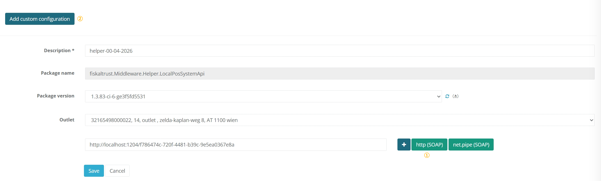
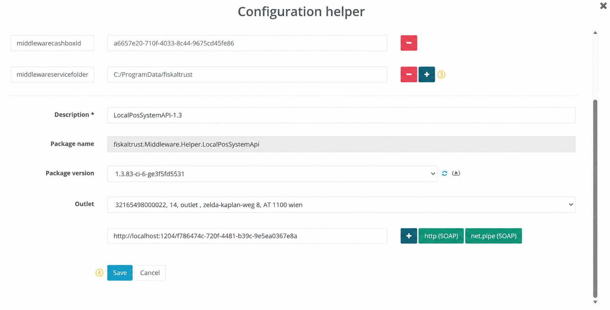

| steps                                           | description                                                                                                                                 |
|-------------------------------------------------|---------------------------------------------------------------------------------------------------------------------------------------------|
|  | Click `http` to generate a URL through which the POS-System can access the Helper. You may also rename the URL to one of your own choosing. |
|  | In the configuration window, click `Add custom configuration` to reveal the Key and Value input fields.                                     |
|  | Enter the parameters specified below one by one. Use the `+` button next to each row to add the next entry.                                 |
|  | `Save` your changes to return to `Configuration`/ `Helper`.                                                                                 |

| Key                       | Value                                                                                                                                                                                                                   |
|---------------------------|-------------------------------------------------------------------------------------------------------------------------------------------------------------------------------------------------------------------------|
| `middlewareaccesstoken`   | The **AccessToken** of the existing 1.2 CashBox.                                                                                                                                                                        |
| `middlewarecashboxid`     | The **CashBox ID** of the existing 1.2 CashBox.                                                                                                                                                                         |
| `middlewareservicefolder` | `C:/ProgramData/fiskaltrust` _(optional, only required if the service folder of the 1.2 CashBox has been changed from the default. Set this to the custom path so the Helper knows where to find the Middleware data.)_ |

The LocalPosSystemApi helper is now connected to the 1.2 CashBox.

## Create a new 1.3 CashBox for the LocalPosSystemApi Helper

To create a new CashBox, navigate to `Configuration` / `CashBox` and follow the steps below.

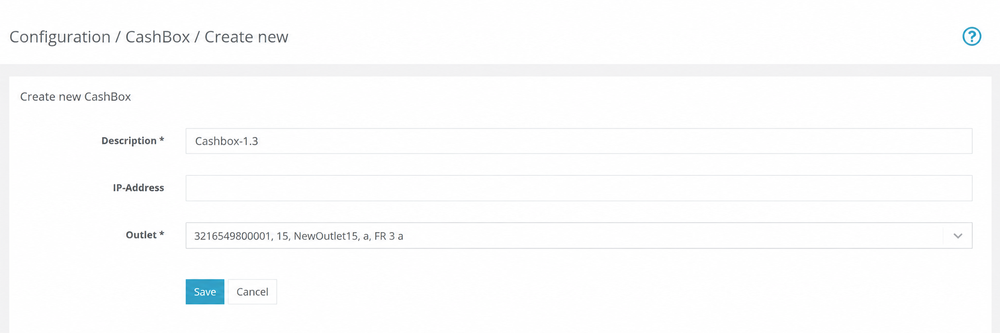

| steps                                           | description                                  |
|-------------------------------------------------|----------------------------------------------|
|  | Navigate to `Configuration` / `CashBox`.     |
|  | Click `Add` to create a new CashBox.         |
|  | Enter a **description** for the new CashBox. |
|  | Select the appropriate **outlet**.           |
|  | `Save` the new CashBox.                      |

Once saved, click `Edit by list` to configure the components of the new CashBox. Note that for this setup, only the LocalPosSystemApi Helper is added to this CashBox, no Queue or SCU is required here.

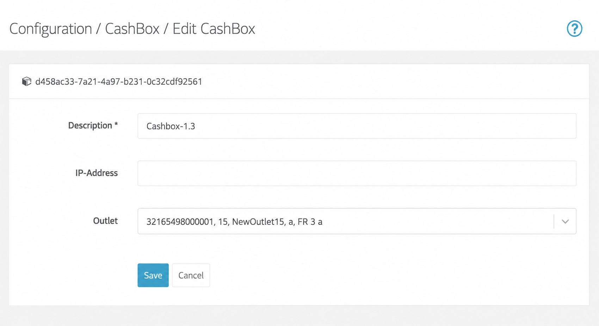

| steps                                           | description                                                                                                                   |
|-------------------------------------------------|-------------------------------------------------------------------------------------------------------------------------------|
|  | Scroll down to the **Helpers** section and locate the `fiskaltrust.Middleware.Helper.LocalPosSystemApi` Helper created above. |
|  | Activate the Helper by selecting its checkbox.                                                                                |
|  | `Save` the CashBox configuration.                                                                                             |

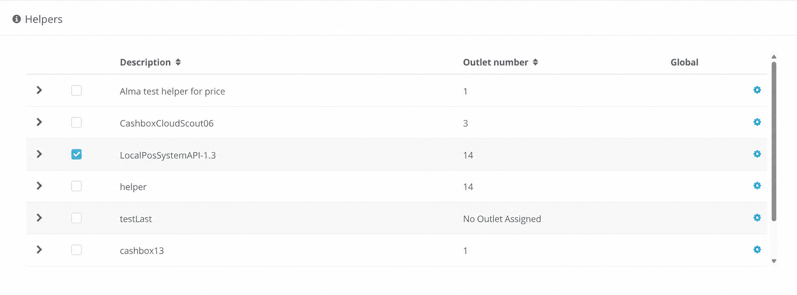

At this point you have two CashBoxes: the original 1.2 CashBox and the new 1.3 CashBox with the PosSystem API Helper assigned.

## Download the Launcher for the 1.3 CashBox

The 1.3 CashBox requires Launcher 2.0. To download it, navigate to `Configuration` / `CashBox`.

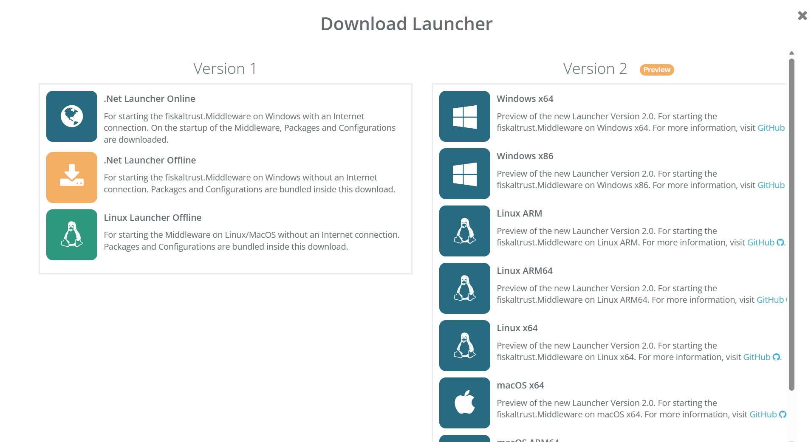

| steps                                           | description                                                                                  |
|-------------------------------------------------|----------------------------------------------------------------------------------------------|
|  | Locate the 1.3 CashBox and click `Rebuild configuration`. Wait for the success confirmation. |
|  | Click `Download` and select the correct **Version 2** Launcher architecture for your system. |

## Run the Launcher for the 1.3 CashBox

Once the Launcher package is downloaded, extract it and run `launcher-test.cmd` (or `launcher-test.sh` on Unix-based systems) to start the Middleware. For detailed instructions on starting the Launcher and installing it as a service, see [Launcher 2.0 Getting Started](https://github.com/fiskaltrust/middleware-launcher?tab=readme-ov-file#getting-started).

## Download the Launcher for the 1.2 CashBox

The 1.2 CashBox supports Launcher version 1. To download it, locate the existing 1.2 CashBox in the `Configuration` / `CashBox` view.

| steps                                           | description                                                                               |
|-------------------------------------------------|-------------------------------------------------------------------------------------------|
|  | Click `Rebuild configuration` and wait for the success confirmation.                      |
|  | Click `Download` and select the correct Launcher 1.2 or 1.3 architecture for your system. |

## Run the Launcher for the 1.2 CashBox

Extract and run `test.cmd` (or `test.sh` on Unix-based systems) to start the Middleware. For detailed instructions on starting the Launcher and installing it as a service, see [Launcher for Windows, Linux & macOS](launchers/desktop.md).

## Find the Helper URL

To get the Helper URL used for sending requests, navigate to `Configuration` / `CashBox`.

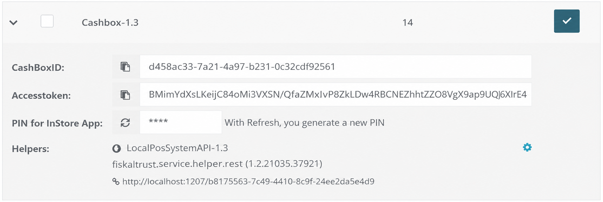

| steps                                           | description                                                                                                        |
|-------------------------------------------------|--------------------------------------------------------------------------------------------------------------------|
|  | Locate the 1.3 CashBox and click the expand arrow to reveal the CashBox configuration inline.                      |
|  | The Helper URL is displayed below the PosSystem API Helper entry. Use this URL to send requests to the Middleware. |

## Test the LocalPosSystemApi Helper

Once the Middleware is running, verify that the LocalPosSystemApi Helper is working correctly by sending a test request. The easiest way to do this is to use the [fiskaltrust Developer Portal](https://developer.fiskaltrust.eu/), which provides an interactive interface for sending requests to the Middleware and inspecting the responses.

Select **POS System API** from the available options.

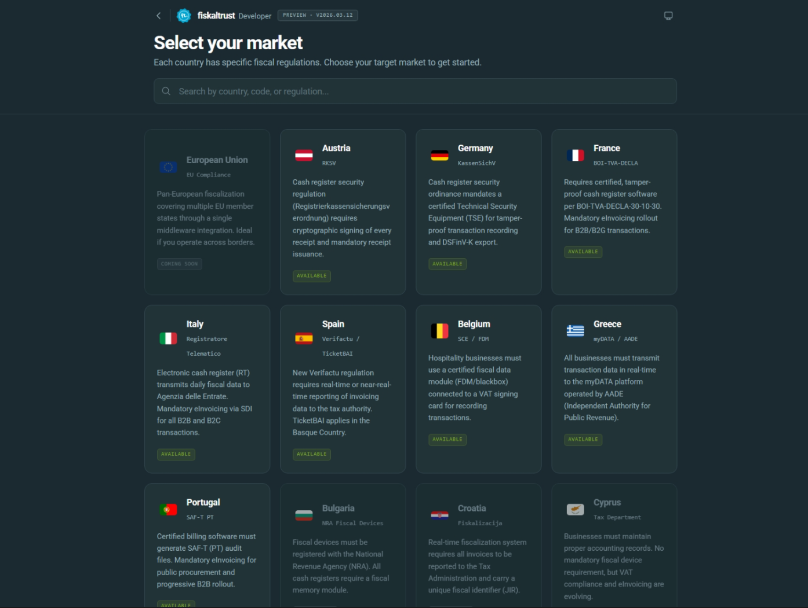

Select your market and then click **Settings** in the top-right corner.

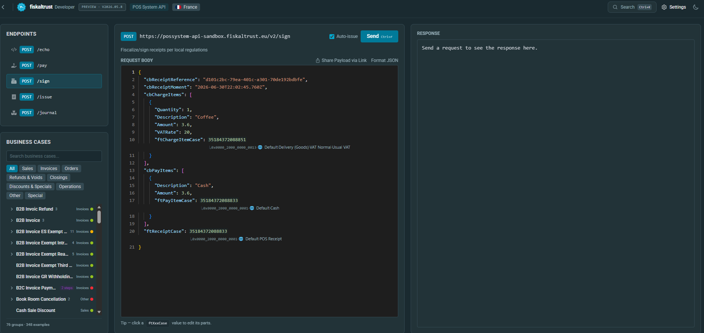

A settings panel opens where you can configure the connection to the local Middleware.

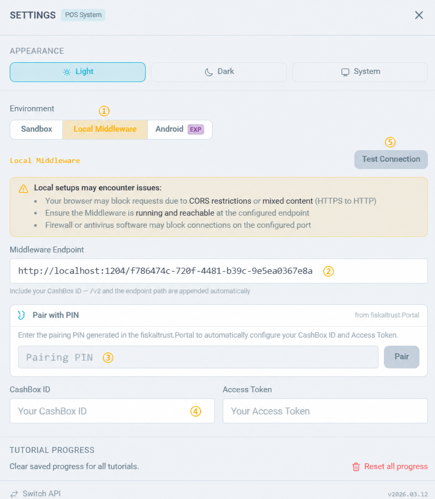

| steps                                           | description                                                                                                                                                  |
|-------------------------------------------------|--------------------------------------------------------------------------------------------------------------------------------------------------------------|
|  | In the `Environment` section, select `Local Middleware`.                                                                                                     |
|  | In the `Middleware Endpoint` field, enter the Helper URL from the 1.3 CashBox found in the previous step.                                                    |
|  | Copy the PIN from the `Configuration` / `CashBox` page, enter it in the field below, then click `Pair`. A confirmation message should appear as shown below. |

| steps                                           | description                                                                                                       |
|-------------------------------------------------|-------------------------------------------------------------------------------------------------------------------|
|  | The **CashBox ID** and **Access Token** fields will be populated with the values of the existing **1.2 CashBox**. |
|  | Click `Test Connection` — a green **201** response confirms the Helper is working correctly.                      |

Close **Settings**. You can now use the available endpoints to send requests to the Middleware and verify the Helper's functionality.
