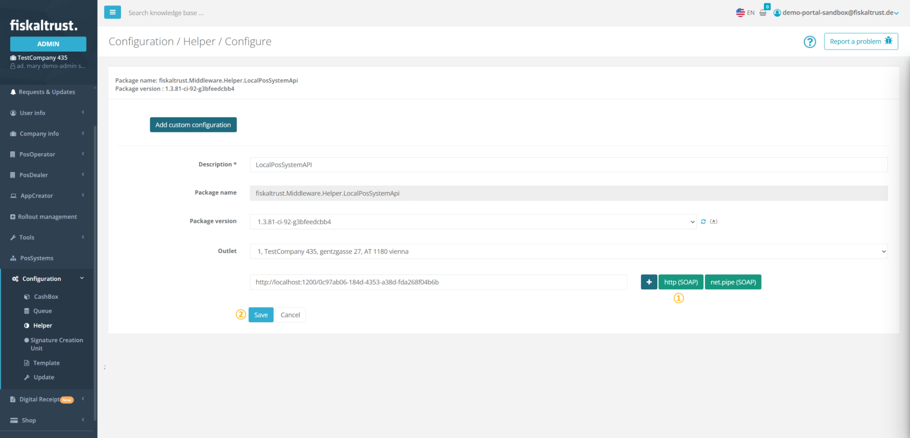
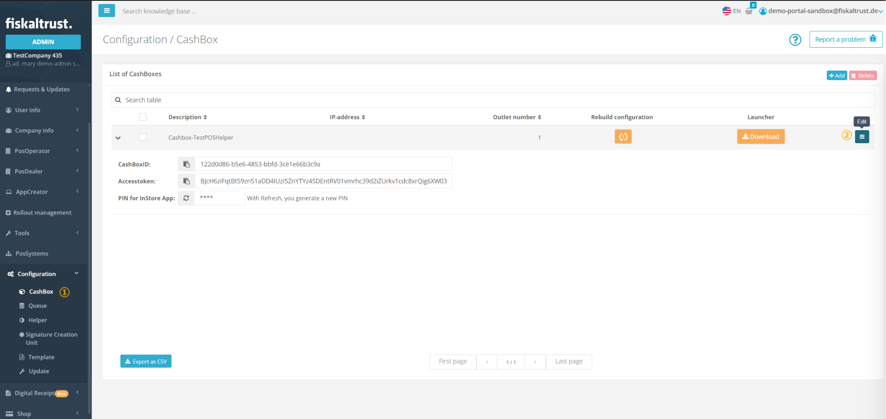
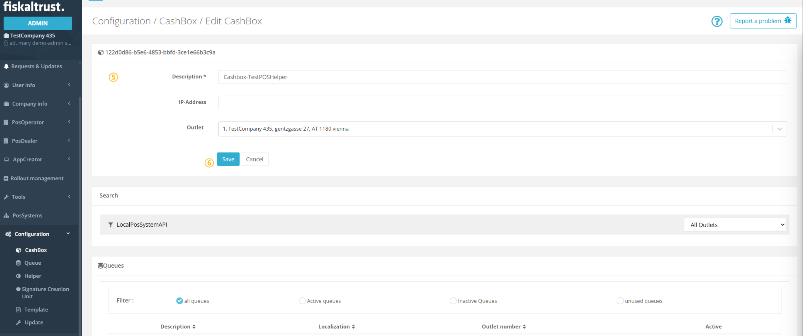
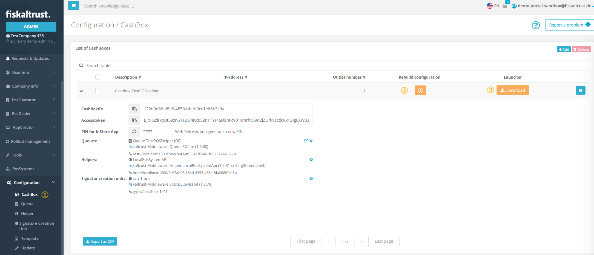
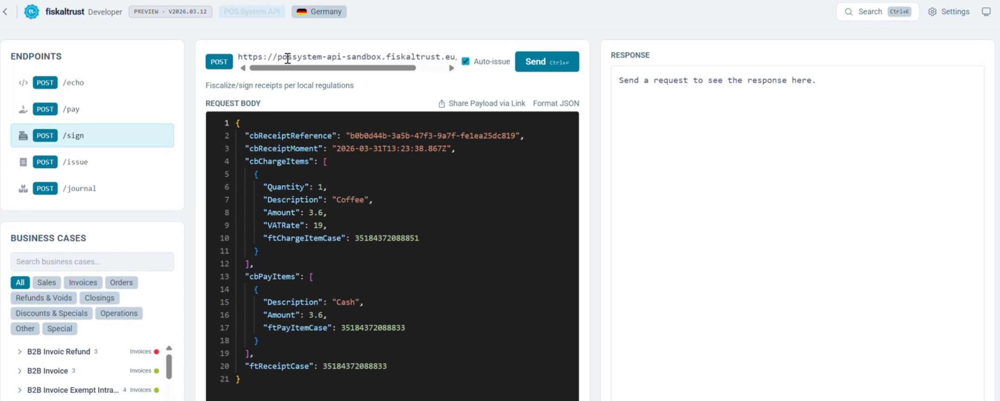
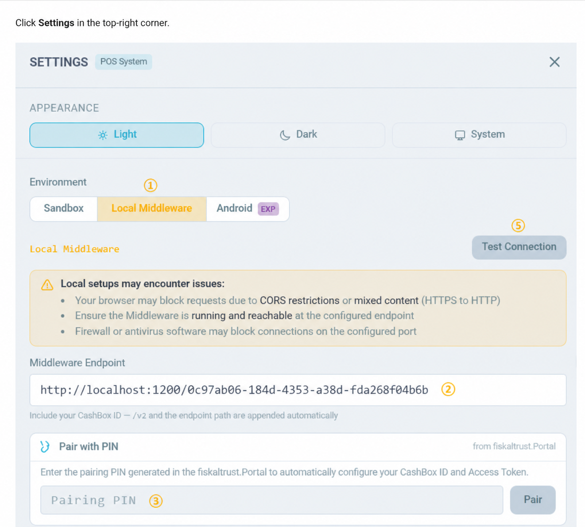
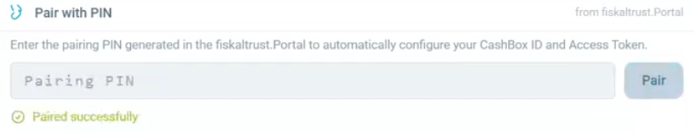
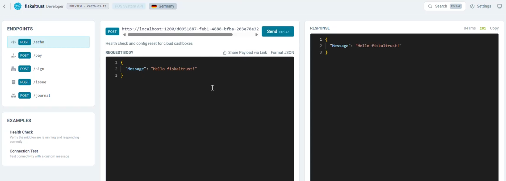

# Configuring the Local PosSystem API Helper with Launcher 2.0

:::caution

The LocalPosSystemApi Helper is currently in preview.

:::

:::info summary

After reading this, you can set up and configure the LocalPosSystemApi Helper within a Launcher 2.0 deployment.

:::

## Introduction

The LocalPosSystemApi Helper is a Middleware component that exposes a local endpoint through which the POS System communicates with the fiskaltrust Middleware.
It acts as a bridge between the POS System and the underlying Queue.

:::caution

The LocalPosSystemApi Helper must be part of the **same [CashBox](../middleware/cashbox.md)** as the Queue it is intended to serve.

:::

:::caution

As the LocalPosSystemApi Helper is currently only supported on the Launcher 2.0 this setup does not work for France.
Refer to the [guide on how to setup the LocalPosSystemApi helper for the Middleware 1.2](./localpossystemapi-helper-1-2.md).

If you're interested in running this in Austria reach out to us as the launcher 2.0 is not enabled per default there.

:::

## Add a LocalPosSystemApi Helper

To add the LocalPosSystemApi Helper, navigate to `Configuration` / `Helper` in the fiskaltrust Portal and follow the steps below.
Note that the following figures and steps are exemplary.

| Steps | Description |
|-------|-------------|
|  | Navigate to `Configuration`/ `Helper` to get to the Helper configuration. |
|  | Click `+Add` to create a new Helper. |
|  | Add or edit a **name** for your Helper at `Description`. |
|  | Select `fiskaltrust.Middleware.Helper.LocalPosSystemApi` from the **`Package name`** drop-down list. Note that this selection **cannot be changed later**. |
|  | Select the latest `Package version` using the drop-down list. |
|  | You can select one of the available outlets with the drop-down list. |
|  | Click `Save` to save your changes. |

After the Helper has been saved, a **success** notification confirms that it has been created. The configuration window for the new Helper then opens automatically, allowing you to proceed with the configuration.

## Configure a LocalPosSystemApi Helper

| Steps | Description |
|-------|-------------|
|  | Click `http` to generate a URL that the POS system can use to access the Helper. You can also rename the URL if desired. |
|  | Click `Save` to save your changes and return to `Configuration`/ `Helper`. |

## Use a LocalPosSystemApi Helper

| Steps | Description |
|-------|-------------|
|  | Navigate to `Configuration` / `CashBox` and search for the desired CashBox. |
|  | Click `Edit` to open the CashBox configuration. |

| Steps | Description |
|-------|-------------|
|  | Scroll down to the **Helpers** section and locate the LocalPosSystemApi Helper. |
|  | Activate the Helper by selecting its checkbox. |

:::info

The same LocalPosSystemApi Helper can be used in multiple cashboxes.

:::

| Steps | Description |
|-------|-------------|
|  | Scroll back to the top of the page. |
|  | Click `Save` to sabe your configuration. |

## Download Launcher

:::caution

The minimum required Launcher version is **2.0.0-rc.25**. When downloading a launcher the latest version is downloaded automatically.

:::

| Steps | Description |
|-------|-------------|
|  | Return to the `Configuration` / `CashBox` page. You should see the Helper URL configured in the previous step. |
|  | Click `Rebuild configuration` and wait for the success confirmation. |
|  | Click `Download` and select the appropriate Version 2 Launcher architecture for your system. |

## Deploy the CashBox

Once the Launcher package is downloaded, extract it and run `launcher-test.cmd` (or `launcher-test.sh` on unix based systems) to start the Middleware. For detailed instructions on starting the Launcher and installing it as a service, see [Launcher 2.0 Getting Started](https://github.com/fiskaltrust/middleware-launcher?tab=readme-ov-file#getting-started).

## Test the LocalPosSystemApi Helper

Once the Middleware is running, verify that the LocalPosSystemApi Helper is working correctly by sending a test request. The easiest way to do this is by using the [fiskaltrust Developer Portal](https://developer.fiskaltrust.eu/), which provides an interactive interface for sending requests to the Middleware and inspecting the responses.

Select **POS System API** from the available options.

Select your market.

Click **Settings** in the top-right corner.

| Steps | Description |
|-------|-------------|
|  | In the `Environment` section, select `Local Middleware`. |
|  | In the `Middleware Endpoint` field, enter the Helper URL found on the `Configuration` / `CashBox` page. |
|  | Copy the PIN from the `Configuration` / `CashBox` page, enter it in the field below, then click `Pair`. A confirmation message should appear as shown below. |

| Steps | Description |
|-------|-------------|
|  | The **CashBox ID** and **Access Token** fields are populated automatically. |
|  | Click `Test Connection` — a green **201** response confirms that the Helper is working correctly. |

Close **Settings**. You can now use the available endpoints to send requests to the Middleware and verify the Helper functionality.

