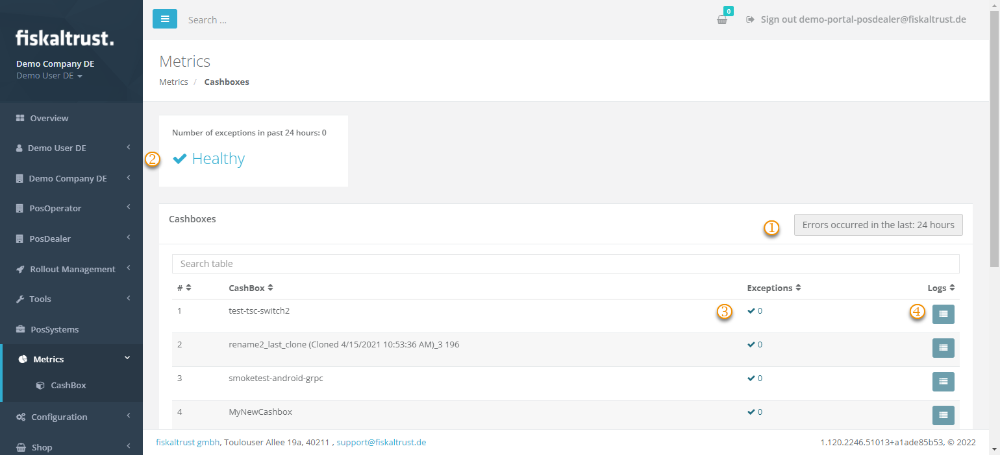
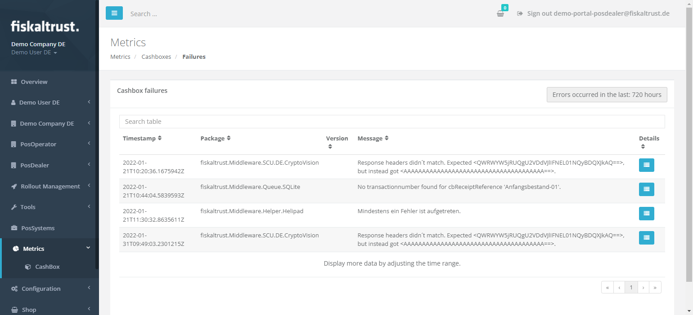

# CashBox failures

:::info summary

After reading this, you can get the information to analyze CashBox failures.

:::

You can analyze CashBox failures remotely using the fiskaltrust.Portal at `Metrics->CashBox` by clicking the button `Go to failed requests` on the tile `CashBox failures`.

:::caution Offline or Opt-out

Using the launcher in [offline mode](../troubleshooting/network-troubleshooting.md#verifying-online-mode) or setting the launcher parameter --telemetry-opt-out prevents log files from being transferred to the fiskaltrust.Portal. Therefore the Metrics section in the Portal will not be available.
Please keep in mind that this will prevent us from actively reacting to issues in the respective customer installations. Instead, we will entirely depend on receiving inquiries and log files manually from you.

:::

*Figure 1. CashBox failures view in the fiskaltrust.Portal Metrics section; elements are listed in Table 1.*

| element | description                                                                                                                |
|:----------------------:|-------------------------------------------------------------------------------------------------------------------------------------|
| |The initial view is filtered to view the failures of the last 24 hours. You can change the period shown here.  |
| |A health indicator shows the number of overall CashBox failures within the filtered period. |
| |The number of exceptions for each single CashBox. |
| |Click the icon in the column `Logs` to get the detailed CashBox failure log. |

*Table 1. Interface elements shown in Figure 1.*

*Figure 2. Detailed CashBox failure log with exception details and stack trace access.*

You will find more detailed information about the exceptions here and can even access the stack trace when clicking on the icon below `Details` to analyze the CashBox failure.

## Basic receipt check

A CashBox can be free of exceptions and still be sending receipts that do not hold up. The basic receipt check looks at the content of the receipts a queue has processed, rather than at whether processing succeeded, and reports the result in the fiskaltrust.Portal under `Configuration` / `Queue`, in the column `Basic receipt check`.

Anyone with access to the account can read it. As a PosOperator you can see whether your own queues follow the basic rules; as a PosDealer you can see the same for the queues of your PosOperators and act before the problem reaches an audit.

The column shows one of three states.

| State | Meaning |
|:-----:| ------- |
| No icon | The checks have not run, because no data is available yet. Nothing is known either way. |
| Warning | At least one of the basic rules was broken. Click the icon for the details. |
| Check mark | All basic rules are met. |

*Table 2. States of the basic receipt check.*

The checks currently performed are:

* the aggregated sum of all charge items equals the aggregated sum of all pay items on the receipt;
* the `ftReceiptCase` of each receipt is valid;
* receipts carry the `ftPosSystemId`;
* a duplicate carries the same data as the receipt it duplicates.

This set is expected to grow as further scenarios are identified.

:::caution a failure is permanent

Once the check has found a rule violation, the queue keeps being reported as failed. Later receipts that pass do not clear the state, because the earlier violation remains part of the queue's history.

:::

To review your queues, open `Configuration` / `Queue` in the fiskaltrust.Portal and narrow the list with a filter such as `Active queues`, then read the `Basic receipt check` column and open the details of anything flagged.

A typical finding reads that the aggregated charge item amount (7.50) does not match the aggregated pay item amount (7.60). A mismatch of this kind is a sign of a problem in how the point-of-sale software builds its requests, so the PosCreator of that system is the right contact. Use the `Open last affected receipt` link in the dialog to jump to the queue and the receipt in question.

For the meaning of the individual fields, see the [Middleware documentation](https://docs.fiskaltrust.cloud/docs/poscreators/middleware-doc).

